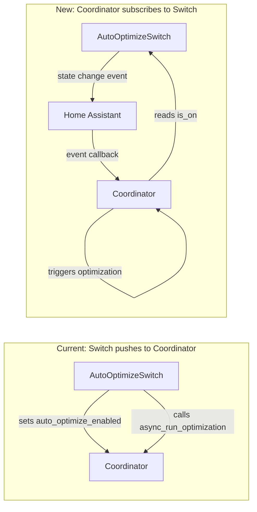

# Auto-optimize Switch as Input Entity

## Current Problem

The auto-optimize switch breaks the normal entity pattern:

- Created in `__init__.py` after coordinator exists (lines 216-232)
- Pushes state to coordinator (`coordinator.auto_optimize_enabled = True`)
- Requires special handling outside normal platform setup

## New Approach

Treat the auto-optimize switch as a true input entity:

- Created in `switch.py` like other switches
- Pure state holder with zero coordinator knowledge
- Coordinator subscribes to state changes and reacts
- Follows the same lifecycle as other input entities

## Architecture



## Changes

### 1. Refactor entity: `entities/auto_optimize_switch.py`

Rename from `haeo_auto_optimize_switch.py` and simplify to a pure state holder:

- Remove coordinator dependency entirely
- Remove all coordinator imports
- Keep `RestoreEntity` for state persistence
- `async_turn_on/off` just update state and write to HA (nothing else)

```python
class AutoOptimizeSwitch(SwitchEntity, RestoreEntity):
    def __init__(
        self,
        hass: HomeAssistant,
        config_entry: ConfigEntry,
        device_entry: DeviceEntry,
    ) -> None:
        # No coordinator, no runtime_data - pure state holder
        self._hass = hass
        self._config_entry = config_entry
        self.device_entry = device_entry
        self._attr_unique_id = f"{config_entry.entry_id}_auto_optimize"
        self._attr_is_on = True  # default

    async def async_turn_on(self, **_kwargs: Any) -> None:
        self._attr_is_on = True
        self.async_write_ha_state()
        # Coordinator subscribes to this and will react

    async def async_turn_off(self, **_kwargs: Any) -> None:
        self._attr_is_on = False
        self.async_write_ha_state()
```

### 2. Update `switch.py`

Add auto-optimize switch creation after input switches:

- Find network subentry
- Create `AutoOptimizeSwitch` linked to network device
- Store in `runtime_data.auto_optimize_switch` for coordinator access

### 3. Update `HaeoRuntimeData` in `__init__.py`

Add field for the auto-optimize switch reference:

```python
@dataclass(slots=True)
class HaeoRuntimeData:
    horizon_manager: HorizonManager
    input_entities: dict[tuple[str, str], HaeoInputNumber | HaeoInputSwitch] = field(default_factory=dict)
    coordinator: HaeoDataUpdateCoordinator | None = field(default=None)
    auto_optimize_switch: AutoOptimizeSwitch | None = field(default=None)  # NEW
    value_update_in_progress: bool = field(default=False)
```

### 4. Update coordinator

In `coordinator/coordinator.py`:

- Remove `_auto_optimize_enabled` internal state variable
- Replace `auto_optimize_enabled` property to read from `runtime_data.auto_optimize_switch.is_on`
- In `async_initialize()`: subscribe to switch's entity_id state changes via `async_track_state_change_event`
- State change handler:
  - On turn-on (`STATE_ON`): resume horizon manager + trigger `async_run_optimization()`
  - On turn-off: pause horizon manager

### 5. Clean up `__init__.py`

Remove lines 216-232 (manual switch creation and platform injection code).

### 6. Delete old file

Delete `entities/haeo_auto_optimize_switch.py`.

## File Summary

| File | Action |
|------|--------|
| `entities/auto_optimize_switch.py` | Create (renamed, simplified to pure state holder) |
| `entities/haeo_auto_optimize_switch.py` | Delete |
| `switch.py` | Add auto-optimize switch creation |
| `__init__.py` | Add field to runtime data, remove manual creation |
| `coordinator/coordinator.py` | Subscribe to switch state, read from it, react to changes |
| `entities/__init__.py` | Update exports |
