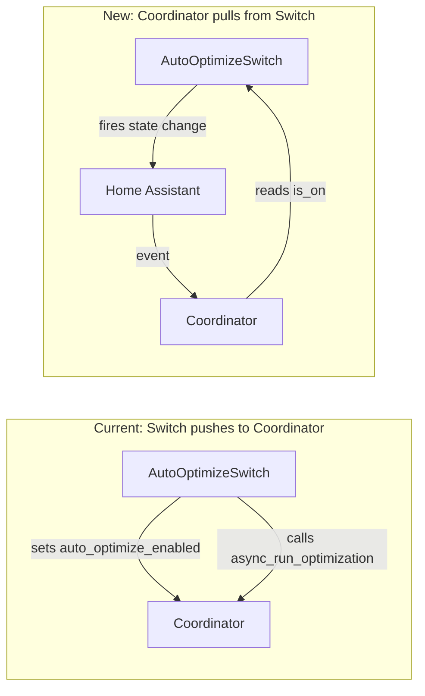

# Auto-optimize Switch as Input Entity

## Current Problem

The auto-optimize switch breaks the normal entity pattern:

- Created in `__init__.py` after coordinator exists (lines 216-232)
- Pushes state to coordinator (`coordinator.auto_optimize_enabled = True`)
- Requires special handling outside normal platform setup

## New Approach

Treat the auto-optimize switch as a true input entity:

- Created in `switch.py` like other switches (no coordinator reference needed)
- Coordinator pulls state from the switch and subscribes to changes
- Follows the same lifecycle as other input entities

## Architecture




## Changes

### 1. Refactor entity: `entities/auto_optimize_switch.py`

Rename from `haeo_auto_optimize_switch.py` and simplify:

- Remove coordinator dependency from constructor
- Remove coordinator imports
- Keep `RestoreEntity` for state persistence
- `async_turn_on/off` just update state (no coordinator calls)
- Store reference to `runtime_data` to trigger coordinator refresh on turn-on

```python
class AutoOptimizeSwitch(SwitchEntity, RestoreEntity):
    def __init__(
        self,
        hass: HomeAssistant,
        config_entry: HaeoConfigEntry,
        device_entry: DeviceEntry,
    ) -> None:
        # No coordinator reference needed
        ...

    async def async_turn_on(self, **_kwargs: Any) -> None:
        self._attr_is_on = True
        self.async_write_ha_state()
        # Trigger coordinator refresh if it exists
        runtime_data = self._config_entry.runtime_data
        if runtime_data and runtime_data.coordinator:
            await runtime_data.coordinator.async_run_optimization()
```

### 2. Update `switch.py`

Add auto-optimize switch creation after input switches:

- Find network subentry (like `__init__.py` does)
- Create `AutoOptimizeSwitch` linked to network device
- Store in `runtime_data` for coordinator access (new field: `auto_optimize_switch`)

### 3. Update `HaeoRuntimeData` in `__init__.py`

Add field for the auto-optimize switch:

```python
@dataclass(slots=True)
class HaeoRuntimeData:
    horizon_manager: HorizonManager
    input_entities: dict[tuple[str, str], HaeoInputNumber | HaeoInputSwitch] = field(default_factory=dict)
    coordinator: HaeoDataUpdateCoordinator | None = field(default=None)
    auto_optimize_switch: AutoOptimizeSwitch | None = field(default=None)  # NEW
    value_update_in_progress: bool = field(default=False)
```

### 4. Update coordinator

In `coordinator/coordinator.py`:

- Remove `_auto_optimize_enabled` internal state
- Add property that reads from switch: `runtime_data.auto_optimize_switch.is_on`
- Subscribe to switch state changes in `async_initialize()`
- On switch turn-on event: resume horizon manager
- On switch turn-off event: pause horizon manager

### 5. Clean up `__init__.py`

Remove lines 216-232 (manual switch creation and platform injection).

### 6. Delete old file

Delete `entities/haeo_auto_optimize_switch.py`.

## File Summary


| File                                    | Action                                            |
| --------------------------------------- | ------------------------------------------------- |
| `entities/auto_optimize_switch.py`      | Create (renamed, simplified)                      |
| `entities/haeo_auto_optimize_switch.py` | Delete                                            |
| `switch.py`                             | Add auto-optimize switch creation                 |
| `__init__.py`                           | Add field to runtime data, remove manual creation |
| `coordinator/coordinator.py`            | Read from switch, subscribe to changes            |
| `entities/__init__.py`                  | Update exports                                    |
