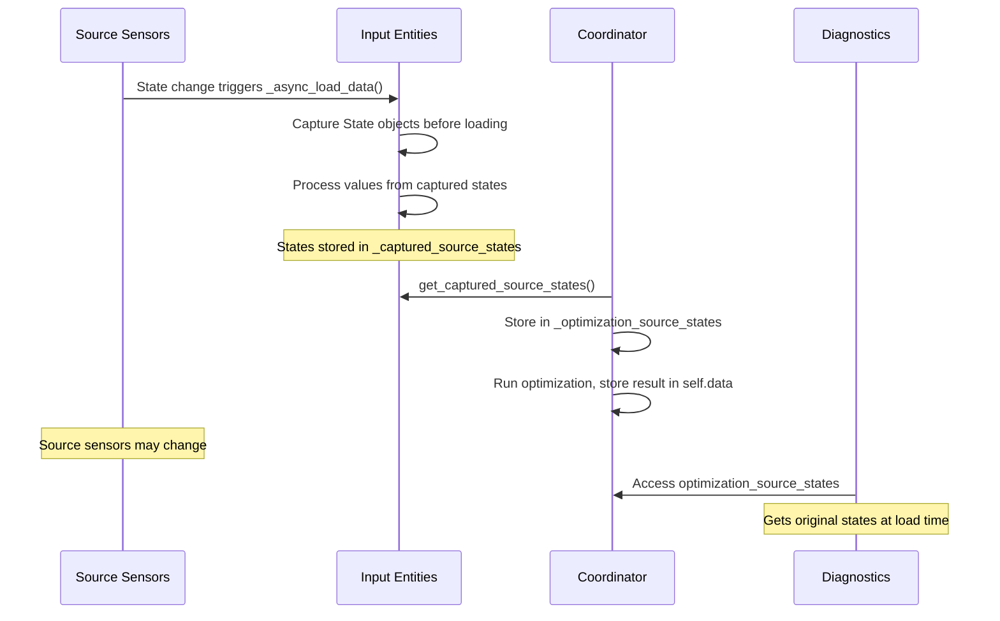

# Capture Source Sensor States at Load Time for Diagnostics

## Problem

Currently, diagnostics fetches source sensor states at request time via `state_provider.get_states()`. However, input entities may have loaded their data from these sensors **earlier**. If source sensors change between when an input entity loads its data and when diagnostics is requested, the captured states don't match what was actually used to produce the optimization outputs.

## Current State (main branch)

- Coordinator stores optimization results in `self.data` (type `CoordinatorData`)
- Coordinator is accessible via `runtime_data.coordinator`
- Diagnostics fetches source states at request time (line 137 in collector.py)
- Input entities don't store the State objects they used when loading data

## Solution

1. Add fields to the coordinator to store timestamp, forecast_timestamps, and source_states
2. Have each input entity capture source sensor State objects when it loads data
3. At optimization time, coordinator collects these states from all input entities and stores them
4. Diagnostics accesses these from the coordinator instead of fetching fresh states

### Key Files to Modify

1. **[`custom_components/haeo/entities/haeo_number.py`](custom_components/haeo/entities/haeo_number.py)** - Capture source states in `_async_load_data()`
2. **[`custom_components/haeo/entities/haeo_switch.py`](custom_components/haeo/entities/haeo_switch.py)** - Capture source state in `_load_source_state()` and `_handle_source_state_change()`
3. **[`custom_components/haeo/coordinator/coordinator.py`](custom_components/haeo/coordinator/coordinator.py)** - Add snapshot fields, collect captured states at optimization time
4. **[`custom_components/haeo/diagnostics/collector.py`](custom_components/haeo/diagnostics/collector.py)** - Use coordinator's stored states when available

### Implementation Details

**1. Coordinator - add snapshot fields**

Add fields to store snapshot data in `__init__`:

```python
# Optimization snapshot data for diagnostics reproducibility
self._optimization_timestamp: datetime | None = None
self._optimization_forecast_timestamps: tuple[float, ...] | None = None
self._optimization_source_states: dict[str, State] = {}
```

Add properties to expose them:

```python
@property
def optimization_timestamp(self) -> datetime | None:
    """Return the timestamp when the last optimization ran."""
    return self._optimization_timestamp


@property
def optimization_forecast_timestamps(self) -> tuple[float, ...] | None:
    """Return the forecast timestamps used in the last optimization."""
    return self._optimization_forecast_timestamps


@property
def optimization_source_states(self) -> dict[str, State]:
    """Return the source sensor states captured for the last optimization."""
    return self._optimization_source_states
```

**2. HaeoInputNumber - capture states in `_async_load_data()`**

Add field in `__init__`:

```python
self._captured_source_states: dict[str, State] = {}
```

In `_async_load_data()`, before calling loader:

```python
# Capture source states before loading - these are the exact states the loader will use
self._captured_source_states = {
    eid: state for eid in self._source_entity_ids if (state := self._hass.states.get(eid)) is not None
}
```

Add method:

```python
def get_captured_source_states(self) -> dict[str, State]:
    """Return the source sensor states captured at last data load."""
    return dict(self._captured_source_states)
```

**3. HaeoInputSwitch - capture state in load methods**

Add field in `__init__`:

```python
self._captured_source_states: dict[str, State] = {}
```

In `_load_source_state()`:

```python
def _load_source_state(self) -> None:
    """Load current state from source entity."""
    if self._source_entity_id is None:
        return

    state = self._hass.states.get(self._source_entity_id)
    if state is not None:
        self._captured_source_states = {self._source_entity_id: state}
        self._attr_is_on = state.state == STATE_ON
        self._update_forecast()
```

In `_handle_source_state_change()`:

```python
def _handle_source_state_change(self, event: Event[EventStateChangedData]) -> None:
    """Handle source entity state change."""
    new_state = event.data["new_state"]
    if new_state is not None and self._source_entity_id is not None:
        self._captured_source_states = {self._source_entity_id: new_state}
        self._attr_is_on = new_state.state == STATE_ON
        self._update_forecast()
        self.async_write_ha_state()
```

Add method:

```python
def get_captured_source_states(self) -> dict[str, State]:
    """Return the source sensor states captured at last data load."""
    return dict(self._captured_source_states)
```

**4. Coordinator - collect states at optimization time**

In `_async_update_data()`, after getting forecast_timestamps, before loading from input entities:

```python
# Collect source states from all input entities
# These were captured when each entity loaded its data
source_states: dict[str, State] = {}
for entity in runtime_data.input_entities.values():
    source_states.update(entity.get_captured_source_states())

# Store snapshot data for diagnostics
self._optimization_timestamp = dt_util.utcnow()
self._optimization_forecast_timestamps = forecast_timestamps
self._optimization_source_states = source_states
```

**5. Diagnostics collector - use coordinator's stored states**

Update `collect_diagnostics()` to check for coordinator snapshot:

```python
# Check for optimization snapshot for reproducibility
coordinator = runtime_data.coordinator if isinstance(runtime_data, HaeoRuntimeData) else None
has_snapshot = coordinator is not None and coordinator.optimization_source_states and not state_provider.is_historical

if has_snapshot:
    # Use snapshot states captured when input entities loaded data
    entity_states = {
        eid: state for eid in all_entity_ids if (state := coordinator.optimization_source_states.get(eid)) is not None
    }
else:
    # Fall back to state provider (historical or no snapshot available)
    entity_states = await state_provider.get_states(sorted(all_entity_ids))
```

Also update timestamp to use snapshot when available:

```python
if has_snapshot and coordinator.optimization_timestamp is not None:
    timestamp = dt_util.as_local(coordinator.optimization_timestamp).isoformat()
else:
    timestamp = dt_util.as_local(state_provider.timestamp or dt_util.now()).isoformat()
```

Optionally include forecast_timestamps in environment for exact reproducibility:

```python
if has_snapshot and coordinator.optimization_forecast_timestamps is not None:
    environment["forecast_timestamps"] = list(coordinator.optimization_forecast_timestamps)
```

### Data Flow



### Notes

- EDITABLE mode entities have no source sensors, so `get_captured_source_states()` returns empty dict for them
- State objects include attributes (like forecast data) which is what extractors need for reproducibility
- The coordinator also stores `optimization_forecast_timestamps` for exact horizon reproducibility
- Historical diagnostics (via recorder) still use the state_provider path
