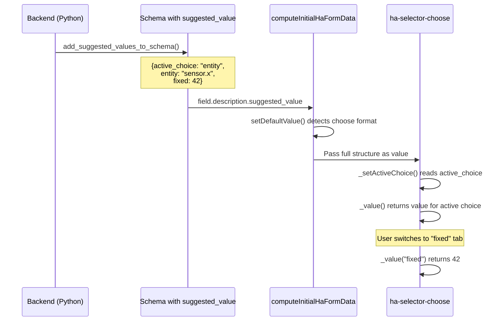

# ChooseSelector suggested_value Support

## Approach

Use the **existing `suggested_value` mechanism** with no backend changes. The suggested value for a choose selector field is a structured object:

```python
# Backend usage (no changes to HA Core needed)
suggested_values = {
    "my_choose_field": {
        "active_choice": "entity",  # which choice is selected by default
        "entity": "sensor.power",  # suggested value when "entity" is active
        "fixed": 42,  # suggested value when "fixed" is active
        "template": "{{ now() }}",  # suggested value when "template" is active
    }
}
schema = self.add_suggested_values_to_schema(schema, suggested_values)
```

The backend already passes `suggested_value` as `Any` - no changes required.---

## Frontend Changes

### 1. Define ChooseSelectorValue Type

**File: `src/data/selector.ts`**

```typescript
export interface ChooseSelectorValue {
  active_choice: string;
  [choiceKey: string]: unknown;  // Each choice key maps to its suggested value
}
```

### 2. Update HaFormData Type

\*\*File: `src/components/ha-form/types.ts`\*\*Define `HaFormChooseData` following the existing naming pattern and add to the union:

```typescript
// Define choose data type (follows existing pattern: HaFormStringData, etc.)
export interface HaFormChooseData {
  active_choice: string;
  [choiceKey: string]: unknown;
}

// Add to HaFormData union
export type HaFormData =
  | HaFormStringData
  | HaFormIntegerData
  | HaFormFloatData
  | HaFormBooleanData
  | HaFormSelectData
  | HaFormMultiSelectData
  | HaFormTimeData
  | HaFormChooseData;  // NEW - properly named
```

### 3. Fix setDefaultValue Function

**File: `src/components/ha-form/compute-initial-ha-form-data.ts`**

```typescript
const setDefaultValue = (
  field: HaFormSchema,
  value: HaFormData | undefined
) => {
  if ("selector" in field && "choose" in field.selector) {
    // If value is already in choose format (has active_choice), return as-is
    if (
      typeof value === "object" &&
      value !== null &&
      "active_choice" in value
    ) {
      return value;
    }
    // Otherwise wrap the value with first choice as default
    const firstChoice = Object.keys(field.selector.choose.choices)[0];
    if (firstChoice) {
      return {
        active_choice: firstChoice,
        [firstChoice]: value,
      };
    }
  }
  return value;
};
```

### 4. Update computeInitialHaFormData for Choose Selectors

\*\*File: `src/components/ha-form/compute-initial-ha-form-data.ts`\*\*When no suggested_value is provided, generate defaults for all choices:

```typescript
} else if ("choose" in selector) {
  const choices = selector.choose.choices;
  const firstChoice = Object.keys(choices)[0];
  if (!firstChoice) {
    data[field.name] = {};
  } else {
    // Generate suggested values for ALL choices
    const chooseValue: Record<string, unknown> = {
      active_choice: firstChoice,
    };
    for (const [choiceKey, choiceConfig] of Object.entries(choices)) {
      chooseValue[choiceKey] = computeInitialHaFormData([
        { name: choiceKey, selector: choiceConfig.selector },
      ])[choiceKey];
    }
    data[field.name] = chooseValue;
  }
}
```

### 5. Update ha-selector-choose Component

\*\*File: `src/components/ha-selector/ha-selector-choose.ts`\*\*When rendering the sub-selector, pass the appropriate suggested value:

```typescript
private _value(choice?: string): any {
  if (!this.value) {
    return undefined;
  }
  // Get the value for the specific choice from the choose structure
  return typeof this.value === "object"
    ? this.value[choice || this.value.active_choice]
    : this.value;
}
```

This already works correctly - the component looks up `this.value[choice]` which will find the per-choice suggested value.---

## Data Flow



---
