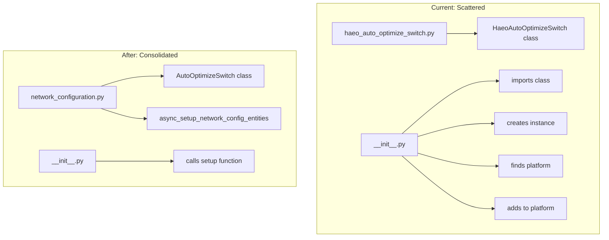

# Network Configuration Entity Refactor

## Problem

Network-level configuration entities (like `HaeoAutoOptimizeSwitch`) are currently:

- Defined in a standalone file `[entities/haeo_auto_optimize_switch.py](custom_components/haeo/entities/haeo_auto_optimize_switch.py)`
- Created inline in `[__init__.py](custom_components/haeo/__init__.py)` (lines 217-232)

This mixes orchestration logic with entity creation and scatters network config code across multiple files.

## Solution

Create a dedicated `[entities/network_configuration.py](custom_components/haeo/entities/network_configuration.py)` module containing both:

- The `AutoOptimizeSwitch` class (renamed from `HaeoAutoOptimizeSwitch`, dropping redundant prefix)
- The `async_setup_network_config_entities()` setup function

This consolidates all network-level configuration entity code in one place.

## Architecture




## Changes

### 1. Create new module: `entities/network_configuration.py`

New file containing:

- `AutoOptimizeSwitch` class (moved and renamed from `HaeoAutoOptimizeSwitch`)
- `async_setup_network_config_entities()` - setup function that:
  - Creates the auto-optimize switch
  - Handles platform lookup and entity registration
  - Designed to easily add more network config entities in future

### 2. Update `__init__.py`

Replace lines 216-232:

```python
from custom_components.haeo.entities.device import get_or_create_network_device
from custom_components.haeo.entities.haeo_auto_optimize_switch import HaeoAutoOptimizeSwitch

network_device_entry = get_or_create_network_device(hass, entry, network_subentry)
auto_optimize_switch = HaeoAutoOptimizeSwitch(...)

switch_platforms = entity_platform.async_get_platforms(hass, DOMAIN)
for platform in switch_platforms:
    if platform.domain == "switch" and platform.config_entry == entry:
        await platform.async_add_entities([auto_optimize_switch])
        break
```

With:

```python
from custom_components.haeo.entities.network_configuration import async_setup_network_config_entities

network_device_entry = get_or_create_network_device(hass, entry, network_subentry)
await async_setup_network_config_entities(hass, entry, coordinator, network_device_entry)
```

### 3. Update `entities/__init__.py`

- Remove `HaeoAutoOptimizeSwitch` if exported (check current exports)
- Add `async_setup_network_config_entities` export

### 4. Delete `entities/haeo_auto_optimize_switch.py`

No longer needed - class now lives in `network_configuration.py` as `AutoOptimizeSwitch`.

## File Summary


| File                                    | Action                          |
| --------------------------------------- | ------------------------------- |
| `entities/network_configuration.py`     | Create (class + setup function) |
| `entities/haeo_auto_optimize_switch.py` | Delete                          |
| `__init__.py`                           | Simplify (single function call) |
| `entities/__init__.py`                  | Update exports                  |
