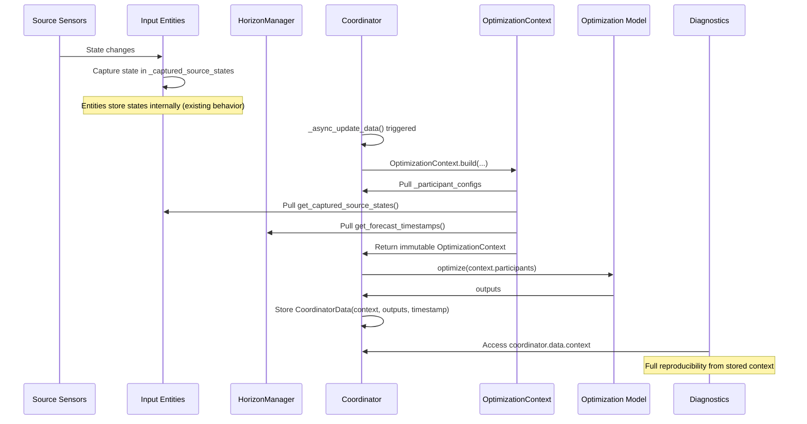

# OptimizationContext Refactor

## Problem

Currently, inputs are scattered across multiple sources and captured at different times:

- Source sensor states: captured when input entities load data
- Editable entity values: captured at diagnostics request time (wrong!)
- Hub config: read from config_entry.data at diagnostics time
- Element configs: built at optimization time but discarded

This makes diagnostics unreliable for reproducibility.

## Solution

Create an immutable `OptimizationContext` with a factory method that pulls all inputs at optimization time.

### Current Architecture (no changes needed to entities)

The existing code already handles state capture well:

1. **Element schemas**: Coordinator stores `_participant_configs: dict[str, ElementConfigSchema]` at init
2. **Source states**: Input entities capture states internally in `_captured_source_states`, pulled via `get_captured_source_states()`
3. **Forecast timestamps**: Pulled from `horizon_manager.get_forecast_timestamps()`

The builder/factory just encapsulates pulling all these together into an immutable snapshot.

### OptimizationContext

Immutable dataclass with a `build()` class method that pulls from existing sources:

```python
@dataclass(frozen=True, slots=True)
class OptimizationContext:
    """Immutable snapshot of all inputs at optimization time."""

    participants: dict[str, ElementConfigSchema]
    """Raw element schemas (not processed ElementConfigData)."""

    source_states: dict[str, State]
    """Source sensor states captured when entities loaded data."""

    forecast_timestamps: tuple[float, ...]
    """Forecast timestamps from horizon manager."""

    @classmethod
    def build(
        cls,
        participant_configs: Mapping[str, ElementConfigSchema],
        input_entities: Mapping[tuple[str, str], HaeoInputNumber | HaeoInputSwitch],
        horizon_manager: HorizonManager,
    ) -> Self:
        """Build context by pulling from existing sources.

        Called at start of _async_update_data() before optimization runs.

        Args:
            participant_configs: Coordinator's _participant_configs dict
            input_entities: runtime_data.input_entities dict
            horizon_manager: runtime_data.horizon_manager
        """
        # Pull source states from all input entities (they captured these when loading data)
        source_states: dict[str, State] = {}
        for entity in input_entities.values():
            source_states.update(entity.get_captured_source_states())

        return cls(
            participants=dict(participant_configs),
            source_states=source_states,
            forecast_timestamps=horizon_manager.get_forecast_timestamps(),
        )
```

### CoordinatorData

```python
@dataclass(slots=True)
class CoordinatorData:
    """Result of an optimization run."""

    context: OptimizationContext
    """Immutable snapshot of all inputs used for this optimization."""

    outputs: dict[str, SubentryDevices]
    """Element outputs organized by element_name → device_name → output_name."""

    timestamp: datetime
    """When the optimization ran."""
```

### Key Files to Modify

1. **[`custom_components/haeo/coordinator/context.py`](custom_components/haeo/coordinator/context.py)** (new) - Create OptimizationContext dataclass with build() method
2. **[`custom_components/haeo/coordinator/coordinator.py`](custom_components/haeo/coordinator/coordinator.py)** - Update CoordinatorData, call OptimizationContext.build() in \_async_update_data()
3. **[`custom_components/haeo/diagnostics/collector.py`](custom_components/haeo/diagnostics/collector.py)** - Use context.participants for schemas, simplify source state access
4. **Tests** - Update to use new structure

### Implementation Details

**1. Create `coordinator/context.py`**

New module containing just `OptimizationContext` - an immutable dataclass with a `build()` class method.

Imports needed:

- `ElementConfigSchema` from elements
- `State` from Home Assistant core
- `HorizonManager` from horizon
- `HaeoInputNumber`, `HaeoInputSwitch` from entities (for type hints)

**2. Update `_async_update_data()` in coordinator.py**

Replace the scattered input collection with a single `OptimizationContext.build()` call:

```python
# BEFORE (current code, lines 653-666):
forecast_timestamps = runtime_data.horizon_manager.get_forecast_timestamps()
source_states: dict[str, State] = {}
for entity in runtime_data.input_entities.values():
    source_states.update(entity.get_captured_source_states())
loaded_configs = self._load_from_input_entities()

# AFTER:
context = OptimizationContext.build(
    participant_configs=self._participant_configs,
    input_entities=runtime_data.input_entities,
    horizon_manager=runtime_data.horizon_manager,
)
# Use context.participants, context.source_states, context.forecast_timestamps
```

**3. Update CoordinatorData**

Add `context` field, keep existing fields:

```python
return CoordinatorData(
    context=context,
    outputs=outputs,
    timestamp=optimization_timestamp,
)
```

**4. Update diagnostics collector**

```python
# Use stored context instead of querying entities at request time
if has_snapshot:
    for element_name, schema in coordinator.data.context.participants.items():
        diagnostics_config[element_name] = schema  # or serialize as needed
```

### Data Flow



### Benefits

1. **No entity changes needed**: Keeps existing pull model where entities capture states internally
2. **Immutable snapshot**: Context is frozen at optimization time
3. **Raw schemas**: Uses `ElementConfigSchema` for full reproducibility (not processed data)
4. **Single source of truth**: All inputs captured together in one object
5. **No request-time capture**: Diagnostics reads stored context
