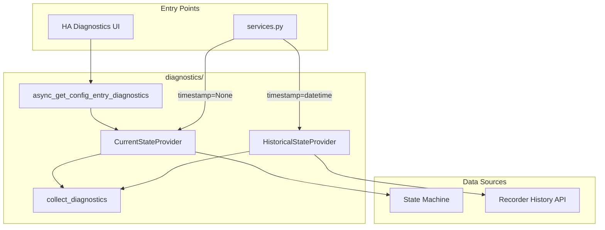

# Parameterized Historical Diagnostics

## Architecture Overview

The current diagnostics system in [`diagnostics.py`](custom_components/haeo/diagnostics.py) fetches state using `hass.states.get()` directly. To support historical timestamps, we introduce a **StateProvider** abstraction that parameterizes state fetching.



## Key Design Decisions

### 1. Protocol-based StateProvider

Use a Python `Protocol` (not ABC) to define the interface, matching HAEO's existing patterns. The provider abstracts how entity state is retrieved:

```python
class StateProvider(Protocol):
    async def get_state(self, entity_id: str) -> State | None:
        """Get entity state (current or at configured timestamp)."""
        ...

    async def get_states(self, entity_ids: Iterable[str]) -> dict[str, State]:
        """Get multiple entity states."""
        ...
```

### 2. Two Implementations

- **CurrentStateProvider**: Wraps `hass.states.get()` - zero overhead for current diagnostics
- **HistoricalStateProvider**: Queries the recorder history API for state at a specific timestamp

### 3. Separate HA Entry Point from Collector

Keep `async_get_config_entry_diagnostics` unchanged as the HA-specific entry point. Create a separate `collect_diagnostics` function that accepts `StateProvider`:

```python
# In collector.py - the parameterized internal API
async def collect_diagnostics(
    hass: HomeAssistant,
    config_entry: HaeoConfigEntry,
    state_provider: StateProvider,
) -> dict[str, Any]:
    """Collect diagnostics using the provided state provider."""
    ...


# In __init__.py - unchanged HA entry point
async def async_get_config_entry_diagnostics(
    hass: HomeAssistant,
    config_entry: HaeoConfigEntry,
) -> dict[str, Any]:
    """HA entry point - delegates to collector with current state."""
    return await collect_diagnostics(hass, config_entry, CurrentStateProvider(hass))
```

This keeps the HA contract stable while exposing a flexible internal API.

## File Changes

### 1. New Directory: `diagnostics/`

Create [`custom_components/haeo/diagnostics/`](custom_components/haeo/diagnostics/) with the following structure:

```
diagnostics/
├── __init__.py          # Re-exports async_get_config_entry_diagnostics
├── collector.py         # Core diagnostics collection logic (moved from diagnostics.py)
└── state_provider.py    # StateProvider protocol and implementations
```

#### `state_provider.py`

- `StateProvider` protocol definition
- `CurrentStateProvider` implementation (wraps `hass.states.get()`)
- `HistoricalStateProvider` implementation using the recorder history API:

```python
from homeassistant.components.recorder.history import get_significant_states


class HistoricalStateProvider:
    def __init__(self, hass: HomeAssistant, timestamp: datetime) -> None:
        self.hass = hass
        self.timestamp = timestamp

    def get_states(self, entity_ids: Iterable[str]) -> dict[str, State]:
        """Get states at the configured timestamp."""
        # get_significant_states with include_start_time_state=True
        # retrieves the most recent state AT or BEFORE start_time
        states = get_significant_states(
            self.hass,
            start_time=self.timestamp,
            end_time=self.timestamp + timedelta(seconds=1),
            entity_ids=list(entity_ids),
            include_start_time_state=True,
            significant_changes_only=False,  # include attribute-only changes
            no_attributes=False,  # preserve attributes (needed for forecasts)
        )
        # Extract first state for each entity (the start state)
        return {eid: states_list[0] for eid, states_list in states.items() if states_list}
```

Key parameters:

- `include_start_time_state=True`: Gets the state AT the timestamp (not just changes after)
- `significant_changes_only=False`: Includes attribute-only changes (important for forecast sensors)
- `no_attributes=False`: Preserves attributes (critical for forecast data)

#### `collector.py`

- Move core logic from current `diagnostics.py`
- Accept `StateProvider` parameter for state fetching
- Replace direct `hass.states.get()` calls with `await state_provider.get_state()`

#### `__init__.py`

- Re-export `async_get_config_entry_diagnostics` for HA compatibility
- Export `StateProvider`, `CurrentStateProvider`, `HistoricalStateProvider`

### 2. Delete: `diagnostics.py` (root level file)

Delete the file [`diagnostics.py`](custom_components/haeo/diagnostics.py) - the `diagnostics/` package replaces it.

When HA imports `custom_components.haeo.diagnostics`, Python will load `diagnostics/__init__.py` (the package), which exports `async_get_config_entry_diagnostics`. This is the same pattern used by `coordinator/` in this codebase.

### 3. Update: `services.py`

Modify [`services.py`](custom_components/haeo/services.py):

- Import `collect_diagnostics`, `CurrentStateProvider`, `HistoricalStateProvider` from `diagnostics` package
- Add optional `timestamp` parameter to service schema
- Create appropriate `StateProvider` based on timestamp presence:
    - `timestamp=None` → `CurrentStateProvider(hass)`
    - `timestamp=datetime` → `HistoricalStateProvider(hass, timestamp)`
- Call `collect_diagnostics(hass, config_entry, state_provider)` directly

### 4. Update: `services.yaml` and translations

- Add `timestamp` field definition with datetime selector
- Add translations for the new field

## Historical Data Source Strategy

| Data Type | Current Source | Historical Source |

| \-------------- | ------------------- | ------------------------------------------- |

| Input sensors | `hass.states.get()` | `recorder.history.get_significant_states()` |

| Output sensors | `hass.states.get()` | **Omitted** |

The history API is used because:

1. It preserves **full state + attributes** (critical for forecast sensors like Solcast, Amber)
2. `include_start_time_state=True` provides point-in-time state retrieval
3. Works within the recorder retention period (default 10 days)

For historical diagnostics, output sensors are omitted because:

1. They reflect the optimization that ran at that past time with different inputs
2. The purpose of historical diagnostics is to capture inputs for scenario replay
3. Including stale outputs would be confusing and not useful for debugging

The `collect_diagnostics` function will check the provider type (via a property or method) to determine whether to include outputs.

## Validation

The service should validate:

1. Timestamp is within recorder retention period (typically 10 days for state history)
2. Input sensors have data at the requested timestamp (gracefully handle missing data)

## Backwards Compatibility

- Standard HA diagnostics download (via UI) continues to work unchanged
- Service call without `timestamp` behaves identically to current implementation
- The `StateProvider` abstraction is internal - no API changes to external consumers
