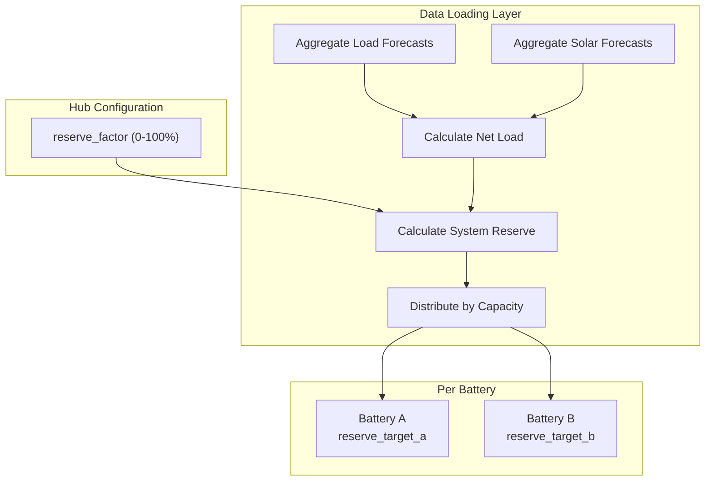

# Self-Sufficiency Reserve Feature

## Overview

Add a **hub-level** `reserve_factor` (0-100%) configuration. When set, the optimizer calculates the total system reserve requirement based on aggregated load and solar forecasts, then distributes it to each battery proportionally by capacity. Depleting below the reserve incurs a soft penalty cost.

## Mathematical Model

### System-Level Reserve Calculation

```
net_load[t] = sum(all_loads) - sum(all_solar)  # kW
energy[t] = net_load[t] * period[t]  # kWh per interval
cumulative[t] = sum(energy[i] for i in t..T)  # Reverse cumsum: energy needed from t to end
system_reserve[t] = reserve_factor * max(0, cumulative[t])  # kWh
```

### Per-Battery Distribution

```
total_capacity = sum(battery.capacity for all batteries)
battery.reserve_target[t] = (battery.capacity / total_capacity) * system_reserve[t]
```

### Soft Penalty

```
shortfall[t] = max(0, reserve_target[t] - stored_energy[t])
penalty = penalty_rate * sum(shortfall)
```

The `penalty_rate` is derived from grid import prices (e.g., 2x max import price).

## Architecture



## Key Files to Modify

1. **[`custom_components/haeo/const.py`](custom_components/haeo/const.py)** - Add `CONF_RESERVE_FACTOR` and `DEFAULT_RESERVE_FACTOR`

2. **[`custom_components/haeo/flows/__init__.py`](custom_components/haeo/flows/__init__.py)** - Add `reserve_factor` to hub config schema with slider (0-100%)

3. **[`custom_components/haeo/model/battery.py`](custom_components/haeo/model/battery.py)** - Add optional `reserve_target` and `reserve_penalty` parameters; create shortfall variables and penalty cost term

4. **[`custom_components/haeo/elements/battery.py`](custom_components/haeo/elements/battery.py)** - Add output sensors for reserve target, shortfall, and shadow price

5. **[`custom_components/haeo/data/__init__.py`](custom_components/haeo/data/__init__.py)** - Calculate system reserve, distribute to batteries by capacity

6. **Translations** - Update for new hub config option and battery sensors

## Implementation Details

### Constants (`const.py`)

```python
CONF_RESERVE_FACTOR: Final = "reserve_factor"
DEFAULT_RESERVE_FACTOR: Final = 0  # 0% = pure profit optimization
```

### Hub Config Flow (`flows/__init__.py`)

Add to `get_network_config_schema()`:

```python
vol.Required(
    CONF_RESERVE_FACTOR,
    default=config_entry.data.get(CONF_RESERVE_FACTOR, DEFAULT_RESERVE_FACTOR)
    if config_entry else DEFAULT_RESERVE_FACTOR,
): vol.All(
    NumberSelector(NumberSelectorConfig(min=0, max=100, step=1, mode=NumberSelectorMode.SLIDER)),
    vol.Coerce(int),
),
```

### Model Layer (`model/battery.py`)

Add new optional parameters:

```python
def __init__(
    self,
    ...,
    reserve_target: Sequence[float] | None = None,
    reserve_penalty: float = 0.0,
) -> None:
    ...
    self.reserve_target = broadcast_to_sequence(reserve_target, n_periods + 1) if reserve_target else None
    self.reserve_penalty = reserve_penalty

    if self.reserve_target is not None:
        self.shortfall = solver.addVariables(n_periods + 1, lb=0.0, name_prefix=f"{name}_shortfall_")
    else:
        self.shortfall = None
```

In `build_constraints()`:

```python
if self.reserve_target is not None:
    self._constraints[BATTERY_RESERVE_SHORTFALL] = h.addConstrs(
        self.shortfall >= self.reserve_target - self.stored_energy
    )
```

In `cost()`:

```python
if self.shortfall is not None:
    costs.append(self.reserve_penalty * Highs.qsum(self.shortfall))
```

### Data Loading (`data/__init__.py`)

New function to calculate and distribute reserve:

```python
def calculate_battery_reserves(
    participants: Mapping[str, ElementConfigData],
    reserve_factor: float,  # 0.0 to 1.0
    periods_hours: Sequence[float],
) -> dict[str, tuple[Sequence[float], float]]:
    """Calculate reserve targets for each battery.

    Returns:
        Mapping of battery name to (reserve_target, penalty_rate)
    """
    # 1. Aggregate all load forecasts
    total_load = aggregate_element_forecasts(participants, "load", "forecast")

    # 2. Aggregate all solar forecasts
    total_solar = aggregate_element_forecasts(participants, "solar", "forecast")

    # 3. Calculate net load energy per period
    net_load = np.array(total_load) - np.array(total_solar)
    energy = net_load * np.array(periods_hours)

    # 4. Reverse cumulative sum (how much energy needed from t to end)
    cumulative = np.cumsum(energy[::-1])[::-1]
    cumulative = np.concatenate([cumulative, [0.0]])  # Add terminal zero

    # 5. Apply reserve factor
    system_reserve = reserve_factor * np.maximum(0, cumulative)

    # 6. Get total battery capacity and penalty rate
    total_capacity = sum_battery_capacities(participants)
    penalty_rate = calculate_penalty_rate(participants)  # 2x max import price

    # 7. Distribute to each battery by capacity
    result = {}
    for name, config in participants.items():
        if config["element_type"] == "battery":
            capacity = config["capacity"][0]
            share = capacity / total_capacity
            result[name] = (share * system_reserve, penalty_rate)

    return result
```

### New Battery Outputs

- `battery_reserve_target` - The calculated reserve target for this battery
- `battery_reserve_shortfall` - Optimized shortfall (how much below target)
- `battery_reserve_shortfall_price` - Shadow price of the shortfall constraint