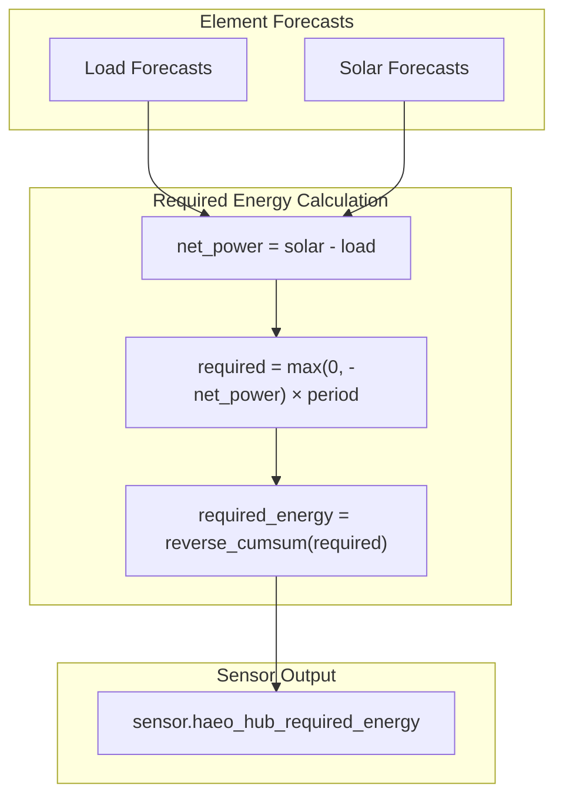

# Required Energy Sensor

Reference: [GitHub Issue #60](https://github.com/hass-energy/haeo/issues/60)

## Overview

Add a virtual **Required Energy** sensor to the network. This sensor represents the total future energy required from dispatchable sources (battery, grid, generator) to satisfy upcoming fixed loads, given current forecasts.

## Primary Use Case: Dynamic Battery Reserve

The sensor can be used as a **dynamic minimum reserve level** for a battery. By setting the battery's minimum state-of-charge equal to the required energy, the system can:

- Ensure the battery **retains enough energy** to cover future load that uncontrollable sources cannot meet
- **Release** stored energy only when doing so will not jeopardize future demand
- Avoid overly aggressive discharge early in the day when requirements are still ahead

## Algorithm

### Step 1: Calculate Net Forecasted Power Per Interval

```
net_power[t] = uncontrollable_generation[t] - load_forecast[t]
```

Where `uncontrollable_generation` includes solar (and future: wind, etc.)

- Positive → generation surplus
- Negative → requires dispatchable energy

### Step 2: Extract Required Energy Per Interval

Only count intervals where load exceeds uncontrollable generation:

```
required[t] = max(0, -net_power[t]) * period[t]  # kWh
```

### Step 3: Reverse Cumulative Sum

Compute the reverse cumulative sum so each time point reflects:

*"From this moment forward, this is the amount of energy required from dispatchable sources."*

```python
# For each timestep, sum required energy from t to end of horizon
required_energy[t] = sum(required[i] for i in t..T)
```

### Resulting Sensor Behaviour

At any timestamp `t`, the sensor outputs:

**"Energy required from now until the end of the forecast horizon that must come from dispatchable sources (battery, grid, generator)."**

The value naturally:

- Drops to zero when future uncontrollable generation covers all remaining load
- Rises when upcoming fixed loads exceed forecasted generation
- Decreases over time as requirements are met

## Example

| Time | Load | Solar | Net Power | Required (interval) | Required Energy (cumulative) |

|------|------|-------|-----------|---------------------|------------------------------|

| 6pm  | 2 kW | 0 kW  | -2 kW     | 4 kWh (2h)          | 11 kWh |

| 8pm  | 1 kW | 0 kW  | -1 kW     | 4 kWh (4h)          | 7 kWh  |

| 12am | 0.5 kW | 0 kW | -0.5 kW  | 3 kWh (6h)          | 3 kWh  |

| 6am  | 1 kW | 2 kW  | +1 kW     | 0 kWh               | 0 kWh  |

| 10am | 1 kW | 5 kW  | +4 kW     | 0 kWh               | 0 kWh  |

At 6pm, you need **11 kWh** from dispatchable sources to meet load until solar returns.

## Architecture



## Key Files to Modify

1. **[`custom_components/haeo/const.py`](custom_components/haeo/const.py)** - Add `NETWORK_REQUIRED_ENERGY` output name

2. **[`custom_components/haeo/data/__init__.py`](custom_components/haeo/data/__init__.py)** - Add `calculate_required_energy()` function

3. **[`custom_components/haeo/coordinator.py`](custom_components/haeo/coordinator.py)** - Calculate required energy and include in `CoordinatorData`

4. **[`custom_components/haeo/sensor.py`](custom_components/haeo/sensor.py)** - Add `HaeoRequiredEnergySensor` entity

5. **[`custom_components/haeo/translations/en.json`](custom_components/haeo/translations/en.json)** - Add translation strings

## Implementation Details

### Constants (`const.py`)

```python
# Add to NetworkOutputName type
type NetworkOutputName = Literal[
    "network_optimization_cost",
    "network_required_energy",  # NEW
]

NETWORK_REQUIRED_ENERGY: Final = "network_required_energy"
```

### Required Energy Calculation (`data/__init__.py`)

```python
def calculate_required_energy(
    participants: Mapping[str, ElementConfigData],
    periods_hours: Sequence[float],
) -> list[float]:
    """Calculate the required energy at each timestep.

    Returns:
        List of required energy values (kWh) at each timestep boundary (n_periods + 1).
        Each value represents the total energy required from dispatchable sources
        from that point until the end of the horizon.
    """
    n_periods = len(periods_hours)

    # Aggregate all load forecasts
    total_load = np.zeros(n_periods)
    for config in participants.values():
        if config["element_type"] == "load":
            total_load += np.array(config["forecast"])

    # Aggregate all uncontrollable generation (solar, future: wind, etc.)
    total_uncontrollable = np.zeros(n_periods)
    for config in participants.values():
        if config["element_type"] == "solar":
            total_uncontrollable += np.array(config["forecast"])

    # Calculate net power (positive = surplus, negative = requires dispatchable)
    net_power = total_uncontrollable - total_load

    # Extract only requirements (negative values become positive energy requirements)
    required_power = np.maximum(0, -net_power)  # kW
    required_interval = required_power * np.array(periods_hours)  # kWh

    # Reverse cumulative sum: how much required energy from t to end
    required_energy = np.cumsum(required_interval[::-1])[::-1]

    # Add terminal zero (at end of horizon, no future requirement)
    required_energy = np.concatenate([required_energy, [0.0]])

    return required_energy.tolist()
```

### Coordinator (`coordinator.py`)

In `_async_update_data()`, after loading configs:

```python
# Calculate required energy
required_energy = calculate_required_energy(loaded_configs, periods_hours)
```

Add to `CoordinatorData`:

```python
required_energy: list[float]  # kWh at each timestep boundary
```

### Sensor Entity (`sensor.py`)

```python
class HaeoRequiredEnergySensor(CoordinatorEntity, SensorEntity):
    """Sensor showing the current required energy from dispatchable sources."""

    _attr_native_unit_of_measurement = UnitOfEnergy.KILO_WATT_HOUR
    _attr_device_class = SensorDeviceClass.ENERGY
    _attr_state_class = SensorStateClass.MEASUREMENT

    @property
    def native_value(self) -> float:
        """Return the current required energy (first timestep)."""
        return self.coordinator.data.required_energy[0]

    @property
    def extra_state_attributes(self) -> dict[str, Any]:
        """Return the full required energy forecast as an attribute."""
        return {
            "forecast": self.coordinator.data.required_energy,
        }
```

## Future Enhancement

Once this sensor exists, a future enhancement could allow it to be used as input to a battery's `min_charge_percentage` field, enabling dynamic reserve management based on actual forecast conditions rather than a static percentage.