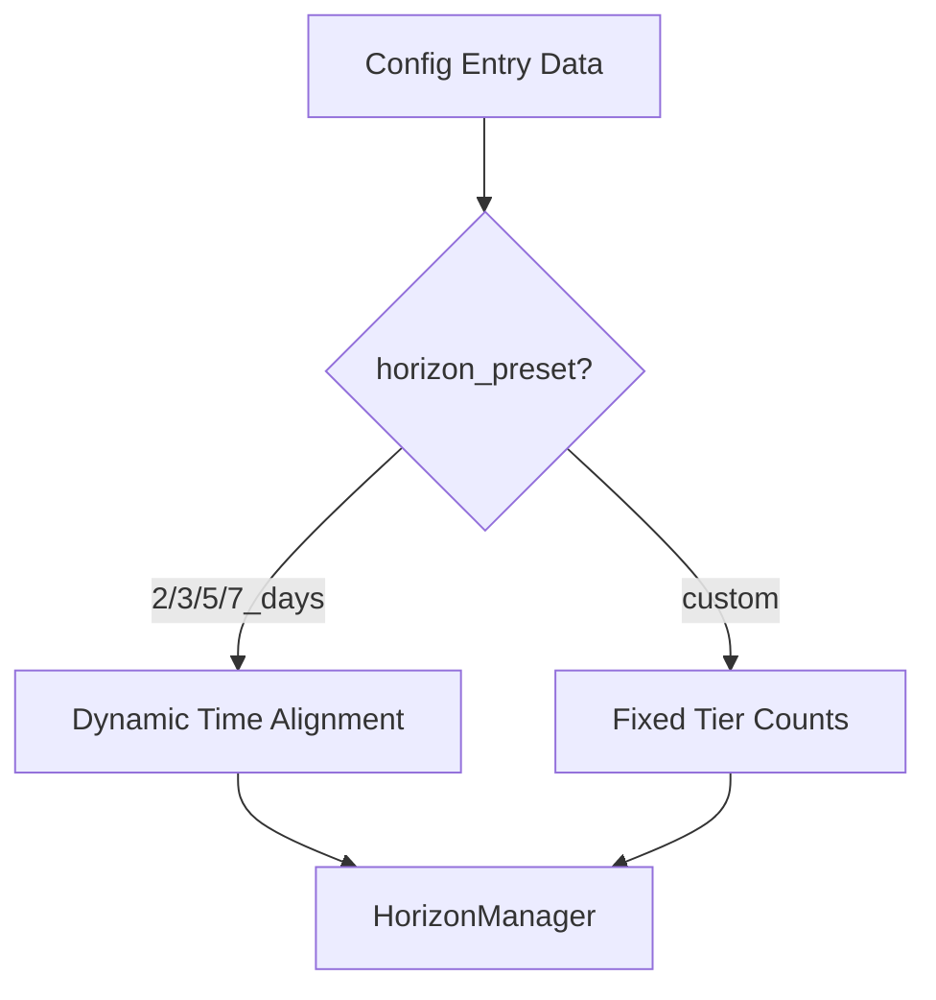

# Simplify Time Step Alignment

Keep the original `horizon_preset` configuration schema unchanged. When a preset is selected (2/3/5/7 days), the new time-aligned step algorithm is used. When "custom" is selected, the legacy fixed tier counts are used as before.

## Strategy

## Changes

### 1. Revert Configuration Schema

**[const.py](custom_components/haeo/const.py)**

- Remove `CONF_HORIZON_DURATION_MINUTES` and related defaults
- Restore `CONF_HORIZON_PRESET`, `CONF_TIER_4_COUNT`, `DEFAULT_TIER_4_COUNT`
- Restore original default tier count values (11, 46, 48)

**[flows/__init__.py](custom_components/haeo/flows/__init__.py)**

- Revert to original preset system (`HORIZON_PRESETS`, `get_tier_config()`)
- Remove `horizon_days` selector, `convert_horizon_days_to_minutes()`
- Restore preset dropdown in `get_hub_setup_schema()` and `get_hub_options_schema()`

**[flows/options.py](custom_components/haeo/flows/options.py)**

- Revert to original options flow logic (preset selection with custom step)
- Remove horizon_days conversion

### 2. Update forecast_times.py for Dual-Path Logic

**[util/forecast_times.py](custom_components/haeo/util/forecast_times.py)**

- Keep the alignment functions (`calculate_aligned_tier_counts`, `calculate_worst_case_total_steps`)
- Update `tiers_to_periods_seconds()` to check for `horizon_preset` instead of `horizon_duration_minutes`:
    - If preset is a known preset (not "custom"): use alignment algorithm with preset's days converted to minutes
    - If preset is "custom" or missing: use legacy fixed tier counts

### 3. Update HorizonManager

**[horizon.py](custom_components/haeo/horizon.py)**

- Detect whether to use aligned or legacy path based on `horizon_preset`
- For presets: compute horizon_minutes from preset days, use alignment
- For custom: use legacy `tiers_to_periods_seconds()` with fixed counts

### 4. Remove Migration

**[__init__.py](custom_components/haeo/__init__.py)**

- Remove `async_migrate_entry()` function (no schema changes)
- Remove `CONF_HORIZON_DURATION_MINUTES` import

### 5. Revert Translations

**[translations/en.json](custom_components/haeo/translations/en.json)**

- Restore `horizon_preset` selector translations
- Remove `horizon_days`, `horizon_duration_minutes` translations
- Restore original tier count labels (remove "Minimum Steps")
- Restore `tier_4_count` label
- Restore original custom_tiers description

### 6. Update Tests

- Tests using `CONF_HORIZON_DURATION_MINUTES` should use `CONF_HORIZON_PRESET` instead
- Tests should use original tier defaults where applicable
