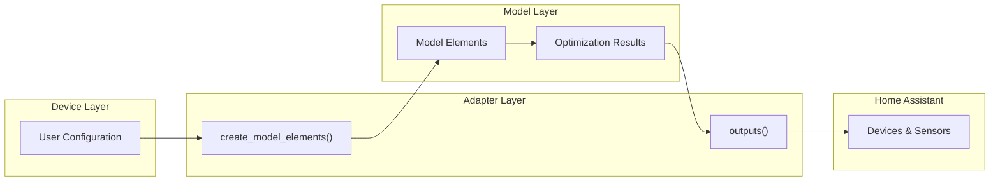

# Adapter layer

The adapter layer transforms Device Layer elements into Model Layer elements and maps optimization outputs back to user-friendly device outputs.
This separation enables composition flexibility where a single configuration creates multiple model elements and devices.

## Purpose

HAEO separates user configuration from optimization modeling through distinct layers:

- **Device Layer**: User-configured elements (Battery, Grid, Solar, Load, Node, Connection) with Home Assistant sensor integration
- **Model Layer**: Mathematical building blocks forming the linear programming problem
- **Adapter Layer**: Transformation logic connecting these layers

This architecture enables:

- **Composition flexibility**: One Device Layer element creates multiple Model Layer elements
- **Output aggregation**: Model outputs map to multiple devices with user-friendly sensor names
- **Future extensibility**: Foundation for composite elements that group multiple devices

## Transformation Flow



The adapter layer provides two transformation functions per element type:

**Configuration → Model** (`create_model_elements`): Transforms user configuration into model element specifications.
Called during network construction before optimization.

**Model → Devices** (`outputs`): Transforms optimization results into device-specific outputs with user-friendly names.
Called after optimization to populate sensors.

## Element Composition Patterns

### One-to-Many Model Elements

Most Device Layer elements create multiple Model Layer elements:

| Device Element | Model Elements Created   |
| -------------- | ------------------------ |
| Battery        | `battery` + `connection` |
| Grid           | `node` + `connection`    |
| Solar          | `node` + `connection`    |
| Load           | `node` + `connection`    |
| Node           | `node` only              |
| Connection     | `connection` only        |

Implicit connections (created by Battery, Grid, PV, Load) link the element to its configured target node.
The connection carries operational parameters (power limits, efficiency, pricing) from the device configuration.

### One-to-Many Devices

Some Device Layer elements produce multiple devices in Home Assistant:

**Battery**: Creates up to 4 devices based on SOC region configuration:

- Aggregate device (always): Total power, energy, SOC
- Undercharge device (optional): Region-specific metrics
- Normal device (optional): Region-specific metrics
- Overcharge device (optional): Region-specific metrics

Other elements create a single device matching their configuration.

### Sub-element Naming

When adapters create multiple model elements or devices, they use a naming convention:

- Main element: `{name}` (e.g., `Battery`)
- Sub-elements: `{name}:{subname}` (e.g., `Battery:connection`, `Battery:undercharge`)

This prevents naming collisions and groups related components visually.

## Output and Input Names

Each element type defines two categories of sensor outputs through typed constants:

### OUTPUT_NAMES

**Computed outputs** from the optimization model.
These represent decision variables or derived values that the optimizer calculates:

- Power flows (import, export, charge, discharge)
- State of charge and energy stored
- Shadow prices (constraint marginal values)

Each element defines its output names as a `frozenset`:

```python
type GridOutputName = Literal[
    "grid_power_import",
    "grid_power_export",
    "grid_power_active",
    "grid_power_max_import_price",
    "grid_power_max_export_price",
]

GRID_OUTPUT_NAMES: Final[frozenset[GridOutputName]] = frozenset(...)
```

### Input Entities

**Configuration-derived inputs** are handled differently from optimization outputs.
Rather than passing through the adapter layer, input values are exposed directly as Number or Switch entities.

The `schema/input_fields.py` module extracts input field metadata from ConfigSchema:

- Power fields become Number entities with kW units
- Price fields become Number entities with \$/kWh units
- Boolean fields become Switch entities

Input entities:

- Created directly from subentry config (not coordinator data)
- Support DRIVEN mode (mirrors external sensor) or EDITABLE mode (user-controlled)
- Persist state across restarts using RestoreNumber/RestoreEntity

### Aggregated Name Sets

The element registry aggregates output names for translation validation:

```python
# All output sensor names across elements
ELEMENT_OUTPUT_NAMES: frozenset[ElementOutputName]
```

This set validates that all sensor names have corresponding translation keys.
Input entity translation keys are derived from the schema field names.

## Adding New Element Types

To add a new Device Layer element:

1. Define configuration schema in `elements/{element}.py`
2. Implement `create_model_elements()` returning model element specifications
3. Implement `updates()` mapping model results to device outputs
4. Register in `elements/__init__.py` `ELEMENT_TYPES` dictionary
5. Add translations in `translations/en.json`

See existing element modules in [`custom_components/haeo/elements/`](https://github.com/hass-energy/haeo/tree/main/custom_components/haeo/elements) for implementation patterns.

## Integration Points

The adapter layer integrates at two points in HAEO's execution:

**Network construction**: [`data/__init__.py`](https://github.com/hass-energy/haeo/blob/main/custom_components/haeo/data/__init__.py) calls `create_model_elements()` for each configured element to build the optimization network.

**Output processing**: [`coordinator.py`](https://github.com/hass-energy/haeo/blob/main/custom_components/haeo/coordinator.py) calls `outputs()` after optimization to transform results into device sensor values.

## Future: Composite Elements

The adapter architecture supports future composite elements that group multiple Device Layer elements:

- **Virtual Power Plant**: Multiple batteries and solar systems as a single unit
- **Building**: Aggregated loads and generation for a location
- **Pre-configured networks**: Complete system templates

Composite adapters would create nested element structures and aggregate their outputs, presenting a unified interface to users while maintaining full optimization capability.

## Next Steps

<div class="grid cards" markdown>

- :material-chart-line:{ .lg .middle } **Modeling documentation**

    ---

    Understand the Model Layer mathematical formulation.

    [:material-arrow-right: Network optimization](../modeling/index.md)

- :material-file-document:{ .lg .middle } **Element configuration**

    ---

    User guide for Device Layer elements.

    [:material-arrow-right: Elements overview](../user-guide/elements/index.md)

- :material-database:{ .lg .middle } **Data loading**

    ---

    How sensor data flows into configuration.

    [:material-arrow-right: Data loading guide](data-loading.md)

</div>
