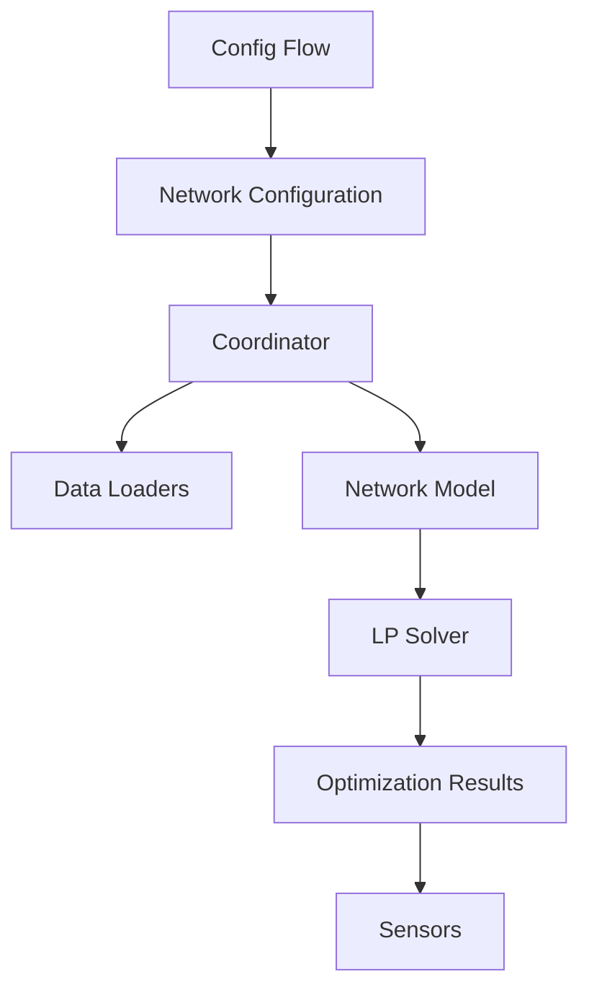

# Architecture

HAEO's architecture follows Home Assistant's integration patterns with specialized optimization components.

## Component Overview

## Key Components

### Config Flow

User-facing configuration via Home Assistant UI.

Located in: `config_flow.py` and `flows/`

### Coordinator

Manages data updates and optimization cycles.

Located in: `coordinator.py`

### Network Model

Represents the energy system as LP problem.

Located in: `model/`

### Data Loaders

Load forecast and sensor data.

Located in: `data/loader/`

### Sensors

Expose optimization results to Home Assistant.

Located in: `sensors/`

See [API Reference](../api/index.md) for detailed documentation.
