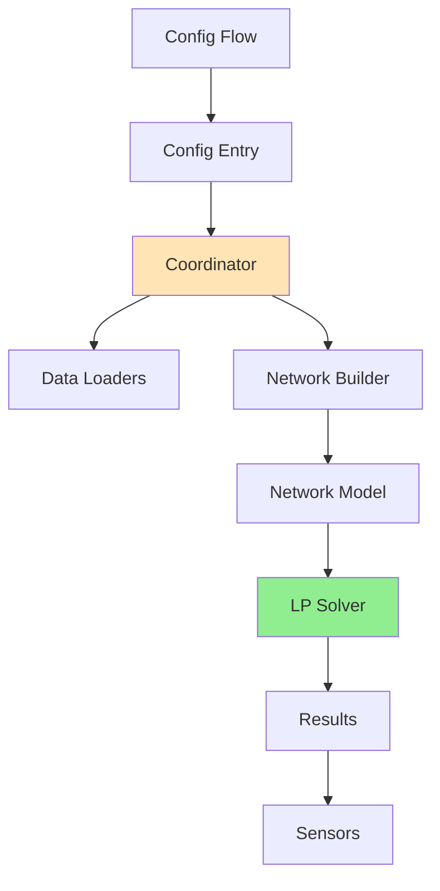

# Architecture

HAEO follows Home Assistant integration patterns with specialized optimization components.

## System Overview



## Core Components

### Config Flow (`config_flow.py`, `flows/`)

User-facing configuration via HA UI. Validates and stores entity/connection config.

### Config Entry

Persistent storage of network configuration (entities, connections, timing parameters).

### Coordinator (`coordinator.py`)

Central manager scheduling optimization cycles (default 5 min), loading data, building network, running solver, distributing results.

**Update cycle**:

1. Load sensor states and forecasts
2. Build network model from config
3. Run LP optimization
4. Extract and store results
5. Sensors auto-update

### Data Loaders (`data/loader/`)

- **Sensor Loader**: Current states from HA
- **Forecast Loader**: Merges multiple forecast sensors
- Aligns data with time grid

### Network Builder

Creates optimization model from config:

- Instantiates entity objects (Battery, Grid, etc.)
- Creates Connection objects
- Builds Network container
- Validates structure

### Network Model (`model/`)

LP representation:

- **Element**: Base class for entities
- **Battery, Grid, Photovoltaics, Load, Net**: Specific entities
- **Connection**: Power flow paths
- **Network**: Container with cost() and constraints() methods

### LP Solver

HiGHS (default) via PuLP. Solves minimization problem, returns optimal cost and variable values.

### Sensors (`sensor.py`)

Expose results to HA:

- Network sensors: cost, status, duration
- Entity sensors: power, energy, SOC
- All include forecast attributes

## Code Organization

```
custom_components/haeo/
├── __init__.py
├── config_flow.py
├── coordinator.py
├── sensor.py
├── const.py
├── schema.py
├── flows/
│   ├── config_entry.py
│   └── options.py
├── data/loader/
│   ├── sensor_loader.py
│   ├── forecast_loader.py
│   └── live_forecast_loader.py
├── model/
│   ├── element.py
│   ├── battery.py
│   ├── grid.py
│   ├── photovoltaics.py
│   ├── constant_load.py
│   ├── forecast_load.py
│   ├── net.py
│   ├── connection.py
│   └── network.py
└── types/
    ├── entity_config.py
    └── validation.py
```

## Extension Points

**Adding entity types**:

1. Create model class in `model/`
2. Add config schema in `types/`
3. Update network builder in `coordinator.py`
4. Add config flow step in `flows/`
5. Write tests

**Custom solvers**: Modify `network.py optimize()` method to support additional LP solvers.

## Related Documentation

- [Coordinator Guide](coordinator.md)
- [Energy Models](energy-models.md)
- [Testing](testing.md)
