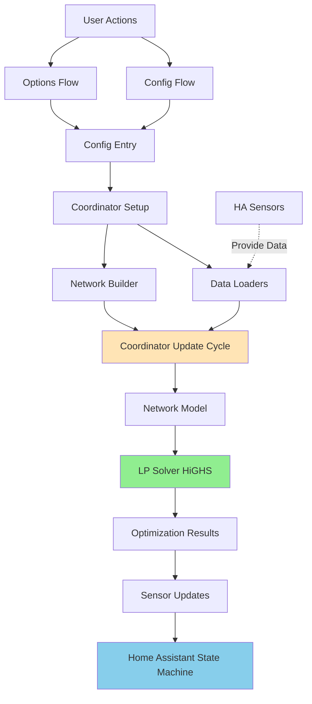
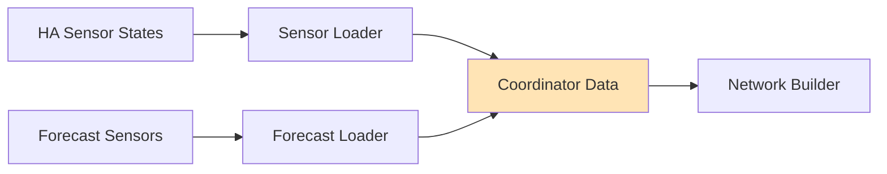
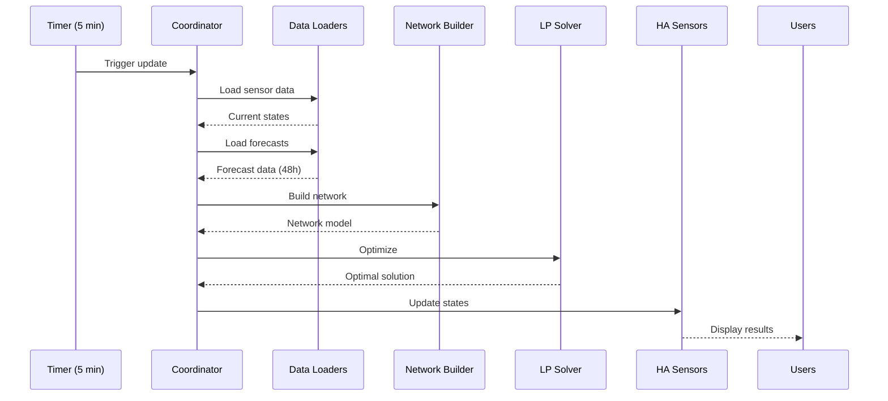
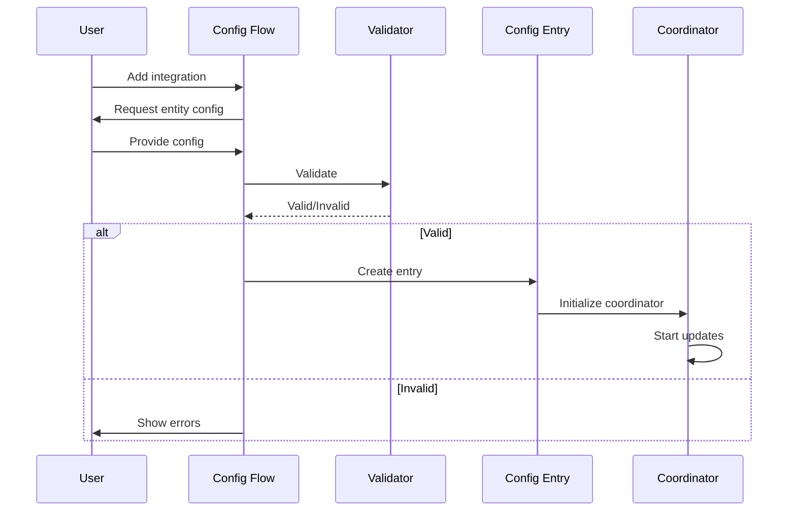
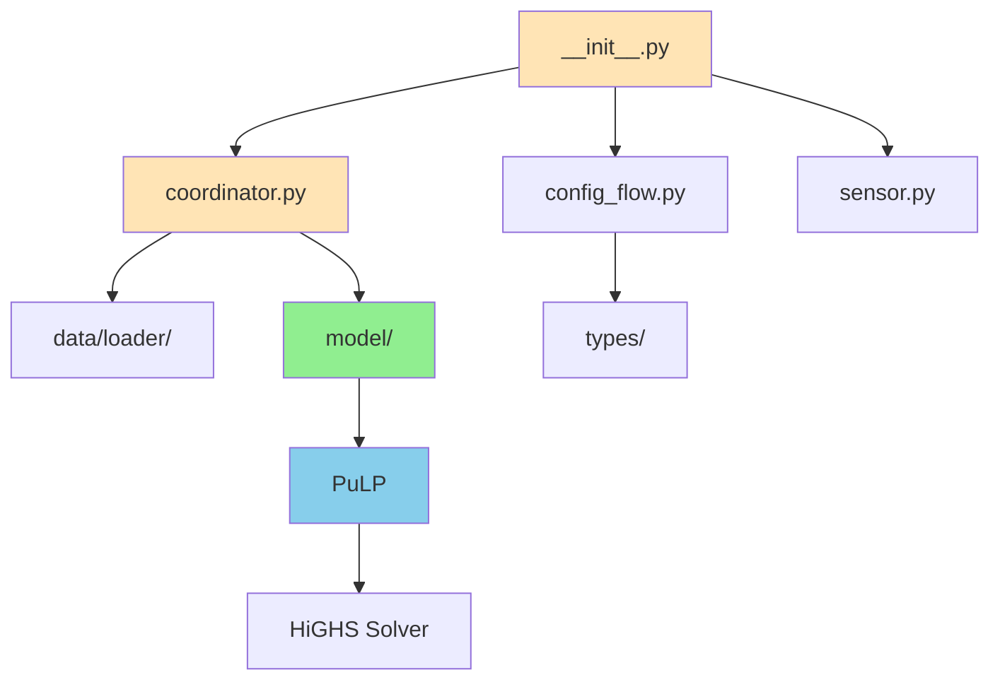

# Architecture

This page provides a comprehensive overview of HAEO's architecture, components, and data flow.

## Overview

HAEO follows Home Assistant's integration patterns while adding specialized optimization components.
The architecture is designed for:

- **Modularity**: Clear separation of concerns
- **Extensibility**: Easy to add new entity types
- **Performance**: Efficient data flow and optimization
- **Reliability**: Robust error handling and validation

## System Architecture



## Component Overview

### 1. Config Flow (`config_flow.py`, `flows/`)

**Purpose**: User-facing configuration through Home Assistant UI

**Responsibilities**:

- Initial integration setup
- Entity configuration (battery, grid, solar, loads, nets)
- Connection definition
- Configuration validation
- Multi-step wizard flow

**Key files**:

- `config_flow.py`: Main flow entry point
- `flows/options.py`: Options (editing) flow
- `flows/config_entry.py`: Config entry management helpers

**User interaction**:

1. User adds HAEO integration
2. Config flow guides through network setup
3. Entities and connections are configured
4. Validation ensures configuration is feasible
5. Config entry is created

### 2. Config Entry & Storage

**Purpose**: Persistent configuration storage

**Structure**:

```python
{
    "horizon_hours": 48,
    "period_minutes": 5,
    "optimizer": "highs",
    "participants": {
        "battery_1": {
            "type": "battery",
            "name": "Home Battery",
            "capacity": 10.0,
            # ... more config
        },
        "grid_1": {
            "type": "grid",
            "name": "Main Grid",
            # ... more config
        },
        # ... more participants
    },
    "connections": [
        {
            "source": "grid_1",
            "target": "main_net",
            "min_power": -10,
            "max_power": 100,
        },
        # ... more connections
    ]
}
```

**Updates**: Via options flow (not directly editable)

### 3. Coordinator (`coordinator.py`)

**Purpose**: Central update and optimization manager

**Class**: `HaeoDataUpdateCoordinator` extends `DataUpdateCoordinator`

**Responsibilities**:

- Schedule optimization cycles (default: 5 minutes)
- Load data from sensors and forecasts
- Build network model from configuration
- Run optimization solver
- Distribute results to sensors
- Handle errors and retries

**Update cycle**:

```python
async def _async_update_data(self) -> dict[str, Any]:
    # 1. Load current data (sensors, forecasts)
    data = await self._load_data()

    # 2. Build network model
    network = self._build_network(data)

    # 3. Run optimization
    cost = network.optimize(optimizer="HiGHS")

    # 4. Extract and return results
    return self._extract_results(network, cost)
```

**Update interval**: Fixed at initialization, not user-configurable (HA best practice)

### 4. Data Loaders (`data/loader/`)

**Purpose**: Load and prepare data for optimization

**Key loaders**:

- **Sensor Loader**: Reads current state from HA sensors
- **Forecast Loader**: Fetches and merges forecast data
- **Live Forecast Loader**: Handles real-time forecast updates

**Data flow**:



**Responsibilities**:

- Fetch sensor states
- Merge multiple forecast sensors
- Align forecasts with time grid
- Validate data completeness
- Handle missing or stale data

**Example**:

```python
# Load battery SOC
soc = await sensor_loader.get_state("sensor.battery_soc")

# Load grid price forecast
prices = await forecast_loader.get_forecast(
    ["sensor.price_today", "sensor.price_tomorrow"],
    horizon_hours=48,
    period_minutes=5
)
```

### 5. Network Builder

**Purpose**: Construct optimization model from configuration

**Process**:

1. Parse config entry
2. Create entity instances (Battery, Grid, etc.)
3. Create connection instances
4. Build Network object
5. Validate network structure

**Entity factory**:

```python
def create_entity(config: dict, period: float, n_periods: int) -> Element:
    entity_type = config["type"]

    if entity_type == "battery":
        return Battery(
            name=config["name"],
            period=period,
            n_periods=n_periods,
            capacity=config["capacity"],
            # ... more parameters
        )
    elif entity_type == "grid":
        return Grid(
            name=config["name"],
            period=period,
            n_periods=n_periods,
            import_limit=config.get("import_limit"),
            # ... more parameters
        )
    # ... more entity types
```

**Network validation**:

- All entities referenced in connections exist
- Network is connected (no isolated subgraphs)
- At least one source exists (grid or unlimited import)
- No duplicate entity names

### 6. Network Model (`model/`)

**Purpose**: Linear programming representation of energy system

**Key classes**:

- `Element`: Base class for all entities
- `Battery`: Energy storage model
- `Grid`: Import/export model
- `Photovoltaics`: Solar generation model
- `ConstantLoad`, `ForecastLoad`: Load models
- `Net`: Virtual balance node
- `Connection`: Power flow path
- `Network`: Container managing all components

**Model structure**:

```python
@dataclass
class Network:
    name: str
    period: float
    n_periods: int
    elements: dict[str, Element]
    connections: list[Connection]

    def cost(self) -> float:
        """Return total cost expression."""

    def constraints(self) -> list[LpConstraint]:
        """Return all optimization constraints."""

    def optimize(self, optimizer: str = "HiGHS") -> float:
        """Run optimization, return total cost."""

    def validate(self) -> None:
        """Validate network structure."""
```

**Linear programming formulation**:

- Decision variables: Power flows, energy levels
- Objective: Minimize total cost
- Constraints: Power balance, energy balance, limits

### 7. LP Solver Integration

**Purpose**: Solve optimization problem

**Solver**: HiGHS (default), also supports GLPK, CBC, Gurobi

**Integration via PuLP**:

```python
from pulp import LpProblem, LpMinimize, getSolver

# Create problem
prob = LpProblem("Energy_Optimization", LpMinimize)

# Add objective
prob += network.cost()

# Add constraints
for constraint in network.constraints():
    prob += constraint

# Solve
solver = getSolver("HiGHS")
status = prob.solve(solver)

# Extract results
optimal_cost = value(prob.objective)
```

**Solver selection**: Configurable in options, defaults to HiGHS

### 8. Sensors (`sensor.py`)

**Purpose**: Expose optimization results to Home Assistant

**Sensor types**:

**Network sensors** (one set per integration):

- `{network}_optimization_cost`: Total cost (\$)
- `{network}_optimization_status`: Status (optimal, infeasible, etc.)
- `{network}_optimization_duration`: Solve time (seconds)

**Entity sensors** (one set per entity):

- `{entity}_power`: Current power (kW)
- `{entity}_energy`: Energy level for batteries (kWh)
- `{entity}_soc`: State of charge for batteries (%)

**Sensor attributes**:

- `state`: Current period value
- `forecast`: Array of future values with timestamps

**Update mechanism**:

```python
class HaeoSensor(CoordinatorEntity, SensorEntity):
    def __init__(self, coordinator, entity_name, sensor_type):
        self.coordinator = coordinator
        self.entity_name = entity_name
        self.sensor_type = sensor_type

    @property
    def native_value(self):
        """Return current state from coordinator data."""
        return self.coordinator.data[self.entity_name][self.sensor_type][0]

    @property
    def extra_state_attributes(self):
        """Return forecast as attribute."""
        return {
            "forecast": self.coordinator.data[self.entity_name][self.sensor_type]
        }
```

### 9. Type System (`types/`)

**Purpose**: Configuration schemas and validation

**Key files**:

- `entity_config.py`: Entity configuration types
- `connection_config.py`: Connection configuration types
- `validation.py`: Validation functions

**Example**:

```python
from dataclasses import dataclass

@dataclass
class BatteryConfig:
    name: str
    capacity: float
    max_charge_power: float | None
    max_discharge_power: float | None
    efficiency: float = 0.99
    # ... more fields

    def validate(self) -> None:
        """Validate configuration."""
        if self.capacity <= 0:
            raise ValueError("Capacity must be positive")
        if not 0 < self.efficiency <= 1:
            raise ValueError("Efficiency must be between 0 and 1")
        # ... more validation
```

## Data Flow

### Optimization Cycle



### Configuration Flow



## Code Organization

### Directory Structure

```
custom_components/haeo/
├── __init__.py              # Integration entry point
├── config_flow.py           # Config flow main
├── coordinator.py           # Data update coordinator
├── sensor.py                # Sensor platform
├── const.py                 # Constants
├── schema.py                # Configuration schemas
│
├── flows/                   # Config flow components
│   ├── config_entry.py
│   └── options.py
│
├── data/                    # Data loading
│   └── loader/
│       ├── sensor_loader.py
│       ├── forecast_loader.py
│       └── live_forecast_loader.py
│
├── model/                   # Optimization model
│   ├── element.py           # Base entity class
│   ├── battery.py
│   ├── grid.py
│   ├── photovoltaics.py
│   ├── constant_load.py
│   ├── forecast_load.py
│   ├── net.py
│   ├── connection.py
│   └── network.py           # Network container
│
└── types/                   # Type definitions
    ├── entity_config.py
    ├── connection_config.py
    └── validation.py
```

### Module Dependencies



## Extension Points

### Adding New Entity Types

1. **Create entity class** in `model/`:

```python
class MyEntity(Element):
    def __init__(self, name: str, period: float, n_periods: int, **kwargs):
        # Initialize with power/energy variables
        super().__init__(
            name=name,
            period=period,
            n_periods=n_periods,
            power_consumption=...,  # LP variables or constants
            power_production=...,
        )

    def constraints(self) -> Sequence[LpConstraint]:
        # Add entity-specific constraints
        return [...]
```

2. **Add config schema** in `types/`:

```python
@dataclass
class MyEntityConfig:
    name: str
    parameter1: float
    parameter2: int
    # ... fields

    def validate(self) -> None:
        # Validation logic
        pass
```

3. **Update config flow** in `flows/`:

```python
# Add entity type option
ELEMENT_TYPES.append("my_entity")

# Add configuration step
async def async_step_configure_my_entity(self, user_input=None):
    # Configuration UI
    pass
```

4. **Update network builder** in `coordinator.py`:

```python
def _create_entity(config: dict) -> Element:
    if config["type"] == "my_entity":
        return MyEntity(
            name=config["name"],
            period=self.period,
            n_periods=self.n_periods,
            parameter1=config["parameter1"],
            # ... parameters
        )
```

5. **Add tests** in `tests/`:

```python
def test_my_entity():
    entity = MyEntity(name="test", period=1.0, n_periods=24, ...)
    assert entity is not None
    # ... more tests
```

### Customizing Solvers

Add new solver support:

```python
# In coordinator.py
SUPPORTED_SOLVERS = ["highs", "glpk", "cbc", "gurobi", "my_solver"]

# In network.py optimize method
def optimize(self, optimizer: str = "HiGHS") -> float:
    if optimizer.lower() == "my_solver":
        solver = getMySolver()
    else:
        solver = getSolver(optimizer)

    status = prob.solve(solver)
    # ... handle results
```

### Adding Sensor Types

Create new sensor for additional data:

```python
# In sensor.py
async def async_setup_entry(hass, entry, async_add_entities):
    coordinator = hass.data[DOMAIN][entry.entry_id]

    # Existing sensors
    sensors = [...]

    # New custom sensor
    sensors.append(
        MyCustomSensor(
            coordinator=coordinator,
            entity_name="my_data",
        )
    )

    async_add_entities(sensors)
```

## Performance Considerations

### Optimization Frequency

- Default: 5 minutes (matches period)
- Configurable via `update_interval` in coordinator
- Balance: Fresh results vs computational load

### Problem Size

- Variables: ~100-200 per entity per period
- 48-hour horizon, 5-min periods: ~4000 variables typical
- Solve time: 0.5-5 seconds for typical problems

### Memory Usage

- Forecast data: ~2-3 KB per sensor per horizon
- Network model: ~1-2 MB typical
- Minimal impact on Home Assistant

### Solver Performance

- HiGHS: Fastest, recommended
- GLPK: Slower, fallback option
- CBC: Similar to GLPK
- Gurobi: Commercial, requires license

## Error Handling

### Configuration Errors

- Validated in config flow before saving
- Re-validated before optimization
- Clear error messages to user

### Optimization Errors

- Infeasible: Network cannot satisfy all constraints
- Unbounded: Problem is not properly constrained (rare)
- Solver error: Numerical issues or solver failure

### Data Loading Errors

- Missing sensors: Skip optimization, report error
- Stale forecasts: Use last known or fallback
- Invalid data: Validation catches, clear error message

## Related Documentation

- [Coordinator Guide](coordinator.md) - Detailed coordinator implementation
- [Energy Models Guide](energy-models.md) - Creating new entity types
- [Testing Guide](testing.md) - Testing strategies
- [Units Documentation](units.md) - Why kW/kWh

## Next Steps

Explore specific architecture components:

- [Coordinator Implementation](coordinator.md) - Update cycle details
- [Energy Models](energy-models.md) - Entity type implementation
- [Testing](testing.md) - Test architecture

[:octicons-arrow-right-24: Continue to Coordinator Guide](coordinator.md)
