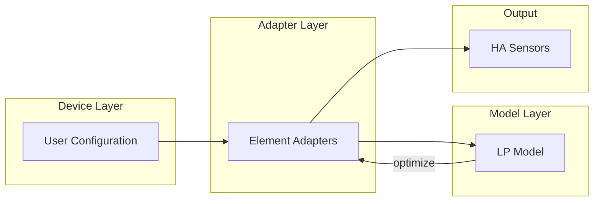
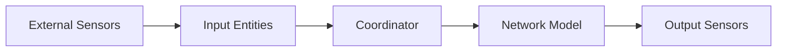

# Architecture

HAEO follows Home Assistant integration patterns with specialized optimization components.
This guide focuses on HAEO-specific architecture.
For Home Assistant fundamentals, see the [Home Assistant developer documentation](https://developers.home-assistant.io/).

## Layered Architecture

HAEO separates user configuration from mathematical modeling through two distinct layers:

**Device Layer**: User-configured elements (Battery, Grid, Solar, Load, Node, Connection) that integrate with Home Assistant sensors and present user-friendly outputs.

**Model Layer**: Mathematical building blocks that form the linear programming problem.

The [Adapter Layer](adapter-layer.md) transforms between these layers, enabling composition where a single Device Layer element creates multiple Model Layer elements and devices.

See [Modeling Documentation](../modeling/index.md) for detailed layer descriptions.

## System Overview

The system uses a two-phase platform setup:

1. **Input phase**: HorizonManager created, then Input Platforms (Number, Switch) load and expose configuration data
2. **Output phase**: Coordinator reads from input entities, runs optimization, and Output Platforms (Sensor) display results

## Core Components

### Config Flow (`config_flow.py`, `flows/`)

User-facing configuration via the Home Assistant UI.
The hub flow creates the main entry and exposes additional flows so users can add and manage elements without leaving the standard interface.

See the Home Assistant documentation for the underlying patterns:

- [Config Entries](https://developers.home-assistant.io/docs/config_entries_index/)
- [Config Flow Handler](https://developers.home-assistant.io/docs/config_entries_config_flow_handler/)
- [Data Entry Flow](https://developers.home-assistant.io/docs/data_entry_flow_index/)

### HorizonManager (`inputs/horizon_manager.py`)

Manages synchronized forecast time windows for all input entities.
Created early in setup before any entity platforms load.
Computes period boundaries from tier configuration and notifies subscribers when the horizon advances.

See the [Horizon Manager guide](horizon-manager.md) for details.

### Input Entities (`inputs/`)

Intermediate layer between external sensors and the optimization model.
Number and Switch entities load, transform, and expose configuration values with forecast attributes.
Operate in two modes: EDITABLE (user-configurable constants) or DRIVEN (values from external sensors).

See the [Input Entities guide](inputs.md) for details.

### Coordinator (`coordinator/`)

Event-driven manager that reads pre-loaded data from input entities, builds the network, runs optimization, and distributes results.
Each hub entry creates one coordinator instance.

The coordinator is organized as a module in `coordinator/`:

- `coordinator/coordinator.py`: Main coordinator class and optimization cycle
- `coordinator/network.py`: Network building functions (`create_network()`, `update_element()`)

See the [DataUpdateCoordinator documentation](https://developers.home-assistant.io/docs/integration_fetching_data/#coordinated-single-api-poll-for-data-for-all-entities) for the base pattern.
HAEO's coordinator reads from `runtime_data.inputs`, assembles the optimization network, runs the optimizer in an executor, and pushes the results back to sensor entities.
It triggers optimization on input entity state changes or horizon boundary crossings.

See the [Coordinator guide](coordinator.md) for event-driven update patterns.

### Data loaders (`data/`)

Data loaders translate Home Assistant sensor data into time series aligned with the optimization horizon.
Input entities call loaders to extract, combine, and fuse forecast data from external sensors.
Loaders also validate sensor availability during the config flow.
Keep new loaders focused on a single responsibility and reuse the shared parser utilities where possible.

See the [Data Loading guide](data-loading.md) for the extraction pipeline.

### Network Builder

Creates optimization model from config:

- Instantiates element objects (Battery, Grid, etc.)
- Creates Connection objects
- Builds Network container
- Validates structure

### Network Model (`model/`)

LP representation using HiGHS solver:

- **Element**: Base class with declarative constraint and cost specification
- **Network**: Container that aggregates element contributions and runs optimization

Model elements are organized in `model/elements/` subdirectory.
Elements declare their constraints and costs using decorators, and the network automatically aggregates them.

See [Modeling Documentation](../modeling/index.md) for mathematical formulations and element types.

### Optimization

Uses the HiGHS linear programming solver directly via the `highspy` Python bindings to solve the energy optimization problem.
Minimizes cost while respecting all constraints, returning optimal cost and decision variable values.

Elements use decorators to declare constraints and costs, which the network automatically aggregates.
When parameters update (like forecast changes), only affected constraints are rebuilt (warm start optimization).

### Sensors (`sensors/`)

Sensor entities expose optimization outputs through standard Home Assistant constructs.
Separate modules handle network-level metrics and per-element values, and every sensor carries a forecast attribute so downstream automations can look ahead.

See the Home Assistant documentation:

- [Entity creation](https://developers.home-assistant.io/docs/core/entity/)
- [Sensor entity](https://developers.home-assistant.io/docs/core/entity/sensor/)
- [Platform development](https://developers.home-assistant.io/docs/creating_platform_index/)
- [Device Registry](https://developers.home-assistant.io/docs/device_registry_index/)

### Model Architecture (`model/`)

Separate subsystem implementing the optimization model:

**Design principles**:

- Pure Python linear programming using HiGHS via `highspy`
- Declarative constraint and cost specification using decorators
- Elements declare their requirements; network aggregates automatically
- Parameter updates trigger selective constraint rebuilding (warm start)
- No Home Assistant dependencies in model layer

**Key components**:

- `Element`: Base class with declarative pattern
- `model/elements/`: Element implementations
- `model/reactive/`: Infrastructure for parameter tracking and constraint caching
- `Network`: Aggregates element contributions and runs optimization

See [Energy Models guide](energy-models.md) for implementing new elements and [Modeling Documentation](../modeling/index.md) for mathematical details.

## Code Organization

The integration lives under `custom_components/haeo/` and follows Home Assistant layout conventions.
Rather than documenting every file, focus on how the major areas collaborate:

- **Entry points**: `__init__.py`, `config_flow.py`, and `coordinator/` bootstrap the integration, collect user input, and run optimizations.
- **Flows (`flows/`)**: Houses hub, element, and options flows; each submodule owns the UI schema for a related group of entries.
- **Input layer (`inputs/`)**: HorizonManager, Number platform, Switch platform, and InputFieldInfo for intermediate input entities.
- **Data layer (`data/`)**: Loader modules turn Home Assistant sensors and forecasts into normalized time series. Called by input entities.
- **Model (`model/`)**: Pure Python optimization layer with declarative constraints and costs.
    - `model/elements/`: Model element implementations (Battery, Node, Connection types)
    - `model/reactive/`: Parameter tracking and constraint caching infrastructure
- **Metadata (`elements/` and `schema/`)**: Describe configuration defaults, validation, INPUT_FIELDS registry, and runtime metadata for every element type.
- **Presentation (`sensors/`)**: Builds sensor platforms that publish optimization results back to Home Assistant.
- **Translations (`translations/`)**: Provides user-facing strings for config flows and entity names.

## Extension Points

### Adding Element Types

1. **Create element subfolder** in `elements/{element_type}/`:

    - `__init__.py`: Public exports
    - `schema.py`: Define `ConfigSchema` and `ConfigData` TypedDicts
    - `flow.py`: Implement config flow with voluptuous schemas
    - `adapter.py`: Implement `available()`, `load()`, `create_model_elements()`, `outputs()`, and `INPUT_FIELDS` registry

2. **Register element type** in `elements/__init__.py`:

    - Add `ElementRegistryEntry` to `ELEMENT_TYPES` mapping

3. **Update translations** in `translations/en.json`:

    - Add device and selector entries

4. **Write tests** in `tests/elements/{element_type}/`:

    - `test_adapter.py`: Tests for `available()` and `load()` functions
    - `test_flow.py`: Config flow tests for user and reconfigure steps
    - Add test data in `tests/flows/test_data/{element_type}.py`

5. **Document** the element:

    - User guide in `docs/user-guide/elements/{element_type}.md`
    - Modeling docs in `docs/modeling/device-layer/{element_type}.md`

### Custom Field Types

Extend `schema/fields.py`:

- Create new Validator subclass with `create_schema()` method
- Add LoaderMeta subclass if needed for custom loading behavior
- Define field type aliases composing Validator, LoaderMeta, and optional Default

## Related Documentation

- :material-timer-outline:{ .lg .middle } **Horizon Manager**

    ---

    Synchronized forecast time windows.

    [:material-arrow-right: Horizon manager guide](horizon-manager.md)

- :material-import:{ .lg .middle } **Input Entities**

    ---

    Intermediate input entity layer.

    [:material-arrow-right: Input entities guide](inputs.md)

- :material-sync:{ .lg .middle } **Coordinator Guide**

    ---

    Event-driven update patterns.

    [:material-arrow-right: Coordinator guide](coordinator.md)

- :material-network:{ .lg .middle } **Energy Models**

    ---

    Network entities and constraints.

    [:material-arrow-right: Energy models](energy-models.md)

- :material-test-tube:{ .lg .middle } **Testing**

    ---

    Testing patterns and fixtures.

    [:material-arrow-right: Testing guide](testing.md)

