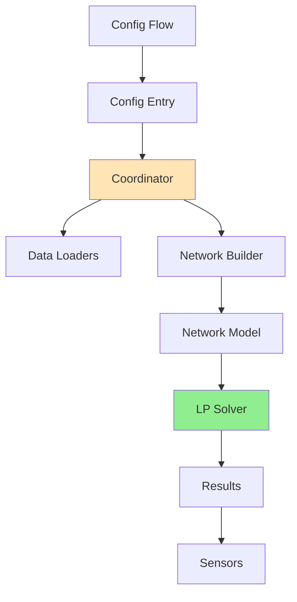

# Architecture

HAEO follows Home Assistant integration patterns with specialized optimization components.
This guide focuses on HAEO-specific architecture.
For Home Assistant fundamentals, see the [Home Assistant developer documentation](https://developers.home-assistant.io/).

## System Overview



## Core Components

### Config Flow (`config_flow.py`, `flows/`)

User-facing configuration via HA UI.
HAEO uses Home Assistant's **ConfigSubentry architecture** where elements are managed as subentries of the main hub entry.

**Entry Types**:

- **Hub Entry**: Main coordination entry containing optimization settings
- **ConfigSubentries**: Elements (network, battery, grid, etc.) managed as subentries via `ConfigSubentryFlow`

This architecture provides:

- Independent configuration of each element through HA's native subentry UI
- Automatic parent-child relationship management by Home Assistant
- Easy addition/removal of elements via the UI
- Proper device registry association with subentry IDs
- No manual `parent_entry_id` tracking needed

See: [Config Entries documentation](https://developers.home-assistant.io/docs/config_entries_index)

### Config Entry

**Hub Entry Storage**:

- `data`: Stores only `integration_type: "hub"` marker
- `options`: Stores optimization settings (horizon_hours, period_minutes, optimizer)
- `subentries`: Dictionary of ConfigSubentry objects (managed by Home Assistant)

**Element ConfigSubentry Storage**:

- `data`: Stores element configuration (name_value, capacity, sensors, defaults, etc.)
- `subentry_type`: Element type identifier (battery, grid, photovoltaics, etc.)
- `subentry_id`: Unique identifier for this subentry
- `title`: Display name for the element

Parent-child relationship is maintained by Home Assistant through the hub entry's `subentries` property.
No `parent_entry_id` is stored in subentry data.

HA loads this data on startup to recreate the integration state.

### Coordinator (`coordinator.py`)

Central manager scheduling optimization cycles (default 5 min), loading data, building network, running solver, distributing results.
Each hub entry creates one coordinator instance.

See: [Data Update Coordinator documentation](https://developers.home-assistant.io/docs/integration_fetching_data)

**Update cycle**:

1. Access subentries via `config_entry.subentries` property
2. Check sensor availability (wait if not ready)
3. Load sensor states and forecasts via data loaders
4. Build network model from subentry configs using `load_network()`
5. Run LP optimization in executor thread
6. Extract and store results
7. Sensors auto-update via coordinator pattern

**HAEO-specific features**:

- Accesses subentries directly through the hub entry's `subentries` dictionary
- State change listeners trigger optimization when configured sensors change
- Waits for all configured sensors before first optimization
- Handles dynamic addition/removal of element subentries automatically

### Data Loaders (`data/`)

The `data` module provides a sophisticated loading system with two modes:

- **Schema mode**: For config flow validation (Voluptuous schemas)
- **Data mode**: For runtime data loading from Home Assistant

**Loader types** (`data/loader/`):

- `ConstantLoader`: Static numeric values
- `SensorLoader`: Live sensor states
- `ForecastLoader`: Forecast data from sensors
- `ForecastAndSensorLoader`: Combines live + forecast data

**Forecast parsing** (`data/loader/forecast_parsers/`): Auto-detects and parses various forecast formats (attribute-based, event-based).

### Network Builder

Creates optimization model from config:

- Instantiates element objects (Battery, Grid, etc.)
- Creates Connection objects
- Builds Network container
- Validates structure

### Network Model (`model/`)

LP representation using PuLP:

- **Element**: Base class for all model elements with power/energy variables
- **Battery**: Storage with charge/discharge power, SOC constraints
- **Grid**: Import/export with optional limits and pricing
- **Photovoltaics**: Solar generation with optional curtailment
- **ConstantLoad, ForecastLoad**: Consumption elements
- **Node**: Virtual balance point enforcing Kirchhoff's law
- **Connection**: Power flow path with optional min/max limits
- **Network**: Container with `optimize()`, `cost()`, and `constraints()` methods

### LP Solver

Multiple solvers supported via PuLP:

- **HiGHS** (default): Fast, open-source, no external dependencies
- **CBC, GLPK, COIN-OR, SCIP, CyLP**: Alternative solvers

Solves linear programming minimization problem, returns optimal cost and decision variable values.

### Sensors (`sensors/`)

Modular sensor platform exposing optimization results to Home Assistant.

See: [Sensor entity documentation](https://developers.home-assistant.io/docs/core/entity/sensor)

**Optimization sensors** (`sensors/optimization.py`):
- Cost, status, duration

**Element sensors**:
- Power (`sensors/power.py`): Current power flow
- Energy (`sensors/energy.py`): Cumulative energy
- SOC (`sensors/soc.py`): Battery state of charge
- Cost (`sensors/cost.py`): Element-specific costs

**Forecast format**: All sensors include `forecast` attribute as `{timestamp: value}` dictionary.

**Device Registration**: Two-phase device creation ensures proper subentry association:

1. **Pre-register devices** (`async_register_devices()`): Creates devices with `config_subentry_id` parameter before entities
2. **Link entities to devices**: Sensors fetch `DeviceEntry` from registry and set `self.device_entry` attribute
3. Home Assistant platform recognizes the device_entry and links entities without auto-creating duplicate devices

This prevents devices from appearing in "Devices that don't belong to a sub-entry" and ensures single device per element.

### Model Architecture (`model/`)

Separate subsystem implementing the optimization model:

**Design principles**:
- Pure Python linear programming using PuLP
- Elements generate their own variables and constraints
- Network assembles elements and runs solver
- No Home Assistant dependencies in model layer

**Key components**:
- `Element`: Base class with power/energy variable patterns
- Entity classes: Battery, Grid, Photovoltaics, Loads, Node
- `Connection`: Power flow with limits
- `Network`: Container with `optimize()` method

## Code Organization

```
custom_components/haeo/
├── __init__.py              # Integration entry point
├── config_flow.py           # Config flow coordinator
├── coordinator.py           # Data update coordinator
├── sensor.py                # Sensor platform setup
├── const.py                 # Constants and defaults
├── manifest.json            # Integration metadata
├── py.typed                 # Type checking marker
├── flows/                   # Config flow implementations
│   ├── __init__.py
│   ├── hub.py              # Hub config flow
│   ├── options.py          # Options flow handler
│   └── elements/           # Per-element config flows
├── data/                    # Data loading system
│   ├── __init__.py         # load_network() entry point
│   └── loader/             # Loader implementations
│       ├── __init__.py
│       ├── constant_loader.py
│       ├── sensor_loader.py
│       ├── forecast_loader.py
│       ├── forecast_and_sensor_loader.py
│       └── forecast_parsers/
├── model/                   # Optimization model
│   ├── __init__.py
│   ├── element.py          # Base element class
│   ├── battery.py
│   ├── grid.py
│   ├── photovoltaics.py
│   ├── constant_load.py
│   ├── forecast_load.py
│   ├── net.py              # Node entity
│   ├── connection.py
│   └── network.py          # Network container
├── schema/                  # Schema/validation system
│   ├── __init__.py
│   └── fields.py           # Field metadata and loaders
├── sensors/                 # Sensor implementations
│   ├── __init__.py
│   ├── base.py             # Base sensor class
│   ├── optimization.py     # Network-level sensors
│   ├── power.py
│   ├── energy.py
│   ├── soc.py
│   ├── cost.py
│   └── types.py
├── types/                   # TypedDict configurations
│   ├── __init__.py
│   ├── battery.py
│   ├── grid.py
│   ├── photovoltaics.py
│   ├── constant_load.py
│   ├── forecast_load.py
│   ├── net.py
│   └── connection.py
└── translations/            # i18n strings
    └── en.json
```

## Extension Points

### Adding Element Types

1. **Create model class** in `model/`:
   - Inherit from `Element`
   - Define power/energy variables
   - Implement `cost()` and `constraints()` methods

2. **Add TypedDict configs** in `types/`:
   - `*ConfigSchema`: For config flow validation
   - `*ConfigData`: For runtime with loaded values
   - Define field metadata using annotations

3. **Register element type** in `types/__init__.py`:
   - Add to `ELEMENT_TYPES` mapping

4. **Create config flow** in `flows/elements/`:
   - Inherit from appropriate base
   - Implement validation and schema generation

5. **Update translations** in `translations/en.json`:
   - Add device and selector entries

6. **Write tests**:
   - Model tests in `tests/test_model.py`
   - Config flow tests in `tests/flows/`
   - Integration tests

### Custom Solvers

Add solver support in `model/network.py`:

- Map solver names in `const.py`
- Add solver validation
- Update `optimize()` to handle new solver options

### Custom Field Types

Extend `schema/fields.py`:

- Create new `FieldMeta` subclass
- Define validation schema
- Implement loader logic
- Register with field type system

## Related Documentation

- [Coordinator Guide](coordinator.md)
- [Energy Models](energy-models.md)
- [Testing](testing.md)
