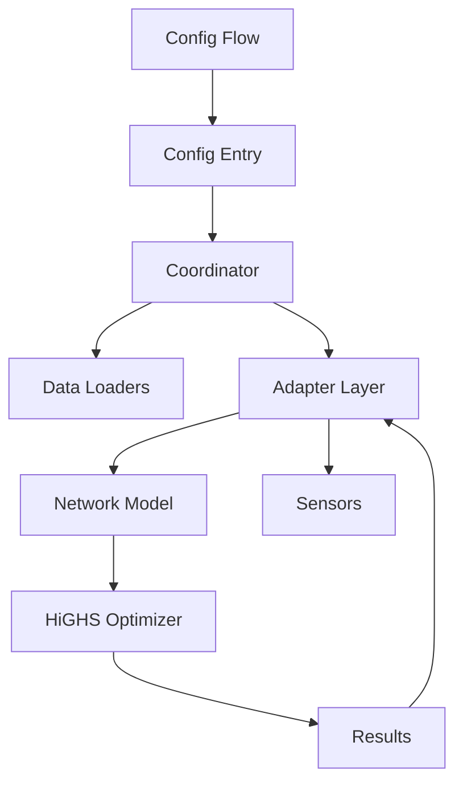

# Architecture

HAEO follows Home Assistant integration patterns with specialized optimization components.
This guide focuses on HAEO-specific architecture.
For Home Assistant fundamentals, see the [Home Assistant developer documentation](https://developers.home-assistant.io/).

## Layered Architecture

HAEO separates user configuration from mathematical modeling through two distinct layers:

**Device Layer**: User-configured elements (Battery, Grid, Solar, Load, Node, Connection) that integrate with Home Assistant sensors and present user-friendly outputs.

**Model Layer**: Mathematical building blocks that form the linear programming problem.

The [Adapter Layer](adapter-layer.md) transforms between these layers, enabling composition where a single Device Layer element creates multiple Model Layer elements and devices.

See [Modeling Documentation](../modeling/index.md) for detailed layer descriptions.

## System Overview

## Core Components

### Config Flow (`config_flow.py`, `flows/`)

User-facing configuration via the Home Assistant UI.
The hub flow creates the main entry and exposes additional flows so users can add and manage elements without leaving the standard interface.

See the Home Assistant documentation for the underlying patterns:

- [Config Entries](https://developers.home-assistant.io/docs/config_entries_index/)
- [Config Flow Handler](https://developers.home-assistant.io/docs/config_entries_config_flow_handler/)
- [Data Entry Flow](https://developers.home-assistant.io/docs/data_entry_flow_index/)

### Coordinator (`coordinator.py`)

Central manager scheduling optimization cycles (default 5 min), loading data, building network, running optimization, distributing results.
Each hub entry creates one coordinator instance.

See the [DataUpdateCoordinator documentation](https://developers.home-assistant.io/docs/integration_fetching_data/#coordinated-single-api-poll-for-data-for-all-entities) for the base pattern.
HAEO's coordinator gathers sensor values, assembles the optimization network, runs the optimizer in an executor, and pushes the results back to the entities.
It listens for element additions or removals and triggers a refresh whenever the underlying data changes.

### Data loaders (`data/`)

Data loaders translate configuration into time series the model can consume.
They validate values during the config flow and fetch real sensor data at runtime, including support for common forecast formats.
Keep new loaders focused on a single responsibility and reuse the shared parser utilities where possible.

### Network Builder

Creates optimization model from config:

- Instantiates element objects (Battery, Grid, etc.)
- Creates Connection objects
- Builds Network container
- Validates structure

### Network Model (`model/`)

LP representation using HiGHS:

- **Element**: Base class for all model elements with power/energy variables
- **Battery**: Storage with charge/discharge power, SOC constraints
- **Grid**: Import/export with optional limits and pricing
- **Solar**: Solar generation with optional curtailment
- **ConstantLoad, ForecastLoad**: Consumption elements
- **Node**: Virtual balance point enforcing Kirchhoff's law
- **Connection**: Power flow path with optional min/max limits
- **Network**: Container with `build()`, `optimize()`, and `cost()` methods

### Optimization

Uses the HiGHS linear programming solver directly via the `highspy` Python bindings to solve the energy optimization problem.
Minimizes cost while respecting all constraints, returning optimal cost and decision variable values.

### Sensors (`sensors/`)

Sensor entities expose optimization outputs through standard Home Assistant constructs.
Separate modules handle network-level metrics and per-element values, and every sensor carries a forecast attribute so downstream automations can look ahead.

See the Home Assistant documentation:

- [Entity creation](https://developers.home-assistant.io/docs/core/entity/)
- [Sensor entity](https://developers.home-assistant.io/docs/core/entity/sensor/)
- [Platform development](https://developers.home-assistant.io/docs/creating_platform_index/)
- [Device Registry](https://developers.home-assistant.io/docs/device_registry_index/)

### Model Architecture (`model/`)

Separate subsystem implementing the optimization model:

**Design principles**:

- Pure Python linear programming using HiGHS via `highspy`
- Elements generate their own variables and constraints
- Network assembles elements and runs optimization
- No Home Assistant dependencies in model layer

**Key components**:

- `Element`: Base class with power/energy variable patterns
- Entity classes: Battery, Grid, Solar, Loads, Node
- `Connection`: Base class for power flow between elements
- `PowerConnection`: Connection with limits, efficiency, and pricing
- `Network`: Container with `optimize()` method

## Code Organization

The integration lives under `custom_components/haeo/` and follows Home Assistant layout conventions.
Rather than documenting every file, focus on how the major areas collaborate:

- **Entry points**: `__init__.py`, `config_flow.py`, and `coordinator.py` bootstrap the integration, collect user input, and run optimizations on schedule.
- **Flows (`flows/`)**: Houses hub, element, and options flows; each submodule owns the UI schema for a related group of entries.
- **Data layer (`data/`)**: Loader modules turn Home Assistant sensors and forecasts into normalized time series for the optimizer.
- **Model (`model/`)**: Pure Python optimization layer composed of elements, connections, and network orchestration.
- **Metadata (`elements/` and `schema/`)**: Describe configuration defaults, validation, and runtime metadata for every element type.
- **Presentation (`sensors/`)**: Builds coordinator entities and sensor platforms that publish optimization results back to Home Assistant.
- **Translations (`translations/`)**: Provides user-facing strings for config flows and entity names.

## Extension Points

### Adding Element Types

1. **Create element subfolder** in `elements/{element_type}/`:

    - `__init__.py`: Public exports
    - `schema.py`: Define `ConfigSchema` and `ConfigData` TypedDicts
    - `flow.py`: Implement config flow with voluptuous schemas
    - `adapter.py`: Implement `available()`, `load()`, `create_model_elements()`, `outputs()`

2. **Register element type** in `elements/__init__.py`:

    - Add `ElementRegistryEntry` to `ELEMENT_TYPES` mapping

3. **Update translations** in `translations/en.json`:

    - Add device and selector entries

4. **Write tests** in `tests/elements/{element_type}/`:

    - `test_adapter.py`: Tests for `available()` and `load()` functions
    - `test_flow.py`: Config flow tests for user and reconfigure steps
    - Add test data in `tests/flows/test_data/{element_type}.py`

5. **Document** the element:

    - User guide in `docs/user-guide/elements/{element_type}.md`
    - Modeling docs in `docs/modeling/device-layer/{element_type}.md`

### Custom Field Types

Extend `schema/fields.py`:

- Create new Validator subclass with `create_schema()` method
- Add LoaderMeta subclass if needed for custom loading behavior
- Define field type aliases composing Validator, LoaderMeta, and optional Default

## Related Documentation

- :material-sync:{ .lg .middle } **Coordinator Guide**

    ---

    Data update coordination patterns.

    [:material-arrow-right: Coordinator guide](coordinator.md)

- :material-network:{ .lg .middle } **Energy Models**

    ---

    Network entities and constraints.

    [:material-arrow-right: Energy models](energy-models.md)

- :material-test-tube:{ .lg .middle } **Testing**

    ---

    Testing patterns and fixtures.

    [:material-arrow-right: Testing guide](testing.md)

