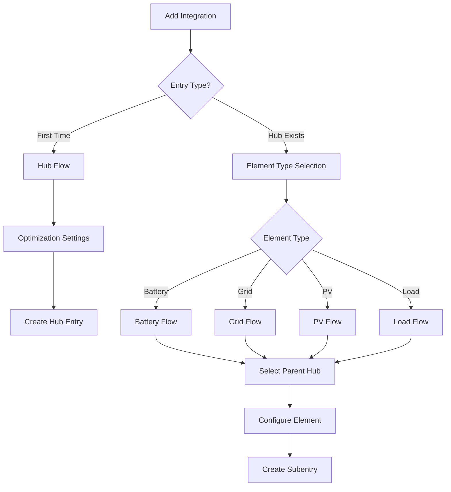

# Configuration Flow Development

Guide to HAEO's ConfigSubentry-based configuration flow implementation.

## Overview

HAEO uses Home Assistant's **ConfigSubentry architecture** where each element is managed as a subentry:

1. **Hub flow** (in `custom_components/haeo/flows/hub.py`): Creates main hub entry with optimization settings
2. **Element flows** (in `custom_components/haeo/flows/element.py`): Creates element ConfigSubentries using `ConfigSubentryFlow`
3. **Network subentry**: Automatically created representing the optimization network itself

This architecture follows Home Assistant's native [subentry pattern](https://developers.home-assistant.io/docs/config_entries_config_flow_handler/).
Elements appear as subentries under the main hub in the UI with proper parent-child management.

For general information on config flows, see the [Home Assistant Config Flow documentation](https://developers.home-assistant.io/docs/config_entries_config_flow_handler/) and [Data Entry Flow](https://developers.home-assistant.io/docs/data_entry_flow_index/).

### Architecture Benefits

- Native Home Assistant subentry UI integration
- Automatic parent-child relationship management
- Independent configuration of each element
- Proper device registry association via `config_subentry_id`
- Easy addition/removal through native UI
- No manual `parent_entry_id` tracking required

## Architecture



## Hub Flow

The hub flow creates the main integration entry that acts as a parent for element subentries and hosts the optimization coordinator.

### Hub entry structure

Hub entries are identified by the presence of `integration_type: "hub"` in their data:

```python
{
    "entry_id": "abc123...",
    "domain": "haeo",
    "title": "Home Energy System",
    "data": {
        "integration_type": "hub"  # Marker to identify hub entries
    },
    "options": {
        "horizon_hours": 48,
        "period_minutes": 5
    }
}
```

Optimization settings are stored in `options` (user-editable), while the hub marker is stored in `data` (immutable).
The hub flow implementation is in `custom_components/haeo/flows/hub.py`.

### Key implementation points

- Hub flow uses standard config flow pattern with user step
- Prevents duplicate hub names by checking existing entries
- Stores optimization settings in `options` for later editing via options flow
- Hub marker in `data` allows coordinator to identify hub entries

## Element Flows

Element subentries are created through separate config flows, one per element type.
All element flows inherit from a common base class that handles parent hub selection and entry creation.

### Element entry structure

Element entries link to their parent hub via `parent_entry_id`:

```python
{
    "entry_id": "def456...",
    "domain": "haeo",
    "title": "Home Battery",
    "data": {
        "element_type": "battery",
        "parent_entry_id": "abc123...",  # Links to hub entry
        "capacity": 13500,
        "charge_power": 5000,
        # ... element-specific configuration
    }
}
```

### Base element flow pattern

All element flows extend `ElementConfigFlow` which provides:

- Parent hub selection (auto-selects if only one hub exists)
- Entry creation with proper parent linkage
- Duplicate prevention
- Standard error handling

The element flow base class is in `custom_components/haeo/flows/element.py`.

### Element-specific implementations

Each element type has its own flow class in `custom_components/haeo/flows/`:

- `BatteryConfigFlow` - Battery element configuration
- `GridConfigFlow` - Grid connection configuration
- `PhotovoltaicsConfigFlow` - PV system configuration
- `ConstantLoadConfigFlow` - Constant load configuration
- `ForecastLoadConfigFlow` - Forecast-based load configuration
- `NodeConfigFlow` - Network node configuration

Each flow defines element-specific schema fields, defaults, and validation logic.## Options Flow

The options flow allows users to edit hub optimization settings after initial setup.
Elements are managed as separate config entries (added/edited/removed through the main integration flow), not through the options flow.

The options flow implementation is in `custom_components/haeo/flows/hub.py`.

### Key points

- Options flow only edits hub-level optimization settings (horizon, period, solver)
- Element configuration happens via separate config entries
- Settings stored in `config_entry.options` (not `data`)
- Changes trigger coordinator reload to apply new parameters

## Element Management

Elements are not managed through the hub's options flow.
Instead, users add/edit/remove elements as independent config entries through the main "Add Integration" flow.

### User workflow

**Adding elements:**
1. Navigate to **Settings** → **Devices & Services**
2. Click **Add Integration**
3. Search for "HAEO"
4. Select element type (battery, grid, etc.)
5. Choose parent hub
6. Configure element parameters

**Editing elements:**
1. Find the element entry in **Devices & Services**
2. Click **Configure** on the element entry
3. Modify parameters
4. Submit changes

**Removing elements:**
1. Find the element entry in **Devices & Services**
2. Click the three-dot menu
3. Select **Delete**

The hub coordinator automatically detects element changes on the next update cycle.
See [user configuration guide](../user-guide/configuration.md) for end-user instructions.

## Testing Config Flow

Config flow testing uses Home Assistant's [testing fixtures](https://developers.home-assistant.io/docs/development_testing/#test-fixtures) and follows standard patterns.

Comprehensive test coverage is in `tests/test_config_flow.py`, including:

- Hub flow success and duplicate prevention
- Element flow with hub selection
- Options flow for editing settings
- Error handling scenarios
- Validation logic

Example test pattern:

```python
async def test_hub_flow_success(hass: HomeAssistant) -> None:
    """Test successful hub creation."""
    result = await hass.config_entries.flow.async_init(
        DOMAIN, context={"source": config_entries.SOURCE_USER}
    )

    result = await hass.config_entries.flow.async_configure(
        result["flow_id"],
        user_input={CONF_NAME: "Test Hub", CONF_HORIZON_HOURS: 48},
    )

    assert result["type"] == FlowResultType.CREATE_ENTRY
    assert result["data"] == {INTEGRATION_TYPE: INTEGRATION_TYPE_HUB}
```


## Related Documentation

- [Architecture](architecture.md) - Overall system design
- [Data Loading](data-loading.md) - Field types and data validation
- [Energy Models](energy-models.md) - Element type implementations
- [Testing](testing.md) - Testing patterns for config flows
- [User Configuration Guide](../user-guide/configuration.md) - End-user configuration instructions
- [Home Assistant Config Flow](https://developers.home-assistant.io/docs/config_entries_config_flow_handler/) - Upstream pattern documentation
- [Data Entry Flow](https://developers.home-assistant.io/docs/data_entry_flow_index/) - Flow framework reference
