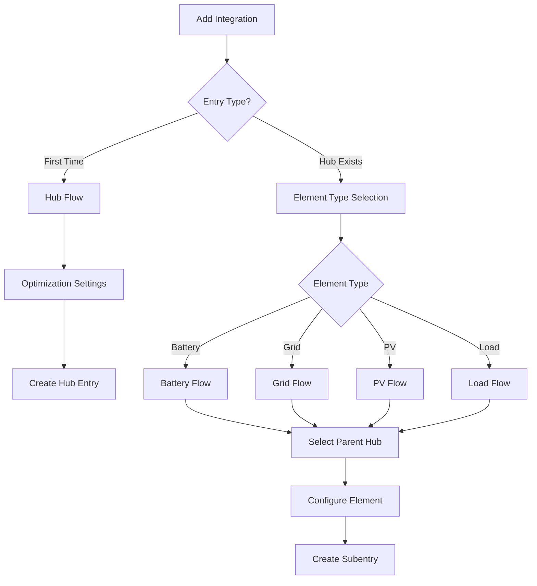

# Configuration Flow Development

Guide to HAEO's ConfigSubentry-based configuration flow implementation.

## Overview

HAEO uses Home Assistant's **ConfigSubentry architecture** where each element is managed as a subentry:

1. **Hub flow** (`flows/hub.py`): Creates main hub entry with optimization settings
2. **Element flows** (`flows/element.py`): Creates element ConfigSubentries using `ConfigSubentryFlow`
3. **Network subentry**: Automatically created representing the optimization network itself

This architecture follows Home Assistant's native subentry pattern.
Elements appear as subentries under the main hub in the UI with proper parent-child management.

### Architecture Benefits

- Native Home Assistant subentry UI integration
- Automatic parent-child relationship management
- Independent configuration of each element
- Proper device registry association via `config_subentry_id`
- Easy addition/removal through native UI
- No manual `parent_entry_id` tracking required

## Architecture



## Hub Flow

### Hub Entry Structure

```python
# Hub entry in config registry
{
    "entry_id": "abc123...",
    "domain": "haeo",
    "title": "Home Energy System",
    "data": {
        "integration_type": "hub"  # Marker to identify hub entries
    },
    "options": {
        "horizon_hours": 48,
        "period_minutes": 5,
        "optimizer": "highs"
    }
}
```

### Step 1: User Input

Collects basic optimization parameters:

```python
class HubConfigFlow(ConfigFlow):
    """Handle hub entry creation."""

    async def async_step_user(
        self, user_input: dict[str, Any] | None = None
    ) -> ConfigFlowResult:
        """Handle hub creation."""
        if user_input is None:
            return self.async_show_form(
                step_id="user",
                data_schema=vol.Schema(
                    {
                        vol.Required(CONF_NAME, default="HAEO"): str,
                        vol.Required(CONF_HORIZON_HOURS, default=48): vol.All(
                            vol.Coerce(int), vol.Range(min=1, max=168)
                        ),
                        vol.Required(CONF_PERIOD_MINUTES, default=5): vol.All(
                            vol.Coerce(int), vol.Range(min=1, max=60)
                        ),
                        vol.Optional(CONF_OPTIMIZER, default="highs"): vol.In(
                            ["highs", "cbc", "glpk"]
                        ),
                    }
                ),
            )

        # Prevent duplicate names
        existing_entries = self._async_current_entries()
        for entry in existing_entries:
            if entry.data.get("integration_type") == "hub" and entry.title == user_input[CONF_NAME]:
                return self.async_abort(reason="already_configured")

        # Create hub entry
        return self.async_create_entry(
            title=user_input[CONF_NAME],
            data={"integration_type": INTEGRATION_TYPE_HUB},  # Marker only
            options={
                CONF_HORIZON_HOURS: user_input[CONF_HORIZON_HOURS],
                CONF_PERIOD_MINUTES: user_input[CONF_PERIOD_MINUTES],
                CONF_OPTIMIZER: user_input[CONF_OPTIMIZER],
            },
        )
```

**Key points**:

- Stores `integration_type: "hub"` marker in `data` to identify hub entries
- Stores all optimization settings in `options` (user-editable via options flow)
- No element data stored - elements are separate subentries
- Hub acts as parent for coordinator and subentry discovery

## Element Flows

Element subentries are created through separate config flows, one per element type.
All element flows inherit from a common base class.

### Element Entry Structure

```python
# Battery subentry example
{
    "entry_id": "def456...",
    "domain": "haeo",
    "title": "Home Battery",
    "data": {
        "element_type": "battery",
        "parent_entry_id": "abc123...",  # Links to hub entry
        "capacity": 13500,
        "charge_power": 5000,
        "discharge_power": 5000,
        "efficiency": 0.95,
        "initial_soc_sensor": "sensor.battery_soc"
    }
}
```

### Base Element Flow

All element flows extend `ElementConfigFlow`:

```python
class ElementConfigFlow(ConfigFlow):
    """Base class for element subentry flows."""

    def __init__(self) -> None:
        """Initialize element flow."""
        self.element_type: str = ""  # Set by subclass
        self.defaults: dict[str, Any] = {}  # Default values
        self.schema_fields: dict[str, Any] = {}  # Schema definition

    async def async_step_user(
        self, user_input: dict[str, Any] | None = None
    ) -> ConfigFlowResult:
        """Handle element creation."""
        if user_input is None:
            # First step: select parent hub
            return await self._async_step_select_hub()

        # Second step: configure element
        return await self._async_step_configure_element(user_input)

    async def _async_step_select_hub(self) -> ConfigFlowResult:
        """Let user select which hub this element belongs to."""
        # Find all hub entries
        hub_entries = [
            entry
            for entry in self._async_current_entries()
            if entry.data.get("integration_type") == INTEGRATION_TYPE_HUB
        ]

        if not hub_entries:
            return self.async_abort(reason="no_hub")

        if len(hub_entries) == 1:
            # Auto-select single hub
            self.parent_entry_id = hub_entries[0].entry_id
            return await self._async_step_configure_element(None)

        # Multiple hubs - let user choose
        return self.async_show_form(
            step_id="select_hub",
            data_schema=vol.Schema(
                {
                    vol.Required("parent_entry_id"): vol.In(
                        {entry.entry_id: entry.title for entry in hub_entries}
                    )
                }
            ),
        )
```

### Element-Specific Implementation

Each element type has its own flow class:

```python
class BatteryConfigFlow(ElementConfigFlow):
    """Handle battery subentry creation."""

    def __init__(self) -> None:
        """Initialize battery flow."""
        super().__init__()
        self.element_type = "battery"
        self.defaults = {
            "capacity": 13500,  # Wh
            "charge_power": 5000,  # W
            "discharge_power": 5000,  # W
            "efficiency": 0.95,
        }
        self.schema_fields = {
            "capacity": "Capacity (Wh)",
            "charge_power": "Charge Power (W)",
            "discharge_power": "Discharge Power (W)",
            "efficiency": "Round-trip Efficiency",
            "initial_soc_sensor": "Initial SOC Sensor",
        }
```

**Key points**:

- Element flow prompts for parent hub selection
- Auto-selects if only one hub exists
- Stores `parent_entry_id` to link subentry to hub
- Element configuration stored in subentry's `data`
- Each element type has specific schema fields and defaults

## Options Flow

The options flow allows users to edit hub optimization settings after initial setup.
Elements and connections are managed as separate config entries, not through the options flow.

### Implementation

```python
class HubOptionsFlow(OptionsFlow):
    """Handle hub options flow for editing optimization settings."""

    def __init__(self, config_entry: ConfigEntry) -> None:
        """Initialize options flow."""
        self.config_entry = config_entry

    async def async_step_init(
        self, user_input: dict[str, Any] | None = None
    ) -> ConfigFlowResult:
        """Manage hub optimization settings."""
        if user_input is not None:
            # Update hub options
            return self.async_create_entry(title="", data=user_input)

        # Show current settings for editing
        return self.async_show_form(
            step_id="init",
            data_schema=vol.Schema(
                {
                    vol.Required(
                        CONF_HORIZON_HOURS,
                        default=self.config_entry.options.get(CONF_HORIZON_HOURS, 48),
                    ): vol.All(vol.Coerce(int), vol.Range(min=1, max=168)),
                    vol.Required(
                        CONF_PERIOD_MINUTES,
                        default=self.config_entry.options.get(CONF_PERIOD_MINUTES, 5),
                    ): vol.All(vol.Coerce(int), vol.Range(min=1, max=60)),
                    vol.Optional(
                        CONF_OPTIMIZER,
                        default=self.config_entry.options.get(CONF_OPTIMIZER, "highs"),
                    ): vol.In(["highs", "cbc", "glpk"]),
                }
            ),
        )
```

**Key points**:

- Options flow only edits hub-level optimization settings
- Element and connection configuration happens via separate config flows
- Settings stored in `config_entry.options` (not `data`)
- Changes trigger coordinator reload to apply new optimization parameters

## Element Management

Elements are not managed through the hub's options flow.
Instead, users add/edit/remove elements as independent config entries through the main "Add Integration" flow.

### Adding Elements

Users add elements by:

1. Navigating to **Settings** → **Devices & Services**
2. Clicking **Add Integration**
3. Searching for "HAEO"
4. Selecting element type (battery, grid, etc.)
5. Choosing parent hub
6. Configuring element parameters

### Editing Elements

To edit an element:

1. Find the element entry in **Devices & Services**
2. Click **Configure** on the element entry
3. Modify parameters
4. Submit changes

Element entries can be independently reconfigured without affecting the hub or other elements.

### Removing Elements

To remove an element:

1. Find the element entry in **Devices & Services**
2. Click the three-dot menu
3. Select **Delete**

The hub coordinator automatically detects removed elements on the next update cycle.

## Testing Config Flow

### Hub Flow Tests

```python
async def test_hub_flow_success(hass: HomeAssistant) -> None:
    """Test successful hub creation."""
    result = await hass.config_entries.flow.async_init(
        DOMAIN, context={"source": config_entries.SOURCE_USER}
    )

    assert result["type"] == FlowResultType.FORM
    assert result["step_id"] == "user"

    # Submit hub configuration
    result = await hass.config_entries.flow.async_configure(
        result["flow_id"],
        user_input={
            CONF_NAME: "Test Hub",
            CONF_HORIZON_HOURS: 48,
            CONF_PERIOD_MINUTES: 5,
            CONF_OPTIMIZER: "highs",
        },
    )

    assert result["type"] == FlowResultType.CREATE_ENTRY
    assert result["title"] == "Test Hub"
    assert result["data"] == {INTEGRATION_TYPE: INTEGRATION_TYPE_HUB}
    assert result["options"][CONF_HORIZON_HOURS] == 48


async def test_hub_flow_duplicate_name(hass: HomeAssistant) -> None:
    """Test duplicate hub name prevention."""
    # Create first hub
    entry = MockConfigEntry(
        domain=DOMAIN,
        title="Existing Hub",
        data={INTEGRATION_TYPE: INTEGRATION_TYPE_HUB},
    )
    entry.add_to_hass(hass)

    # Attempt to create duplicate
    result = await hass.config_entries.flow.async_init(
        DOMAIN, context={"source": config_entries.SOURCE_USER}
    )

    result = await hass.config_entries.flow.async_configure(
        result["flow_id"],
        user_input={CONF_NAME: "Existing Hub"},
    )

    assert result["type"] == FlowResultType.ABORT
    assert result["reason"] == "already_configured"
```

### Element Flow Tests

```python
async def test_battery_flow_success(hass: HomeAssistant) -> None:
    """Test successful battery element creation."""
    # Create hub first
    hub_entry = MockConfigEntry(
        domain=DOMAIN,
        title="Test Hub",
        data={INTEGRATION_TYPE: INTEGRATION_TYPE_HUB},
    )
    hub_entry.add_to_hass(hass)

    # Start battery flow
    result = await hass.config_entries.flow.async_init(
        DOMAIN, context={"source": config_entries.SOURCE_USER}
    )

    # Select battery type
    result = await hass.config_entries.flow.async_configure(
        result["flow_id"],
        user_input={"element_type": "battery"},
    )

    # Hub auto-selected (only one exists)
    assert result["type"] == FlowResultType.FORM
    assert result["step_id"] == "user"

    # Configure battery
    result = await hass.config_entries.flow.async_configure(
        result["flow_id"],
        user_input={
            CONF_NAME: "Home Battery",
            "capacity": 13500,
            "charge_power": 5000,
            "initial_soc_sensor": "sensor.battery_soc",
        },
    )

    assert result["type"] == FlowResultType.CREATE_ENTRY
    assert result["title"] == "Home Battery"
    assert result["data"][CONF_PARENT_ENTRY_ID] == hub_entry.entry_id
    assert result["data"]["capacity"] == 13500
```

### Options Flow Tests

```python
async def test_options_flow_success(hass: HomeAssistant) -> None:
    """Test editing hub optimization settings."""
    hub_entry = MockConfigEntry(
        domain=DOMAIN,
        title="Test Hub",
        data={INTEGRATION_TYPE: INTEGRATION_TYPE_HUB},
        options={
            CONF_HORIZON_HOURS: 48,
            CONF_PERIOD_MINUTES: 5,
            CONF_OPTIMIZER: "highs",
        },
    )
    hub_entry.add_to_hass(hass)

    result = await hass.config_entries.options.async_init(hub_entry.entry_id)

    assert result["type"] == FlowResultType.FORM
    assert result["step_id"] == "init"

    # Change settings
    result = await hass.config_entries.options.async_configure(
        result["flow_id"],
        user_input={
            CONF_HORIZON_HOURS: 72,
            CONF_PERIOD_MINUTES: 15,
            CONF_OPTIMIZER: "cbc",
        },
    )

    assert result["type"] == FlowResultType.CREATE_ENTRY
    assert hub_entry.options[CONF_HORIZON_HOURS] == 72
    assert hub_entry.options[CONF_PERIOD_MINUTES] == 15
```

## Related Documentation

- [Architecture](architecture.md) - Overall system design
- [Data Loading](data-loading.md) - Field types and data validation
- [Energy Models](energy-models.md) - Element type implementations
- [Testing](testing.md) - Testing patterns for config flows
