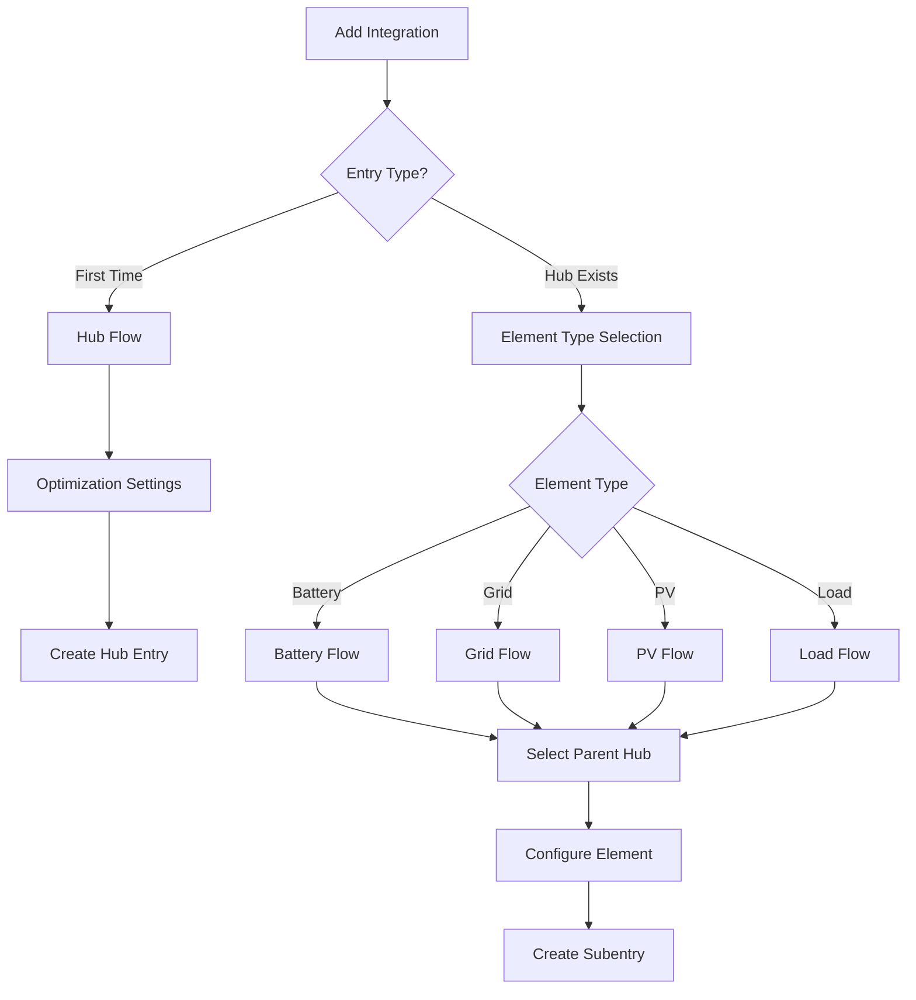

# Configuration Flow Development

Guide to HAEO's ConfigSubentry-based configuration flow implementation.

## Overview

HAEO uses Home Assistant's **ConfigSubentry architecture** where each element is managed as a subentry:

1. **Hub flow** (in `custom_components/haeo/flows/hub.py`): Creates main hub entry with optimization settings
2. **Element flows** (in `custom_components/haeo/flows/element.py`): Creates element ConfigSubentries using `ConfigSubentryFlow`
3. **Network subentry**: Automatically created representing the optimization network itself

This architecture follows Home Assistant's native [subentry pattern](https://developers.home-assistant.io/docs/config_entries_config_flow_handler/).
Elements appear as subentries under the main hub in the UI with proper parent-child management.

For general information on config flows, see the [Home Assistant Config Flow documentation](https://developers.home-assistant.io/docs/config_entries_config_flow_handler/) and [Data Entry Flow](https://developers.home-assistant.io/docs/data_entry_flow_index/).

### Architecture Benefits

- Native Home Assistant subentry UI integration
- Automatic parent-child relationship management
- Independent configuration of each element
- Proper device registry association via `config_subentry_id`
- Easy addition/removal through native UI
- No manual `parent_entry_id` tracking required

## Architecture



## Hub Flow

The hub flow creates the main integration entry that acts as a parent for element subentries and hosts the optimization coordinator.

### Hub entry structure

Hub entries are identified by the presence of `integration_type: "hub"` in their data:

```python
{
    "entry_id": "abc123...",
    "domain": "haeo",
    "title": "Home Energy System",
    "data": {
        "integration_type": "hub"  # Marker to identify hub entries
    },
    "options": {
        "horizon_hours": 48,
        "period_minutes": 5,
    },
}
```

Optimization settings are stored in `options` (user-editable), while the hub marker is stored in `data` (immutable).
The hub flow implementation is in `custom_components/haeo/flows/hub.py`.

### Key implementation points

- Hub flow uses standard config flow pattern with user step
- Prevents duplicate hub names by checking existing entries
- Stores optimization settings in `options` for later editing via options flow
- Hub marker in `data` allows coordinator to identify hub entries

## Element Flows

Element subentries are created through separate config flows, one per element type.
All element flows inherit from a common base class that handles parent hub selection and entry creation.

### Element entry structure

Element entries link to their parent hub via `parent_entry_id`:

```python
{
    "entry_id": "def456...",
    "domain": "haeo",
    "title": "Home Battery",
    "data": {
        "element_type": "battery",
        "parent_entry_id": "abc123...",  # Links to hub entry
        "capacity": 13500,
        "charge_power": 5000,
        # ... element-specific configuration
    },
}
```

### Base element flow pattern

All element flows extend `ElementConfigFlow` which provides:

- Parent hub selection (auto-selects if only one hub exists)
- Entry creation with proper parent linkage
- Duplicate prevention
- Standard error handling

The element flow base class is in `custom_components/haeo/flows/element.py`.

### Connection endpoint filtering

Connection elements require selecting source and target endpoints from other configured elements.
The element flow filters available elements based on connectivity level and Advanced Mode setting.

Each element type in the `ELEMENT_TYPES` registry defines a connectivity level that controls when it appears in connection selectors.
The `ConnectivityLevel` enum has three values:

- **`ALWAYS`**: Always shown in connection selectors
- **`ADVANCED`**: Only shown when Advanced Mode is enabled
- **`NEVER`**: Never shown in connection selectors

This filtering ensures connection endpoints are appropriate for the user's configuration level.
It prevents invalid connection topologies by excluding elements that shouldn't be connection endpoints.
See [`custom_components/haeo/elements/__init__.py`](https://github.com/hass-energy/haeo/blob/main/custom_components/haeo/elements/__init__.py) for the connectivity level assigned to each element type.

### Element-specific implementations

Each element type has its own flow class in `custom_components/haeo/flows/`:

- `BatteryConfigFlow` - Battery element configuration
- `GridConfigFlow` - Grid configuration
- `SolarConfigFlow` - Solar system configuration
- `ConstantLoadConfigFlow` - Constant load configuration
- `ForecastLoadConfigFlow` - Forecast-based load configuration
- `NodeConfigFlow` - Network node configuration

Each flow defines element-specific schema fields, defaults, and validation logic.

## Entity-First Two-Step Config Flow Pattern

Most element types use a two-step configuration flow that provides a streamlined user experience.
Users select entities or "Configurable Entity" for each field, then enter constant values only where needed.

### Flow Steps

**Step 1 (user)**: User enters the element name, connection target, and selects entities for each configurable field.
Each entity selector includes a special "Configurable Entity" option that signals a constant value will be entered.

**Step 2 (values)**: Only shown if the user selected "Configurable Entity" for any field.
The user enters constant values for those fields. Step 2 is skipped if no configurable fields were selected.

### Entity Selection Options

Each entity field supports three types of selections:

| Selection Type       | Description                                         | Step 2 Behavior        |
| -------------------- | --------------------------------------------------- | ---------------------- |
| External Entity      | Value comes from Home Assistant sensors             | No input shown         |
| Configurable Entity    | User enters a constant value                        | Shows NumberSelector   |
| Empty (optional)     | Field is disabled (only for optional fields)        | No input shown         |

Required fields must have at least one entity selected (either external or Configurable Entity).
Optional fields can be left empty to use default values.

### Implementation Pattern

The entity-first flow utilities are in `custom_components/haeo/flows/field_schema.py`:

- `build_entity_schema_entry()`: Creates the entity selector for step 1 (includes Configurable Entity)
- `build_configurable_value_schema()`: Builds step 2 schema for fields with Configurable Entity selected
- `extract_entity_selections()`: Extracts entity selections from step 1 data
- `convert_entity_selections_to_config()`: Converts selections to final config format
- `get_configurable_value_defaults()`: Provides defaults for configurable value entry

Flow handlers store step 1 data (`_step1_data`) and use it to determine which fields need value entry in step 2.
The `has_configurable_selection()` helper checks if any field needs a constant value.

### Entity Creation

HAEO creates input entities (number/switch) for fields configured with "Configurable Entity".
These entities allow runtime adjustment of constant values without reconfiguring the element.
Fields linked to external entities use those entities directly without creating HAEO input entities.

## Field Schema System

HAEO uses a typed schema system to define element configuration fields.
The schema system provides type safety, validation, and data loading from Home Assistant entities.

### ELEMENT_TYPES Registry

All element types are registered in `custom_components/haeo/elements/__init__.py`:

```python
ELEMENT_TYPES: dict[ElementType, ElementRegistryEntry] = {
    "battery": ElementRegistryEntry(
        schema=BatteryConfigSchema,  # TypedDict for UI configuration
        data=BatteryConfigData,  # TypedDict for loaded values
        defaults={...},  # Default field values
        translation_key="battery",  # For UI localization
        adapter=create_battery,  # Creates model elements
        extract=extract_battery,  # Extracts optimization results
    ),
    # ... other element types
}
```

The registry provides:

- **Schema/Data class pairs**: Dual TypedDict pattern for type safety
- **Default values**: Pre-populated fields in the UI
- **Adapter functions**: Convert loaded data to model elements
- **Result extractors**: Convert optimization results to sensor data

### Schema vs Data Mode

Each element type has two TypedDict definitions:

**Schema mode** (`*ConfigSchema`): What the user enters in the UI

- Contains entity IDs as strings
- Used during config flow form display and validation

**Data mode** (`*ConfigData`): What the optimizer uses

- Contains loaded numeric values
- Produced by the `load()` function during coordinator updates

```python
# Schema mode: entity IDs with Annotated metadata
class BatteryConfigSchema(TypedDict):
    capacity: EnergySensorFieldSchema  # Annotated[str, EntitySelect(...), TimeSeries(...)]


# Data mode: loaded values
class BatteryConfigData(TypedDict):
    capacity: EnergySensorFieldData  # Annotated[list[float], ...]
```

### Field Metadata with Annotated

Fields use `Annotated` types with composable metadata markers:

```python
from typing import Annotated

# Define field type with composed metadata
EnergySensorFieldSchema = Annotated[
    str,
    EntitySelect(accepted_units=ENERGY_UNITS),
    TimeSeries(accepted_units=ENERGY_UNITS),
]


class BatteryConfigSchema(TypedDict):
    capacity: EnergySensorFieldSchema  # Entity ID with attached metadata
```

The composable metadata types are:

- **Validator subclasses**: Define schema validation and UI selectors (e.g., `PositiveKW`, `Percentage`, `EntitySelect`)
- **LoaderMeta subclasses**: Specify how values are loaded at runtime (e.g., `ConstantFloat`, `TimeSeries`)
- **Default**: Provides default values for config flow UI forms

### Available Field Types

Field types are defined in `custom_components/haeo/schema/fields.py`:

| Validator Class | Purpose                       | Base Type |
| --------------- | ----------------------------- | --------- |
| `PositiveKW`    | Positive power values in kW   | `float`   |
| `AnyKW`         | Power flow (pos or neg) in kW | `float`   |
| `PositiveKWH`   | Positive energy values in kWh | `float`   |
| `Price`         | Price values in \$/kWh        | `float`   |
| `Percentage`    | Percentage values (0-100)     | `float`   |
| `BatterySOC`    | Battery SOC percentage        | `float`   |
| `Boolean`       | Boolean flags                 | `bool`    |
| `Name`          | Free-form text names          | `str`     |
| `ElementName`   | References to other elements  | `str`     |
| `EntitySelect`  | Entity sensor references      | `str`     |

### Data Loading Flow

The schema system integrates with data loading:

1. User enters entity IDs in config flow (Schema mode)
2. Voluptuous validators ensure valid entity selection
3. On coordinator update, `load()` converts Schema → Data mode
4. LoaderMeta markers determine which loader extracts values from Home Assistant
5. Adapter functions receive Data mode config to create model elements

For details on loaders, see [Data Loading](data-loading.md).

## Options Flow

The options flow allows users to edit hub optimization settings after initial setup.
Elements are managed as separate config entries (added/edited/removed through the main integration flow), not through the options flow.

The options flow implementation is in `custom_components/haeo/flows/hub.py`.

### Key points

- Options flow only edits hub-level optimization settings (horizon, period, solver)
- Element configuration happens via separate config entries
- Settings stored in `config_entry.options` (not `data`)
- Changes trigger coordinator reload to apply new parameters

## Element Management

Elements are not managed through the hub's options flow.
Instead, users add/edit/remove elements as independent config entries through the main "Add Integration" flow.

### User workflow

**Adding elements:**

1. Navigate to **Settings** → **Devices & Services**
2. Click **Add Integration**
3. Search for "HAEO"
4. Select element type (battery, grid, etc.)
5. Choose parent hub
6. Configure element parameters

**Editing elements:**

1. Find the element entry in **Devices & Services**
2. Click **Configure** on the element entry
3. Modify parameters
4. Submit changes

**Removing elements:**

1. Find the element entry in **Devices & Services**
2. Click the three-dot menu
3. Select **Delete**

The hub coordinator automatically detects element changes on the next update cycle.
See [user configuration guide](../user-guide/configuration.md) for end-user instructions.

## Testing Config Flow

Config flow testing uses Home Assistant's [testing fixtures](https://developers.home-assistant.io/docs/development_testing/#test-fixtures) and follows standard patterns.

Comprehensive test coverage is in `tests/test_config_flow.py`, including:

- Hub flow success and duplicate prevention
- Element flow with hub selection
- Options flow for editing settings
- Error handling scenarios
- Validation logic

Example test pattern:

```python
async def test_hub_flow_success(hass: HomeAssistant) -> None:
    """Test successful hub creation."""
    result = await hass.config_entries.flow.async_init(DOMAIN, context={"source": config_entries.SOURCE_USER})

    result = await hass.config_entries.flow.async_configure(
        result["flow_id"],
        user_input={CONF_NAME: "Test Hub", CONF_HORIZON_HOURS: 48},
    )

    assert result["type"] == FlowResultType.CREATE_ENTRY
    assert result["data"] == {INTEGRATION_TYPE: INTEGRATION_TYPE_HUB}
```

## Related Documentation

<div class="grid cards" markdown>

- :material-sitemap:{ .lg .middle } **Architecture**

    ---

    Overall system design.

    [:material-arrow-right: Architecture guide](architecture.md)

- :material-database:{ .lg .middle } **Data Loading**

    ---

    Field types and data validation.

    [:material-arrow-right: Data loading guide](data-loading.md)

- :material-network:{ .lg .middle } **Energy Models**

    ---

    Element type implementations.

    [:material-arrow-right: Energy models](energy-models.md)

- :material-test-tube:{ .lg .middle } **Testing**

    ---

    Testing patterns for config flows.

    [:material-arrow-right: Testing guide](testing.md)

- :material-file-document:{ .lg .middle } **User Configuration Guide**

    ---

    End-user configuration instructions.

    [:material-arrow-right: Configuration guide](../user-guide/configuration.md)

- :material-home-assistant:{ .lg .middle } **Home Assistant Config Flow**

    ---

    Upstream pattern documentation.

    [:material-arrow-right: HA Config Flow](https://developers.home-assistant.io/docs/config_entries_config_flow_handler/)

- :material-home-assistant:{ .lg .middle } **Data Entry Flow**

    ---

    Flow framework reference.

    [:material-arrow-right: Data Entry Flow](https://developers.home-assistant.io/docs/data_entry_flow_index/)

</div>
