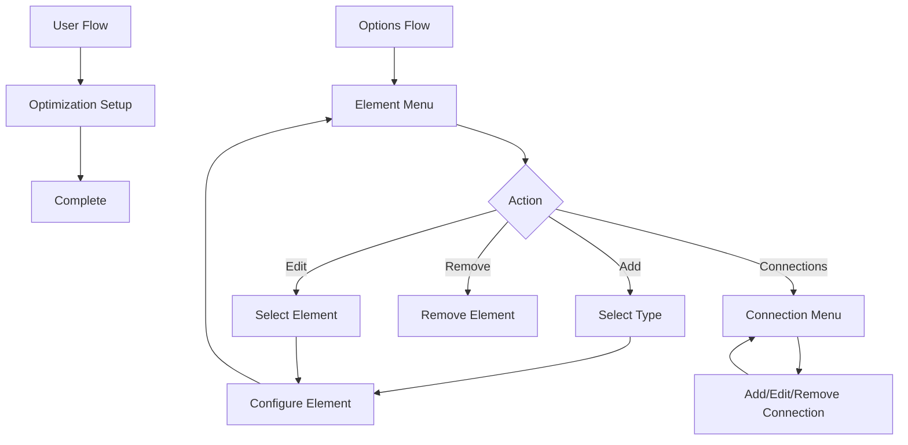

# Configuration Flow Development

Guide to HAEO's multi-step configuration flow implementation.

## Overview

HAEO uses a sophisticated configuration flow that guides users through:

1. **Initial setup**: Optimization parameters and solver selection
2. **Options flow**: Add/edit/remove network elements and connections

The implementation follows Home Assistant's config flow patterns while providing a clean, validated configuration experience.

## Architecture



## Initial Setup Flow

### Step 1: User Input

Collects basic optimization parameters:

```python
class HaeoConfigFlow(ConfigFlow, domain=DOMAIN):
    """Handle HAEO config flow."""

    VERSION = 1
    MINOR_VERSION = 1

    async def async_step_user(
        self, user_input: dict[str, Any] | None = None
    ) -> ConfigFlowResult:
        """Handle initial setup step."""
        if user_input is None:
            return self.async_show_form(
                step_id="user",
                data_schema=vol.Schema(
                    {
                        vol.Required(CONF_NAME, default="HAEO"): str,
                        vol.Required(
                            CONF_OPTIMIZATION_PERIOD,
                            default=30,
                        ): vol.All(vol.Coerce(int), vol.Range(min=1, max=1440)),
                        vol.Required(
                            CONF_OPTIMIZATION_HORIZON,
                            default=24,
                        ): vol.All(vol.Coerce(int), vol.Range(min=1, max=168)),
                        vol.Optional(
                            CONF_OPTIMIZER,
                            default=DEFAULT_OPTIMIZER,
                        ): vol.In(OPTIMIZERS),
                    }
                ),
            )

        # Validate input
        errors = {}
        try:
            await self._validate_optimization_config(user_input)
        except ValueError:
            errors["base"] = "invalid_config"
            return self.async_show_form(
                step_id="user",
                data_schema=self._user_schema(user_input),
                errors=errors,
            )

        # Create entry with minimal data
        return self.async_create_entry(
            title=user_input[CONF_NAME],
            data={
                CONF_PARTICIPANTS: {},  # Empty initially
                CONF_CONNECTIONS: [],   # Empty initially
            },
            options=user_input,  # Store settings in options
        )
```

**Key points**:
- Stores optimization settings in `options` (user-editable)
- Stores network structure in `data` (managed via options flow)
- Creates empty entry - elements added via options flow

### Validation

```python
async def _validate_optimization_config(self, config: dict[str, Any]) -> None:
    """Validate optimization configuration."""
    period = config[CONF_OPTIMIZATION_PERIOD]
    horizon = config[CONF_OPTIMIZATION_HORIZON]

    # Check total periods is reasonable
    total_periods = (horizon * 60) / period
    if total_periods > 1000:
        raise ValueError("Too many periods - reduce horizon or increase period")

    # Verify solver is available (if not default)
    if config.get(CONF_OPTIMIZER) != DEFAULT_OPTIMIZER:
        solver_name = OPTIMIZER_NAME_MAP.get(config[CONF_OPTIMIZER])
        if not pulp.listSolvers(onlyAvailable=True).__contains__(solver_name):
            raise ValueError(f"Solver {solver_name} not available")
```

## Options Flow

The options flow manages network elements and connections through a menu-driven interface.

### Entry Point

```python
@staticmethod
@callback
def async_get_options_flow(config_entry: ConfigEntry) -> OptionsFlow:
    """Get options flow handler."""
    return HaeoOptionsFlowHandler(config_entry)


class HaeoOptionsFlowHandler(OptionsFlow):
    """Handle HAEO options flow."""

    def __init__(self, config_entry: ConfigEntry) -> None:
        """Initialize options flow."""
        self.config_entry = config_entry
        self._element_id: str | None = None
        self._element_config: dict[str, Any] = {}

    async def async_step_init(
        self, user_input: dict[str, Any] | None = None
    ) -> ConfigFlowResult:
        """Manage elements and connections."""
        return await self.async_step_element_menu(user_input)
```

### Element Menu

Main navigation for element management:

```python
async def async_step_element_menu(
    self, user_input: dict[str, Any] | None = None
) -> ConfigFlowResult:
    """Show element management menu."""
    if user_input is not None:
        action = user_input["action"]
        if action == "add":
            return await self.async_step_select_element_type()
        elif action == "edit":
            return await self.async_step_select_element()
        elif action == "remove":
            return await self.async_step_remove_element()
        elif action == "connections":
            return await self.async_step_connection_menu()
        elif action == "settings":
            return await self.async_step_settings()
        else:  # done
            return self.async_create_entry(title="", data={})

    # Build menu with current elements
    participants = self.config_entry.data[CONF_PARTICIPANTS]
    element_list = "\n".join(
        f"- {config['name']['value']} ({element_id.split('_')[0]})"
        for element_id, config in participants.items()
    )

    return self.async_show_form(
        step_id="element_menu",
        data_schema=vol.Schema(
            {
                vol.Required("action"): vol.In(
                    {
                        "add": "Add element",
                        "edit": "Edit element",
                        "remove": "Remove element",
                        "connections": "Manage connections",
                        "settings": "Optimization settings",
                        "done": "Done",
                    }
                ),
            }
        ),
        description_placeholders={"elements": element_list or "None"},
    )
```

### Element Type Selection

```python
async def async_step_select_element_type(
    self, user_input: dict[str, Any] | None = None
) -> ConfigFlowResult:
    """Select element type to add."""
    if user_input is not None:
        element_type = user_input["element_type"]
        # Generate unique ID
        self._element_id = self._generate_element_id(element_type)
        # Route to type-specific configuration
        return await self._show_element_form(element_type)

    return self.async_show_form(
        step_id="select_element_type",
        data_schema=vol.Schema(
            {
                vol.Required("element_type"): vol.In(
                    {
                        "battery": "Battery",
                        "grid": "Grid",
                        "photovoltaic": "Solar PV",
                        "constant_load": "Constant Load",
                        "forecast_load": "Forecast Load",
                        "net": "Node",
                    }
                ),
            }
        ),
    )

def _generate_element_id(self, element_type: str) -> str:
    """Generate unique element ID."""
    participants = self.config_entry.data[CONF_PARTICIPANTS]
    existing_ids = [
        id for id in participants.keys() if id.startswith(f"{element_type}_")
    ]

    # Find next available number
    index = 1
    while f"{element_type}_{index}" in existing_ids:
        index += 1

    return f"{element_type}_{index}"
```

### Element Configuration Forms

Each element type has a dedicated configuration form:

```python
async def _show_element_form(
    self, element_type: str, errors: dict[str, str] | None = None
) -> ConfigFlowResult:
    """Show element-specific configuration form."""
    # Dispatch to element-specific form builder
    form_builders = {
        "battery": self._battery_schema,
        "grid": self._grid_schema,
        "photovoltaic": self._photovoltaic_schema,
        "constant_load": self._constant_load_schema,
        "forecast_load": self._forecast_load_schema,
        "net": self._net_schema,
    }

    schema_builder = form_builders[element_type]
    schema = schema_builder(self._element_config)

    return self.async_show_form(
        step_id=f"configure_{element_type}",
        data_schema=schema,
        errors=errors,
    )
```

### Battery Configuration Example

```python
def _battery_schema(self, defaults: dict[str, Any]) -> vol.Schema:
    """Build battery configuration schema."""
    return vol.Schema(
        {
            vol.Required(
                "name",
                default=defaults.get("name", {}).get("value", "Battery"),
            ): str,
            vol.Required(
                "capacity",
                default=defaults.get("capacity", {}).get("value", 10.0),
            ): vol.All(vol.Coerce(float), vol.Range(min=0.1)),
            vol.Required(
                "charge_power",
                default=defaults.get("charge_power", {}).get("value", 5.0),
            ): vol.All(vol.Coerce(float), vol.Range(min=0.1)),
            vol.Required(
                "discharge_power",
                default=defaults.get("discharge_power", {}).get("value", 5.0),
            ): vol.All(vol.Coerce(float), vol.Range(min=0.1)),
            vol.Required("soc_source"): vol.In(["sensor", "value"]),
        }
    )

async def async_step_configure_battery(
    self, user_input: dict[str, Any] | None = None
) -> ConfigFlowResult:
    """Configure battery element."""
    if user_input is not None:
        # Store base config
        self._element_config.update(user_input)

        # Route to field configuration based on source type
        if user_input["soc_source"] == "sensor":
            return await self.async_step_configure_battery_soc_sensor()
        else:
            return await self.async_step_configure_battery_soc_value()

    return self._show_element_form("battery")
```

### Field Configuration

Fields are configured through sub-steps:

```python
async def async_step_configure_battery_soc_sensor(
    self, user_input: dict[str, Any] | None = None
) -> ConfigFlowResult:
    """Configure battery SOC sensor field."""
    if user_input is not None:
        # Build field config
        self._element_config["soc"] = {
            "sensor": user_input["sensor"],
        }

        # Move to next field or save
        return await self._save_or_continue_battery()

    return self.async_show_form(
        step_id="configure_battery_soc_sensor",
        data_schema=vol.Schema(
            {
                vol.Required("sensor"): selector.EntitySelector(
                    selector.EntitySelectorConfig(
                        domain="sensor",
                    )
                ),
            }
        ),
    )

async def async_step_configure_battery_soc_value(
    self, user_input: dict[str, Any] | None = None
) -> ConfigFlowResult:
    """Configure battery SOC static value."""
    if user_input is not None:
        self._element_config["soc"] = {
            "value": user_input["value"],
        }

        return await self._save_or_continue_battery()

    return self.async_show_form(
        step_id="configure_battery_soc_value",
        data_schema=vol.Schema(
            {
                vol.Required("value", default=0.5): vol.All(
                    vol.Coerce(float),
                    vol.Range(min=0.0, max=1.0),
                ),
            }
        ),
    )
```

### Saving Element Configuration

```python
async def _save_or_continue_battery(self) -> ConfigFlowResult:
    """Save battery config or continue to optional fields."""
    # Check if all required fields are configured
    required_fields = ["name", "capacity", "charge_power", "discharge_power", "soc"]
    if all(field in self._element_config for field in required_fields):
        # Ask about optional fields
        return await self.async_step_battery_optional_fields()

    # Continue to next required field
    return await self._next_required_field_battery()

async def async_step_battery_optional_fields(
    self, user_input: dict[str, Any] | None = None
) -> ConfigFlowResult:
    """Configure optional battery fields."""
    if user_input is not None:
        if user_input.get("configure_pricing"):
            return await self.async_step_battery_pricing()
        elif user_input.get("configure_efficiency"):
            return await self.async_step_battery_efficiency()
        else:
            # Save and return to menu
            return await self._save_element()

    return self.async_show_form(
        step_id="battery_optional_fields",
        data_schema=vol.Schema(
            {
                vol.Optional("configure_pricing", default=False): bool,
                vol.Optional("configure_efficiency", default=False): bool,
            }
        ),
    )

async def _save_element(self) -> ConfigFlowResult:
    """Save element configuration and return to menu."""
    # Convert flat config to structured field format
    element_config = self._build_structured_config()

    # Validate using schema
    try:
        await self._validate_element_config(element_config)
    except ValueError as err:
        return self.async_abort(reason=f"validation_failed: {err}")

    # Update config entry data
    participants = dict(self.config_entry.data[CONF_PARTICIPANTS])
    participants[self._element_id] = element_config

    self.hass.config_entries.async_update_entry(
        self.config_entry,
        data={
            **self.config_entry.data,
            CONF_PARTICIPANTS: participants,
        },
    )

    # Reset state and return to menu
    self._element_id = None
    self._element_config = {}

    return await self.async_step_element_menu()
```

### Element Editing

```python
async def async_step_select_element(
    self, user_input: dict[str, Any] | None = None
) -> ConfigFlowResult:
    """Select element to edit."""
    if user_input is not None:
        self._element_id = user_input["element"]
        # Load existing config
        self._element_config = dict(
            self.config_entry.data[CONF_PARTICIPANTS][self._element_id]
        )
        # Show appropriate form
        element_type = self._element_id.split("_")[0]
        return await self._show_element_form(element_type)

    # Build element selector
    participants = self.config_entry.data[CONF_PARTICIPANTS]
    element_options = {
        element_id: config["name"]["value"]
        for element_id, config in participants.items()
    }

    if not element_options:
        return self.async_abort(reason="no_elements")

    return self.async_show_form(
        step_id="select_element",
        data_schema=vol.Schema(
            {
                vol.Required("element"): vol.In(element_options),
            }
        ),
    )
```

### Element Removal

```python
async def async_step_remove_element(
    self, user_input: dict[str, Any] | None = None
) -> ConfigFlowResult:
    """Remove element from configuration."""
    if user_input is not None:
        element_id = user_input["element"]

        # Check if element is used in connections
        connections_using = [
            conn
            for conn in self.config_entry.data[CONF_CONNECTIONS]
            if conn[CONF_FROM] == element_id or conn[CONF_TO] == element_id
        ]

        if connections_using:
            return self.async_abort(
                reason="element_in_use",
                description_placeholders={
                    "connections": ", ".join(
                        f"{c[CONF_FROM]} → {c[CONF_TO]}" for c in connections_using
                    )
                },
            )

        # Remove element
        participants = dict(self.config_entry.data[CONF_PARTICIPANTS])
        del participants[element_id]

        self.hass.config_entries.async_update_entry(
            self.config_entry,
            data={
                **self.config_entry.data,
                CONF_PARTICIPANTS: participants,
            },
        )

        return await self.async_step_element_menu()

    # Show removal form
    participants = self.config_entry.data[CONF_PARTICIPANTS]
    element_options = {
        element_id: config["name"]["value"]
        for element_id, config in participants.items()
    }

    if not element_options:
        return self.async_abort(reason="no_elements")

    return self.async_show_form(
        step_id="remove_element",
        data_schema=vol.Schema(
            {
                vol.Required("element"): vol.In(element_options),
            }
        ),
    )
```

## Connection Management

Connections are managed through a separate submenu:

```python
async def async_step_connection_menu(
    self, user_input: dict[str, Any] | None = None
) -> ConfigFlowResult:
    """Manage connections between elements."""
    if user_input is not None:
        action = user_input["action"]
        if action == "add":
            return await self.async_step_add_connection()
        elif action == "remove":
            return await self.async_step_remove_connection()
        else:  # back
            return await self.async_step_element_menu()

    # Show current connections
    connections = self.config_entry.data[CONF_CONNECTIONS]
    connection_list = "\n".join(
        f"- {conn[CONF_FROM]} → {conn[CONF_TO]}"
        for conn in connections
    )

    return self.async_show_form(
        step_id="connection_menu",
        data_schema=vol.Schema(
            {
                vol.Required("action"): vol.In(
                    {
                        "add": "Add connection",
                        "remove": "Remove connection",
                        "back": "Back to element menu",
                    }
                ),
            }
        ),
        description_placeholders={"connections": connection_list or "None"},
    )

async def async_step_add_connection(
    self, user_input: dict[str, Any] | None = None
) -> ConfigFlowResult:
    """Add connection between elements."""
    participants = self.config_entry.data[CONF_PARTICIPANTS]

    if not participants or len(participants) < 2:
        return self.async_abort(reason="insufficient_elements")

    if user_input is not None:
        # Validate connection
        from_id = user_input[CONF_FROM]
        to_id = user_input[CONF_TO]

        if from_id == to_id:
            return self.async_show_form(
                step_id="add_connection",
                data_schema=self._connection_schema(),
                errors={"base": "same_element"},
            )

        # Check for duplicate
        existing = [
            conn
            for conn in self.config_entry.data[CONF_CONNECTIONS]
            if conn[CONF_FROM] == from_id and conn[CONF_TO] == to_id
        ]

        if existing:
            return self.async_show_form(
                step_id="add_connection",
                data_schema=self._connection_schema(),
                errors={"base": "duplicate_connection"},
            )

        # Add connection
        connection = {
            CONF_NAME: user_input[CONF_NAME],
            CONF_FROM: from_id,
            CONF_TO: to_id,
            CONF_EFFICIENCY: user_input.get(CONF_EFFICIENCY, 1.0),
        }

        if user_input.get(CONF_MAX_POWER):
            connection[CONF_MAX_POWER] = user_input[CONF_MAX_POWER]

        connections = list(self.config_entry.data[CONF_CONNECTIONS])
        connections.append(connection)

        self.hass.config_entries.async_update_entry(
            self.config_entry,
            data={
                **self.config_entry.data,
                CONF_CONNECTIONS: connections,
            },
        )

        return await self.async_step_connection_menu()

    return self.async_show_form(
        step_id="add_connection",
        data_schema=self._connection_schema(),
    )

def _connection_schema(self) -> vol.Schema:
    """Build connection configuration schema."""
    participants = self.config_entry.data[CONF_PARTICIPANTS]
    element_options = {
        element_id: config["name"]["value"]
        for element_id, config in participants.items()
    }

    return vol.Schema(
        {
            vol.Required(CONF_NAME, default="Connection"): str,
            vol.Required(CONF_FROM): vol.In(element_options),
            vol.Required(CONF_TO): vol.In(element_options),
            vol.Optional(CONF_EFFICIENCY, default=1.0): vol.All(
                vol.Coerce(float),
                vol.Range(min=0.0, max=1.0),
            ),
            vol.Optional(CONF_MAX_POWER): vol.All(
                vol.Coerce(float),
                vol.Range(min=0.0),
            ),
        }
    )
```

## Validation

Configuration validation happens at multiple levels:

### Form-Level Validation

```python
async def async_step_configure_battery(
    self, user_input: dict[str, Any] | None = None
) -> ConfigFlowResult:
    """Configure battery with validation."""
    if user_input is not None:
        errors = {}

        # Validate capacity > 0
        if user_input["capacity"] <= 0:
            errors["capacity"] = "must_be_positive"

        # Validate power limits
        if user_input["charge_power"] <= 0:
            errors["charge_power"] = "must_be_positive"

        if errors:
            return self.async_show_form(
                step_id="configure_battery",
                data_schema=self._battery_schema(user_input),
                errors=errors,
            )

        # Continue...
```

### Schema-Level Validation

```python
async def _validate_element_config(self, config: dict[str, Any]) -> None:
    """Validate element configuration using schema."""
    element_type = self._element_id.split("_")[0]

    # Import appropriate schema class
    if element_type == "battery":
        from custom_components.haeo.schema.battery import Battery as Schema
    # ... other types

    # Attempt to construct schema object
    try:
        schema_obj = Schema(**config)
    except (TypeError, ValueError) as err:
        raise ValueError(f"Invalid configuration: {err}") from err

    # Check if config is complete
    if not schema_obj.config_available():
        raise ValueError("Configuration incomplete")
```

### Integration-Level Validation

Config entry setup validates the complete network:

```python
async def async_setup_entry(hass: HomeAssistant, entry: ConfigEntry) -> bool:
    """Set up HAEO from config entry."""
    try:
        # Attempt to build network in schema mode
        from custom_components.haeo.data import load_network

        network = load_network(
            config=entry.data,
            config_options=entry.options,
            hass=None,  # Schema mode doesn't need hass
        )
    except ValueError as err:
        _LOGGER.error("Invalid network configuration: %s", err)
        raise ConfigEntryError(f"Configuration error: {err}") from err

    # Network is valid, proceed with setup
```

## Testing Config Flow

```python
async def test_user_flow(hass: HomeAssistant) -> None:
    """Test user configuration flow."""
    result = await hass.config_entries.flow.async_init(
        DOMAIN, context={"source": config_entries.SOURCE_USER}
    )

    assert result["type"] == FlowResultType.FORM
    assert result["step_id"] == "user"

    # Submit user input
    result = await hass.config_entries.flow.async_configure(
        result["flow_id"],
        user_input={
            CONF_NAME: "Test HAEO",
            CONF_OPTIMIZATION_PERIOD: 30,
            CONF_OPTIMIZATION_HORIZON: 24,
            CONF_OPTIMIZER: DEFAULT_OPTIMIZER,
        },
    )

    assert result["type"] == FlowResultType.CREATE_ENTRY
    assert result["title"] == "Test HAEO"
    assert result["data"][CONF_PARTICIPANTS] == {}


async def test_options_add_battery(
    hass: HomeAssistant, config_entry: ConfigEntry
) -> None:
    """Test adding battery via options flow."""
    result = await hass.config_entries.options.async_init(config_entry.entry_id)

    # Navigate to add element
    result = await hass.config_entries.options.async_configure(
        result["flow_id"],
        user_input={"action": "add"},
    )

    # Select battery type
    result = await hass.config_entries.options.async_configure(
        result["flow_id"],
        user_input={"element_type": "battery"},
    )

    # Configure battery
    result = await hass.config_entries.options.async_configure(
        result["flow_id"],
        user_input={
            "name": "Home Battery",
            "capacity": 13.5,
            "charge_power": 5.0,
            "discharge_power": 5.0,
            "soc_source": "value",
        },
    )

    # Provide SOC value
    result = await hass.config_entries.options.async_configure(
        result["flow_id"],
        user_input={"value": 0.5},
    )

    # Skip optional fields
    result = await hass.config_entries.options.async_configure(
        result["flow_id"],
        user_input={},
    )

    # Should return to menu
    assert result["type"] == FlowResultType.FORM
    assert result["step_id"] == "element_menu"

    # Verify battery was added
    assert "battery_1" in config_entry.data[CONF_PARTICIPANTS]
```

## Related Documentation

- [Architecture](architecture.md) - Overall system design
- [Data Loading](data-loading.md) - Field types and data validation
- [Energy Models](energy-models.md) - Element type implementations
- [Testing](testing.md) - Testing patterns for config flows
