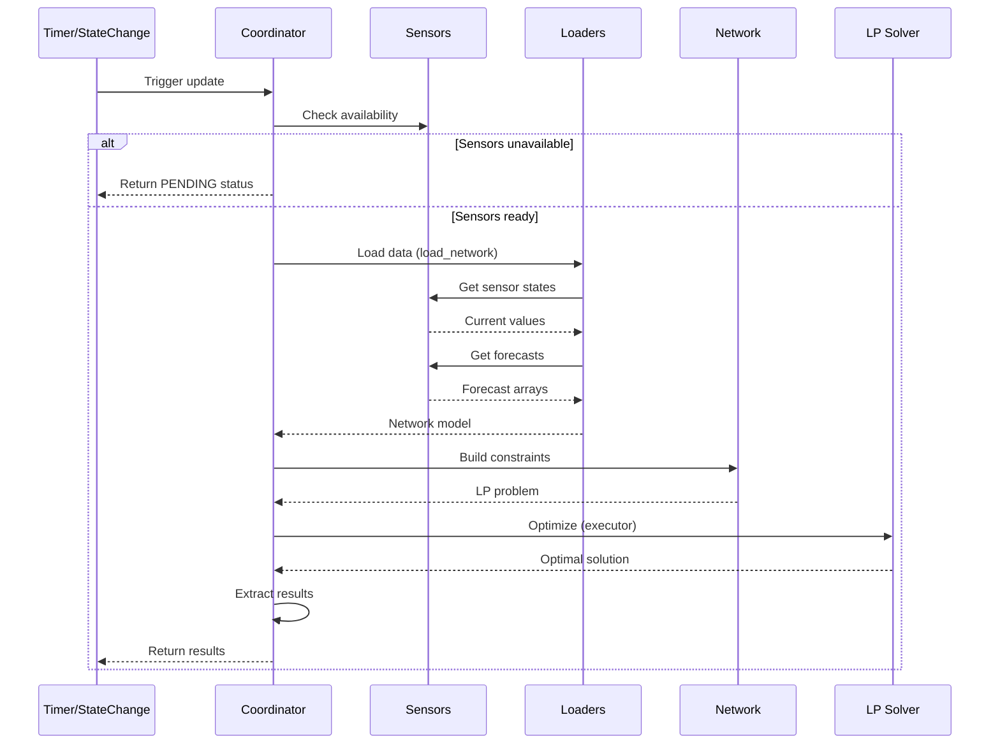

# Data Update Coordinator

The coordinator manages optimization cycles, sensor monitoring, and data distribution.

## Purpose

HAEO's coordinator implements Home Assistant's [DataUpdateCoordinator pattern](https://developers.home-assistant.io/docs/integration_fetching_data/#coordinated-single-api-poll-for-data-for-all-entities) to orchestrate optimization cycles.
The implementation is in `custom_components/haeo/coordinator.py`.

The coordinator performs these core responsibilities:

- Schedules regular optimization cycles (default: 5 minutes)
- Monitors sensor state changes for immediate re-optimization
- Validates sensor availability before optimization attempts
- Loads sensor data and forecasts via data loaders
- Builds network model from configuration
- Runs LP solver in executor thread (non-blocking)
- Distributes results to sensors
- Handles errors gracefully with [UpdateFailed](https://developers.home-assistant.io/docs/integration_fetching_data/) exceptions

**Subentry discovery**:

The coordinator is created only for hub entries (identified by `integration_type: "hub"`).
It discovers element subentries by querying the config entry registry for entries where `parent_entry_id` matches the hub's `entry_id`.
This discovery happens on each update cycle, supporting dynamic element addition and removal without integration reload.
State change listeners monitor sensors from all discovered child elements.

## Update Cycle

The coordinator follows this sequence for each optimization cycle:



### Update phases

**1. Sensor availability check**

On first refresh after Home Assistant startup, the coordinator validates all configured entity IDs.
If sensors are unavailable, it returns `OPTIMIZATION_STATUS_PENDING` and logs an informative message.
State change monitoring automatically retries when sensors become available.

**2. Data loading**

The coordinator calls `load_network()` (defined in `custom_components/haeo/data/__init__.py`) to build a populated network model.
This function uses field metadata to determine required loaders, loads sensor states and forecasts, aligns all data to the time grid, and raises `ValueError` if required data is missing.
See [data loading](data-loading.md) for details on how loaders work.

**3. Optimization**

The network optimization runs in an executor thread via `hass.async_add_executor_job()` to avoid blocking the event loop.
The coordinator extracts the solver name from configuration and passes it to `network.optimize()`.
This blocking operation is tracked for diagnostics timing.

**4. Result extraction**

The coordinator converts model outputs to Home Assistant-friendly structures using `_collect_outputs()`.
Results include optimization cost, status, duration, and entity-specific outputs (power, energy, SOC, etc.).
These are stored in `coordinator.data` and exposed to sensor entities through the coordinator pattern.

## Error Handling

The coordinator implements comprehensive error handling using Home Assistant's [UpdateFailed](https://developers.home-assistant.io/docs/integration_fetching_data/) exception pattern:

### Error scenarios

**Sensor unavailability (startup)**

When configured sensors are not yet available, the coordinator returns `PENDING` status without logging an error (this is expected during startup).
Sensors show "Unavailable" state in the UI, and the coordinator retries on the next update interval.

**Data loading errors**

When sensor data is available but loading fails (invalid format, missing forecast, type conversion failures), the coordinator raises `UpdateFailed` with a descriptive message.

**Optimization errors**

When network optimization fails (infeasible constraints, solver not installed, numerical instabilities), the coordinator raises `UpdateFailed` with the solver error.

### Error propagation

All coordinator errors raise `UpdateFailed`, which:

- Sets `coordinator.last_update_success = False`
- Logs the error message
- Makes dependent entities unavailable
- Schedules a retry on the next interval

State change triggers use the same error handling through the coordinator framework and don't crash the integration.

## State Change Listeners

The coordinator monitors configured sensors and triggers immediate re-optimization when their state changes.

### Implementation approach

During setup, the coordinator:

1. Collects all sensor entity IDs from child element subentries (looking for fields ending in `_sensor`)
2. Subscribes to state change events for each sensor using `async_track_state_change_event()`
3. Registers cleanup callbacks with `async_on_remove()` to unsubscribe on coordinator teardown

When a state changes:

1. The `_handle_state_change()` callback is invoked (marked with `@callback` for event loop safety)
2. It calls `async_request_refresh()` asynchronously
3. The coordinator debounces overlapping updates automatically
4. The full update cycle runs with the latest sensor data

The state change listener implementation is in `custom_components/haeo/coordinator.py`.

### Performance considerations

- **Debouncing**: Coordinator prevents overlapping updates automatically
- **Event loop friendly**: All operations use `@callback` or async patterns
- **No polling overhead**: Only updates when data changes
- **Dynamic discovery**: Sensor list updates when elements are added/removed

## Testing

Coordinator testing uses Home Assistant's [test fixtures](https://developers.home-assistant.io/docs/development_testing/#test-fixtures) and mocks.
Comprehensive test coverage is in `tests/test_coordinator.py`, including:

- Successful coordinator updates
- Sensor unavailability handling
- Data loading error scenarios
- Optimization failure cases
- State change trigger behavior

Example test pattern:

```python
@pytest.fixture
async def coordinator(hass: HomeAssistant, mock_config_entry: MockConfigEntry) -> HaeoDataUpdateCoordinator:
    """Create coordinator for testing."""
    mock_config_entry.add_to_hass(hass)
    await hass.config_entries.async_setup(mock_config_entry.entry_id)
    await hass.async_block_till_done()
    return mock_config_entry.runtime_data.coordinator
```

## Related Documentation

<div class="grid cards" markdown>

- :material-sitemap:{ .lg .middle } **Architecture**

    ---

    System overview and component relationships.

    [:material-arrow-right: Architecture guide](architecture.md)

- :material-database:{ .lg .middle } **Data Loading**

    ---

    How coordinator loads data from sensors.

    [:material-arrow-right: Data loading guide](data-loading.md)

- :material-network:{ .lg .middle } **Energy Models**

    ---

    Network entities and constraints.

    [:material-arrow-right: Energy models](energy-models.md)

- :material-chart-line:{ .lg .middle } **Sensor Reference**

    ---

    Exposed sensor entities and their meanings.

    [:material-arrow-right: Understanding Results](../user-guide/optimization.md)

- :material-test-tube:{ .lg .middle } **Testing Guide**

    ---

    Testing patterns and fixtures.

    [:material-arrow-right: Testing guide](testing.md)

- :material-home-assistant:{ .lg .middle } **Home Assistant DataUpdateCoordinator**

    ---

    Upstream pattern documentation.

    [:material-arrow-right: HA documentation](https://developers.home-assistant.io/docs/integration_fetching_data/#coordinated-single-api-poll-for-data-for-all-entities)

</div>
