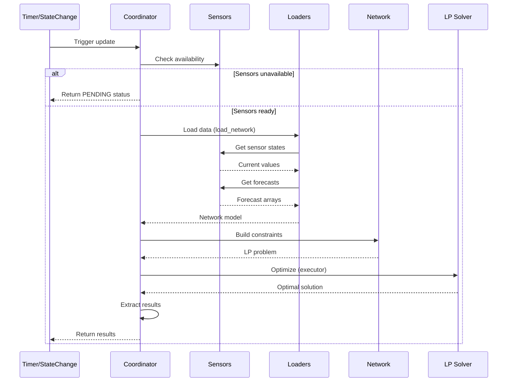

# Data Update Coordinator

The coordinator manages optimization cycles, sensor monitoring, and data distribution.

## Purpose

Central orchestrator implementing Home Assistant's DataUpdateCoordinator pattern that:

- Schedules regular optimization cycles (default: 5 minutes)
- Monitors sensor state changes for immediate re-optimization
- Validates sensor availability before optimization attempts
- Loads sensor data and forecasts via data loaders
- Builds network model from configuration
- Runs LP solver in executor thread (non-blocking)
- Distributes results to sensors
- Handles errors gracefully with appropriate status reporting

**Key subentry handling**:

- Coordinator created only for hub entries (identified by `integration_type: "hub"`)
- `_get_child_elements()` discovers subentries by querying config entry registry
- Subentries identified by matching `parent_entry_id` with hub's `entry_id`
- Discovery happens on each update - supports dynamic element addition/removal
- State change listeners monitor sensors from all child elements

## Update Cycle



## Startup Behavior

On first refresh after Home Assistant startup:

1. **Sensor availability check**: Coordinator validates all configured entity IDs
2. **Wait if unavailable**: Returns `OPTIMIZATION_STATUS_PENDING` and logs informative message
3. **State change monitoring**: Automatically retries when sensors become available
4. **Proceed when ready**: Once all sensors report valid states, optimization proceeds

```python
def _check_sensors_available(self) -> tuple[bool, list[str]]:
    """Check if all configured sensors are available."""
    entity_ids = _extract_entity_ids(self.config)
    unavailable = []

    for entity_id in entity_ids:
        state = self.hass.states.get(entity_id)
        if state is None or state.state in ("unavailable", "unknown"):
            unavailable.append(entity_id)

    return len(unavailable) == 0, unavailable
```

This prevents failed optimizations during Home Assistant startup when sensors are still initializing.

### Step 1: Load Data

Data loading is handled by `load_network()` from the `data` module:

```python
from custom_components.haeo.data import load_network

# Calculate time parameters
period_seconds = self.config[CONF_PERIOD_MINUTES] * 60
horizon_seconds = self.config[CONF_HORIZON_HOURS] * 3600
n_periods = horizon_seconds // period_seconds

# Load network with data
self.network = await load_network(
    self.hass,
    self.entry,
    period_seconds=period_seconds,
    n_periods=n_periods,
)
```

`load_network()` internally:

- Uses field metadata to determine required loaders
- Loads sensor states via `SensorLoader`
- Loads forecasts via `ForecastLoader`
- Aligns all data to time grid
- Raises `ValueError` if required data missing

### Step 2: Build Network

Network building is handled by `load_network()` which:

1. Converts participant configs to typed schema objects
2. Validates all required data is available via `config_available()`
3. Calculates forecast times aligned to period boundaries
4. Creates `Network` instance with period in hours (model layer uses hours)
5. Instantiates entity objects via network builder
6. Creates connections between elements

The coordinator receives a fully populated `Network` object ready for optimization.

### Step 3: Optimize

Optimization runs in executor thread to avoid blocking event loop:

```python
# Extract solver from config
optimizer_key = self.config.get(CONF_OPTIMIZER, DEFAULT_OPTIMIZER)
optimizer_name = OPTIMIZER_NAME_MAP.get(optimizer_key, optimizer_key)

# Run optimization (blocking operation)
cost = await self.hass.async_add_executor_job(
    self.network.optimize,
    optimizer_name
)
```

**Timing**: Coordinator tracks optimization duration for diagnostics.

**Thread safety**: Network object is not accessed by other coroutines during optimization.

### Step 4: Extract Results

```python
def get_element_data(self, element_name: str) -> dict[str, list[float]] | None:
    """Extract element data from optimization results."""
    if not self.network or element_name not in self.network.elements:
        return None

    element = self.network.elements[element_name]
    element_data: dict[str, list[float]] = {}

    # Extract power data
    if hasattr(element, "power") and element.power is not None:
        element_data[ATTR_POWER] = extract_values(element.power)

    # Extract energy data
    if hasattr(element, "energy") and element.energy is not None:
        element_data[ATTR_ENERGY] = extract_values(element.energy)

    return element_data
```

Results are stored in coordinator and accessed by sensors via `coordinator.data` and helper methods.

## Error Handling

The coordinator implements comprehensive error handling for different failure scenarios:

### Sensor Unavailability

When configured sensors are not yet available (startup scenario):

```python
# _check_sensors_available returns status
if not self._check_sensors_available():
    _LOGGER.info(
        "Waiting for sensors to become available before running optimization",
    )
    return DataUpdateStatus.PENDING
```

**Behavior**:
- Coordinator returns `PENDING` status
- No error logged (this is expected during startup)
- Sensors show "Unavailable" state in UI
- Coordinator retries on next update interval

### Data Loading Errors

When sensor data is available but loading fails:

```python
try:
    self.network = load_network(
        self.config_entry.data,
        self.config,
        self.hass,
    )
except ValueError as err:
    raise UpdateFailed(f"Failed to load network data: {err}") from err
```

**Common causes**:
- Sensor returning invalid/unexpected data format
- Missing forecast data when required
- Type conversion failures

### Optimization Errors

When network optimization fails:

```python
try:
    cost = await self.hass.async_add_executor_job(
        self.network.optimize,
        optimizer_name,
    )
except pulp.PulpSolverError as err:
    raise UpdateFailed(f"Optimization failed: {err}") from err
```

**Common causes**:
- Infeasible constraints (no solution exists)
- Solver not installed or misconfigured
- Numerical instabilities in LP formulation

### Error Propagation

All coordinator errors raise `UpdateFailed` which:
- Sets `coordinator.last_update_success = False`
- Logs error message
- Makes entities unavailable
- Schedules retry on next interval

### State Change Error Handling

State change triggers use same error handling but with different context:

```python
@callback
def _handle_state_change(self, event: Event) -> None:
    """Handle state changes from configured sensors."""
    self.hass.async_create_task(self.async_request_refresh())
```

Errors during state-triggered updates are caught by coordinator framework and don't crash integration.

## State Change Listeners

The coordinator monitors configured sensors and triggers immediate re-optimization when their state changes:

### Listener Setup

```python
def _setup_state_change_listeners(self) -> None:
    """Set up listeners for configured sensor state changes."""
    # Collect all sensor entity IDs from child element subentries
    sensor_ids: set[str] = set()
    for child_entry in self._get_child_elements():
        # Extract sensor IDs from element configuration
        for field_name, field_value in child_entry.data.items():
            if field_name.endswith("_sensor") and isinstance(field_value, str):
                sensor_ids.add(field_value)

    # Subscribe to state changes
    for entity_id in sensor_ids:
        self.async_on_remove(
            async_track_state_change_event(
                self.hass,
                entity_id,
                self._handle_state_change,
            )
        )
```

### State Change Handler

```python
@callback
def _handle_state_change(self, event: Event) -> None:
    """Handle state changes from configured sensors."""
    # Trigger coordinator refresh asynchronously
    self.hass.async_create_task(self.async_request_refresh())
```

**Behavior**:

- State change → immediate `async_request_refresh()` call
- Debounced by coordinator (ignores if update already in progress)
- Goes through full update cycle (availability check → data load → optimize)
- Results in fresh optimization based on latest sensor data
- Dynamically updates when elements are added/removed

**Use cases**:
- Energy price changes (grid pricing sensors)
- Forecast updates (solar production, load predictions)
- Battery state changes (SOC updates)
- Manual sensor updates via automation

### Performance Considerations

- **Debouncing**: Coordinator automatically prevents overlapping updates
- **Event loop friendly**: All operations use `@callback` or async
- **No polling overhead**: Only updates when data changes
- **Configurable sensors**: Only monitors sensors actually used in config

## Testing

Coordinator testing uses Home Assistant test fixtures and mocks:

```python
@pytest.fixture
async def coordinator(hass: HomeAssistant, mock_config_entry: MockConfigEntry) -> HaeoDataUpdateCoordinator:
    """Create coordinator for testing."""
    mock_config_entry.add_to_hass(hass)
    await hass.config_entries.async_setup(mock_config_entry.entry_id)
    await hass.async_block_till_done()

    # Return coordinator from runtime_data
    return mock_config_entry.runtime_data.coordinator


async def test_coordinator_update(coordinator: HaeoDataUpdateCoordinator) -> None:
    """Test successful coordinator update."""
    await coordinator.async_refresh()

    assert coordinator.last_update_success
    assert coordinator.network is not None
    assert coordinator.network.status == NetworkStatus.OPTIMAL


async def test_sensor_unavailable_on_startup(
    hass: HomeAssistant,
    coordinator: HaeoDataUpdateCoordinator,
) -> None:
    """Test coordinator handles unavailable sensors gracefully."""
    # Sensors not yet available
    await coordinator.async_refresh()

    # Should return PENDING status
    assert coordinator.status == DataUpdateStatus.PENDING
    assert coordinator.network is None
```

See `tests/test_coordinator.py` for comprehensive test coverage.

## Related Documentation

- [Architecture](architecture.md) - System overview and component relationships
- [Data Loading](data-loading.md) - How coordinator loads data from sensors
- [Energy Models](energy-models.md) - Network entities and constraints
- [Sensor Reference](../reference/sensors.md) - Exposed sensor entities
- [Testing Guide](testing.md) - Testing patterns and fixtures
