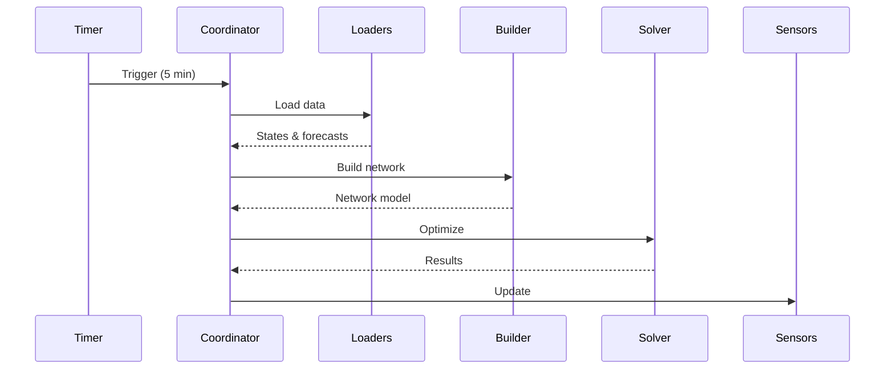

# Data Update Coordinator

Coordinator manages optimization cycles and data distribution.

## Purpose

Central orchestrator that:
- Schedules optimization (default every 5 min)
- Loads sensor data and forecasts
- Builds network model
- Runs LP solver
- Distributes results to sensors

## Coordinator Class

```python
class HaeoDataUpdateCoordinator(DataUpdateCoordinator[dict[str, Any]]):
    def __init__(self, hass: HomeAssistant, config_entry: ConfigEntry):
        # Extract config
        self.horizon_hours = config_entry.data["horizon_hours"]
        self.period_minutes = config_entry.data["period_minutes"]
        
        # Initialize
        super().__init__(
            hass,
            _LOGGER,
            name=DOMAIN,
            update_interval=timedelta(minutes=self.period_minutes),
            config_entry=config_entry,
        )
    
    async def _async_update_data(self) -> dict[str, Any]:
        # Main update cycle
        pass
```

## Update Cycle



### Step 1: Load Data

```python
async def _load_data(self) -> dict[str, Any]:
    data = {}
    # Load sensor states (e.g., battery SOC)
    data["battery_soc"] = await self.sensor_loader.get_state("sensor.battery_soc")
    # Load forecasts (e.g., prices)
    data["prices"] = await self.forecast_loader.get_forecast(["sensor.price_today"])
    return data
```

### Step 2: Build Network

```python
def _build_network(self, data: dict[str, Any]) -> Network:
    network = Network(name=self.name, period=self.period, n_periods=self.n_periods)
    
    # Create entities from config
    for entity_id, config in self.config_entry.data["participants"].items():
        entity = self._create_entity(entity_id, config, data)
        network.elements[entity_id] = entity
    
    # Create connections
    for conn_config in self.config_entry.data["connections"]:
        network.connections.append(Connection(...))
    
    return network
```

### Step 3: Optimize

```python
# Run in executor (blocking)
cost = await self.hass.async_add_executor_job(network.optimize, "HiGHS")
```

### Step 4: Extract Results

```python
results = {"_network": {"cost": cost, "status": "optimal"}}
for entity_name, entity in network.elements.items():
    results[entity_name] = {
        "power": [value(var) for var in entity.power_production],
        "energy": [value(var) for var in entity.energy] if entity.energy else None,
    }
return results
```

## Error Handling

```python
try:
    cost = network.optimize()
except InfeasibleError:
    raise UpdateFailed("Network constraints cannot be satisfied")
except SolverError as err:
    raise UpdateFailed(f"Solver failed: {err}")
```

Coordinator marks data unavailable on failure. Next update cycle retries.

## Testing

```python
async def test_coordinator_update(hass, mock_config_entry):
    coordinator = HaeoDataUpdateCoordinator(hass, mock_config_entry)
    await coordinator.async_refresh()
    
    assert coordinator.data is not None
    assert coordinator.data["_network"]["status"] == "optimal"
```

## Related Documentation

- [Architecture](architecture.md)
- [Sensor Reference](../reference/sensors.md)
