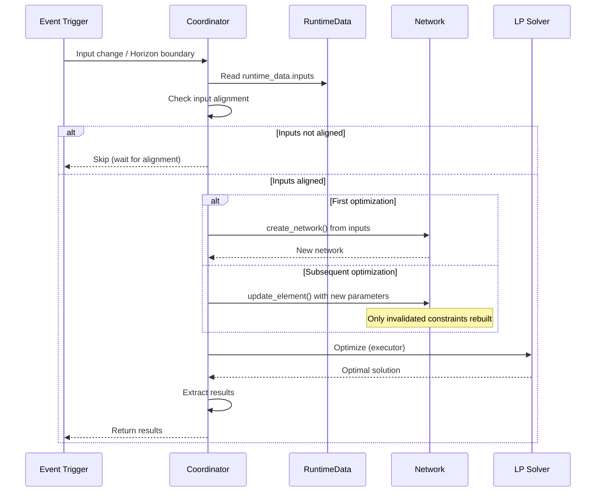
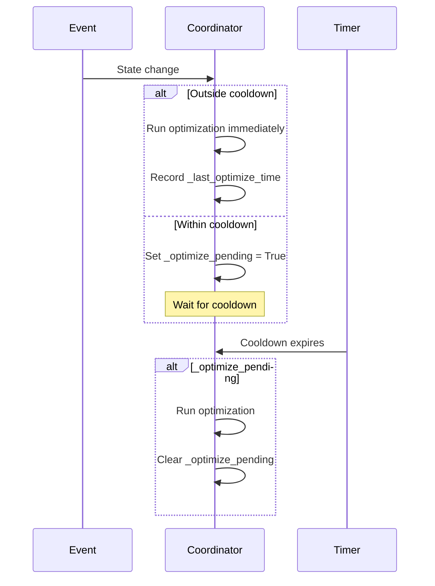

# Data Update Coordinator

The coordinator manages optimization cycles and result distribution using an event-driven model.

## Purpose

HAEO's coordinator implements Home Assistant's [DataUpdateCoordinator pattern](https://developers.home-assistant.io/docs/integration_fetching_data/#coordinated-single-api-poll-for-data-for-all-entities) to orchestrate optimization cycles.
The implementation is in `custom_components/haeo/coordinator/coordinator.py`.
Network building functions are in `custom_components/haeo/coordinator/network.py`.

The coordinator performs these core responsibilities:

- Reads pre-loaded data from [input entities](inputs.md)
- Validates input alignment before optimization
- Builds network model from configuration and loaded data
- Runs LP solver in executor thread (non-blocking)
- Updates network parameters for warm start optimization
- Distributes results to sensors
- Triggers re-optimization on input changes or horizon boundaries
- Handles errors gracefully with [UpdateFailed](https://developers.home-assistant.io/docs/integration_fetching_data/) exceptions

**Event-driven updates**:

Unlike traditional coordinators with fixed polling intervals, HAEO uses event-driven triggers.
Optimization runs when input entity states change or when the [HorizonManager](horizon-manager.md) signals a period boundary crossing.
This ensures optimization uses the latest data without unnecessary polling.

**Subentry discovery**:

The coordinator is created only for hub entries (identified by `integration_type: "hub"`).
It discovers element subentries by querying the config entry registry for entries where `parent_entry_id` matches the hub's `entry_id`.
This discovery happens on each update cycle, supporting dynamic element addition and removal without integration reload.

## Update Cycle

The coordinator follows this sequence for each optimization cycle:



### Update phases

**1. Input alignment check**

Before optimization, the coordinator verifies all input entities have matching `horizon_id` values.
This ensures temporal consistency—all inputs represent the same forecast horizon.
If inputs are misaligned (some entities haven't refreshed after a horizon change), the coordinator skips optimization and waits.

**2. Data reading**

The coordinator reads pre-loaded values from `runtime_data.inputs`, a dictionary keyed by `(element_name, field_name)`.
Input entities populate this dictionary during their refresh cycles.
See [Input Entities](inputs.md) for details on how data loading works.

**3. Optimization**

The network optimization runs in an executor thread via `hass.async_add_executor_job()` to avoid blocking the event loop.
The coordinator extracts the solver name from configuration and passes it to `network.optimize()`.
This blocking operation is tracked for diagnostics timing.

**Network building and warm start**:

On the first optimization cycle, the coordinator calls `create_network()` from `coordinator/network.py` to build the complete network from configuration.
On subsequent cycles, it calls `update_element()` to update element parameters without recreating the network.

The warm start pattern works by:

1. Elements declare parameters using `TrackedParam` descriptors
2. `update_element()` modifies these parameters directly
3. Changed parameters automatically invalidate dependent constraints
4. Only invalidated constraints are rebuilt during optimization
5. Unchanged constraints are reused from the previous solve

This selective rebuilding is more efficient than recreating the entire problem, particularly when only forecasts change between cycles.

**4. Result extraction**

The coordinator converts model outputs to Home Assistant-friendly structures using `_collect_outputs()`.
Results include optimization cost, status, duration, and entity-specific outputs (power, energy, SOC, etc.).
These are stored in `coordinator.data` and exposed to sensor entities through the coordinator pattern.

## Error Handling

The coordinator implements comprehensive error handling using Home Assistant's [UpdateFailed](https://developers.home-assistant.io/docs/integration_fetching_data/) exception pattern:

### Error scenarios

**Sensor unavailability (startup)**

When configured sensors are not yet available, the coordinator returns `PENDING` status without logging an error (this is expected during startup).
Sensors show "Unavailable" state in the UI, and the coordinator retries on the next input entity update or horizon boundary.

**Data loading errors**

When sensor data is available but loading fails (invalid format, missing forecast, type conversion failures), the coordinator raises `UpdateFailed` with a descriptive message.

**Optimization errors**

When network optimization fails (infeasible constraints, solver not installed, numerical instabilities), the coordinator raises `UpdateFailed` with the solver error.

### Error propagation

All coordinator errors raise `UpdateFailed`, which:

- Sets `coordinator.last_update_success = False`
- Logs the error message
- Makes dependent entities unavailable
- Schedules a retry on the next interval

State change triggers use the same error handling through the coordinator framework and don't crash the integration.

## Event-Driven Triggers

The coordinator uses event-driven triggers instead of a fixed polling interval.

### Trigger sources

**Input entity state changes**

When any input entity updates its state (due to external sensor changes or user modification), the coordinator receives a state change event and schedules optimization.

**Horizon boundary crossings**

The coordinator subscribes to the [HorizonManager](horizon-manager.md).
When the forecast horizon advances (at period boundaries like every 1 minute for the finest tier), the manager notifies the coordinator to refresh.

**Manual refresh**

Users can trigger optimization via the standard Home Assistant update service or entity refresh action.
Manual refreshes bypass the cooldown period.

### Custom debouncing

The coordinator implements custom debouncing to prevent excessive optimization runs:



**Debouncing parameters**:

- **Cooldown period**: Minimum time between optimizations (prevents rapid re-runs)
- **Pending flag**: Tracks whether optimization was requested during cooldown
- **Timer**: Schedules retry when cooldown expires with pending request

This approach batches rapid updates while ensuring eventual consistency.

### Subscription lifecycle

1. **Initialization**: Coordinator created without active subscriptions
2. **First refresh**: Initial optimization runs, subscriptions enabled on success
3. **Runtime**: Subscriptions active, coordinator responds to events
4. **Shutdown**: Subscriptions cancelled via cleanup callbacks

## Testing

Coordinator testing uses Home Assistant's [test fixtures](https://developers.home-assistant.io/docs/development_testing/#test-fixtures) and mocks.
Comprehensive test coverage is in `tests/test_coordinator.py`, including:

- Successful coordinator updates
- Input alignment verification
- Debouncing behavior
- Optimization failure cases
- Event-driven trigger behavior

Example test pattern:

```python
@pytest.fixture
async def coordinator(hass: HomeAssistant, mock_config_entry: MockConfigEntry) -> HaeoDataUpdateCoordinator:
    """Create coordinator for testing."""
    mock_config_entry.add_to_hass(hass)
    await hass.config_entries.async_setup(mock_config_entry.entry_id)
    await hass.async_block_till_done()
    return mock_config_entry.runtime_data.coordinator
```

## Related Documentation

<div class="grid cards" markdown>

- :material-timer-outline:{ .lg .middle } **Horizon Manager**

    ---

    Synchronized forecast time windows.

    [:material-arrow-right: Horizon manager guide](horizon-manager.md)

- :material-import:{ .lg .middle } **Input Entities**

    ---

    How input entities load and expose data.

    [:material-arrow-right: Input entities guide](inputs.md)

- :material-sitemap:{ .lg .middle } **Architecture**

    ---

    System overview and component relationships.

    [:material-arrow-right: Architecture guide](architecture.md)

- :material-database:{ .lg .middle } **Data Loading**

    ---

    How data is extracted and aligned.

    [:material-arrow-right: Data loading guide](data-loading.md)

- :material-network:{ .lg .middle } **Energy Models**

    ---

    Network entities and constraints.

    [:material-arrow-right: Energy models](energy-models.md)

- :material-home-assistant:{ .lg .middle } **Home Assistant DataUpdateCoordinator**

    ---

    Upstream pattern documentation.

    [:material-arrow-right: HA documentation](https://developers.home-assistant.io/docs/integration_fetching_data/#coordinated-single-api-poll-for-data-for-all-entities)

</div>
