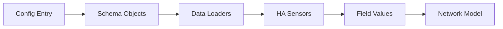

# Data Loading System

Guide to HAEO's data loading architecture and field type system.

## Overview

HAEO's data loading system bridges Home Assistant sensor entities with the optimization model.
The system supports two operational modes and multiple field types to handle diverse data sources.

For more information on Home Assistant sensors and state management, see:
- [Entity state documentation](https://developers.home-assistant.io/docs/core/entity/)
- [Sensor platform guide](https://developers.home-assistant.io/docs/core/entity/sensor/)

## Architecture



1. **Config Entry**: User configuration with entity IDs
2. **Schema Objects**: Typed configuration structures
3. **Data Loaders**: Extract and transform sensor data
4. **HA Sensors**: Home Assistant entity states
5. **Field Values**: Validated, typed values
6. **Network Model**: Optimization variables and constraints

## Schema vs Data Modes

The system operates in two modes depending on data availability:

### Schema Mode

Used during configuration and validation when sensor data is not required:

```python
from custom_components.haeo.schema.battery import Battery as BatterySchema

# Create schema object from config
battery_schema = BatterySchema(
    name={"value": "Home Battery"},
    capacity={"value": 13.5},  # kWh
    charge_power={"value": 5.0},  # kW
    discharge_power={"value": 5.0},  # kW
    # No sensor data needed
)

# Check if field config is complete
if battery_schema.config_available():
    # Ready to build network
    pass
```

**Characteristics**:
- No sensor state access required
- Used in config flow validation
- Validates field configuration structure
- Fast and synchronous

### Data Mode

Used during optimization when actual sensor values are needed:

```python
from custom_components.haeo.data.battery import Battery as BatteryData

# Load data from sensors
battery_data = BatteryData.load(
    battery_schema,
    hass,
    forecast_times,
)

# Access sensor values
initial_soc = battery_data.soc  # Loaded from sensor
import_prices = battery_data.price_import  # Forecast data
```

**Characteristics**:
- Reads current sensor states
- Parses forecast attributes
- Validates data types and ranges
- Returns typed values ready for model

## Field Types

Fields define how configuration values are obtained and validated.

### Value Field

Static numeric value from configuration:

```python
{
    "capacity": {
        "value": 13.5  # kWh
    }
}
```

**Loader behavior**:
```python
capacity = field_config["value"]  # Returns float directly
```

### Sensor Field

Current state from Home Assistant sensor:

```python
{
    "soc": {
        "sensor": "sensor.battery_state_of_charge"
    }
}
```

**Loader behavior**:
```python
entity_id = field_config["sensor"]
state = hass.states.get(entity_id)
soc = float(state.state)  # Parse state to float
```

### Forecast Field

Time-series data from sensor attributes:

```python
{
    "price_import": {
        "sensor": "sensor.electricity_price",
        "attribute": "forecast",
        "forecast": True
    }
}
```

**Loader behavior**:
```python
entity_id = field_config["sensor"]
attribute = field_config["attribute"]
state = hass.states.get(entity_id)
raw_forecast = state.attributes[attribute]

# Parse forecast format (list of dicts or dict)
if isinstance(raw_forecast, dict):
    forecast = parse_dict_forecast(raw_forecast, forecast_times)
elif isinstance(raw_forecast, list):
    forecast = parse_list_forecast(raw_forecast, forecast_times)
```

### Sensor Attribute Field

Static value from sensor attribute:

```python
{
    "capacity": {
        "sensor": "sensor.battery_info",
        "attribute": "total_capacity"
    }
}
```

**Loader behavior**:
```python
entity_id = field_config["sensor"]
attribute = field_config["attribute"]
state = hass.states.get(entity_id)
capacity = float(state.attributes[attribute])
```

## Forecast Parsing

HAEO supports multiple forecast formats to integrate with various Home Assistant integrations.

### Dictionary Format

Simple timestamp-to-value mapping:

```python
{
    "2024-01-15T10:00:00+00:00": 0.25,
    "2024-01-15T10:30:00+00:00": 0.28,
    "2024-01-15T11:00:00+00:00": 0.30,
}
```

**Parsing**:
```python
def parse_dict_forecast(
    forecast: dict[str, float],
    forecast_times: list[datetime],
) -> list[float]:
    """Extract values at forecast_times from dict."""
    values = []
    for time in forecast_times:
        # Convert to ISO format string for lookup
        key = time.isoformat()
        if key in forecast:
            values.append(forecast[key])
        else:
            # Interpolate or use nearest
            values.append(interpolate_value(forecast, time))
    return values
```

### List of Dicts Format

Common format from many integrations:

```python
[
    {"timestamp": "2024-01-15T10:00:00+00:00", "price": 0.25},
    {"timestamp": "2024-01-15T10:30:00+00:00", "price": 0.28},
    {"timestamp": "2024-01-15T11:00:00+00:00", "price": 0.30},
]
```

**Parsing**:
```python
def parse_list_forecast(
    forecast: list[dict],
    forecast_times: list[datetime],
    value_key: str = "value",
    timestamp_key: str = "timestamp",
) -> list[float]:
    """Extract values from list of dicts."""
    # Build dict first
    forecast_dict = {}
    for entry in forecast:
        timestamp = parse_datetime(entry[timestamp_key])
        value = float(entry[value_key])
        forecast_dict[timestamp.isoformat()] = value

    # Use dict parsing
    return parse_dict_forecast(forecast_dict, forecast_times)
```

### Time Alignment

Forecasts are aligned to optimization period boundaries:

```python
def calculate_forecast_times(
    start_time: datetime,
    period: timedelta,
    n_periods: int,
) -> list[datetime]:
    """Calculate forecast timestamps at period boundaries."""
    return [
        start_time + (i * period)
        for i in range(n_periods)
    ]

# Example: 30-minute periods starting at 10:00
forecast_times = calculate_forecast_times(
    datetime(2024, 1, 15, 10, 0, tzinfo=UTC),
    timedelta(minutes=30),
    48,  # 24 hours of 30-min periods
)
```

## Data Loader Implementation

### Base Loader Pattern

```python
from dataclasses import dataclass
from homeassistant.core import HomeAssistant
from ..schema.battery import Battery as BatterySchema


@dataclass
class Battery:
    """Data loader for battery entities."""

    # Required fields
    capacity: float  # kWh
    charge_power: float  # kW
    discharge_power: float  # kW
    soc: float  # 0-1

    # Optional fields
    efficiency: float = 1.0
    soc_min: float = 0.0
    soc_max: float = 1.0
    price_import: list[float] | None = None
    price_export: list[float] | None = None

    @classmethod
    def load(
        cls,
        schema: BatterySchema,
        hass: HomeAssistant,
        forecast_times: list[datetime],
    ) -> "Battery":
        """Load battery data from sensors."""
        from ..data.loaders import load_value, load_sensor, load_forecast

        # Load each field based on configuration
        return cls(
            capacity=load_value(schema.capacity),
            charge_power=load_value(schema.charge_power),
            discharge_power=load_value(schema.discharge_power),
            soc=load_sensor(schema.soc, hass),
            efficiency=load_value(schema.efficiency) if schema.efficiency else 1.0,
            soc_min=load_value(schema.soc_min) if schema.soc_min else 0.0,
            soc_max=load_value(schema.soc_max) if schema.soc_max else 1.0,
            price_import=load_forecast(schema.price_import, hass, forecast_times) if schema.price_import else None,
            price_export=load_forecast(schema.price_export, hass, forecast_times) if schema.price_export else None,
        )
```

### Field Loader Functions

```python
def load_value(field_config: dict) -> float:
    """Load static value from config."""
    return float(field_config["value"])


def load_sensor(field_config: dict, hass: HomeAssistant) -> float:
    """Load current sensor state."""
    entity_id = field_config["sensor"]
    state = hass.states.get(entity_id)

    if state is None:
        raise ValueError(f"Sensor {entity_id} not found")

    try:
        return float(state.state)
    except ValueError as err:
        raise ValueError(f"Invalid state for {entity_id}: {state.state}") from err


def load_forecast(
    field_config: dict,
    hass: HomeAssistant,
    forecast_times: list[datetime],
) -> list[float]:
    """Load forecast data from sensor attributes."""
    entity_id = field_config["sensor"]
    attribute = field_config["attribute"]

    state = hass.states.get(entity_id)
    if state is None:
        raise ValueError(f"Sensor {entity_id} not found")

    raw_forecast = state.attributes.get(attribute)
    if raw_forecast is None:
        raise ValueError(f"Attribute {attribute} not found on {entity_id}")

    # Parse based on format
    if isinstance(raw_forecast, dict):
        return parse_dict_forecast(raw_forecast, forecast_times)
    elif isinstance(raw_forecast, list):
        return parse_list_forecast(raw_forecast, forecast_times)
    else:
        raise ValueError(f"Unsupported forecast format: {type(raw_forecast)}")


def load_sensor_attribute(field_config: dict, hass: HomeAssistant) -> float:
    """Load static value from sensor attribute."""
    entity_id = field_config["sensor"]
    attribute = field_config["attribute"]

    state = hass.states.get(entity_id)
    if state is None:
        raise ValueError(f"Sensor {entity_id} not found")

    value = state.attributes.get(attribute)
    if value is None:
        raise ValueError(f"Attribute {attribute} not found on {entity_id}")

    try:
        return float(value)
    except ValueError as err:
        raise ValueError(f"Invalid value for {entity_id}.{attribute}: {value}") from err
```

## Integration with Network Building

The coordinator orchestrates data loading:

```python
async def _async_update_data(self) -> dict[str, Any]:
    """Load data and run optimization."""
    from .data import load_network

    # Calculate forecast times
    forecast_times = calculate_forecast_times(
        start_time=datetime.now(UTC),
        period=self.period,
        n_periods=self.n_periods,
    )

    # Load network (Data mode)
    try:
        self.network = load_network(
            config=self.config_entry.data,
            config_options=self.config_entry.options,
            hass=self.hass,
            forecast_times=forecast_times,
        )
    except ValueError as err:
        raise UpdateFailed(f"Failed to load network data: {err}") from err

    # Network is now ready for optimization
    cost = await self.hass.async_add_executor_job(
        self.network.optimize,
        solver_name,
    )

    return self._extract_results()
```

## Data Validation

Loaders perform automatic validation:

### Type Validation

```python
def load_sensor(field_config: dict, hass: HomeAssistant) -> float:
    """Load and validate sensor value."""
    state = hass.states.get(field_config["sensor"])

    try:
        value = float(state.state)
    except ValueError:
        raise ValueError(f"Sensor state is not numeric: {state.state}")

    return value
```

### Range Validation

```python
def load_soc(field_config: dict, hass: HomeAssistant) -> float:
    """Load and validate SOC (must be 0-1)."""
    soc = load_sensor(field_config, hass)

    if not 0 <= soc <= 1:
        raise ValueError(f"SOC must be between 0 and 1, got {soc}")

    return soc
```

### Forecast Length Validation

```python
def load_forecast(
    field_config: dict,
    hass: HomeAssistant,
    forecast_times: list[datetime],
) -> list[float]:
    """Load and validate forecast length."""
    values = parse_forecast(...)

    if len(values) != len(forecast_times):
        raise ValueError(
            f"Forecast length mismatch: expected {len(forecast_times)}, "
            f"got {len(values)}"
        )

    return values
```

## Error Handling

Data loading errors are propagated to coordinator:

```python
try:
    network = load_network(config, hass, forecast_times)
except ValueError as err:
    # Coordinator catches and converts to UpdateFailed
    raise UpdateFailed(f"Failed to load network data: {err}") from err
```

Common error scenarios:
- Sensor not available
- Invalid sensor state format
- Missing forecast attribute
- Forecast length mismatch
- Out of range values

## Testing Data Loaders

```python
async def test_battery_loader(hass: HomeAssistant) -> None:
    """Test battery data loader."""
    from custom_components.haeo.schema.battery import Battery as BatterySchema
    from custom_components.haeo.data.battery import Battery as BatteryData

    # Setup test sensor
    hass.states.async_set("sensor.battery_soc", "0.75")

    # Create schema
    schema = BatterySchema(
        name={"value": "Test Battery"},
        capacity={"value": 13.5},
        charge_power={"value": 5.0},
        discharge_power={"value": 5.0},
        soc={"sensor": "sensor.battery_soc"},
    )

    # Load data
    forecast_times = calculate_forecast_times(
        datetime.now(UTC),
        timedelta(hours=1),
        24,
    )

    data = BatteryData.load(schema, hass, forecast_times)

    assert data.capacity == 13.5
    assert data.soc == 0.75
    assert data.charge_power == 5.0
```

## Related Documentation

- [Architecture](architecture.md) - System overview
- [Coordinator](coordinator.md) - Data loading orchestration
- [Energy Models](energy-models.md) - How data flows into models
- [Config Flow](config-flow.md) - Field configuration UI
- [Testing](testing.md) - Testing patterns for loaders
