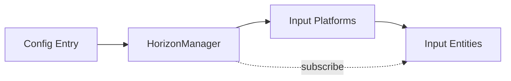
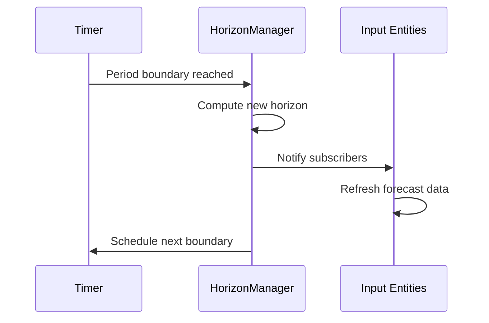

# Horizon Manager

The HorizonManager provides synchronized forecast time windows for all input entities in HAEO.

## Purpose

HAEO's optimization operates over a forecast horizon divided into time intervals (periods).
The HorizonManager ensures all input entities work with consistent timestamps by:

- Computing forecast period boundaries from tier configuration
- Scheduling updates at period boundaries (for example, every 5 minutes for the finest tier)
- Notifying subscribers when the horizon advances

This coordination prevents race conditions where different inputs might use different time windows.

## Architecture

The HorizonManager is a pure Python class (not a Home Assistant entity) created early in the setup process before any entity platforms load.

### Creation Timing

The HorizonManager is created during `async_setup_entry()` before platform setup:

1. Hub entry loaded
2. **HorizonManager created** and stored in `runtime_data`
3. Input platforms (Number, Switch) set up
4. Input entities subscribe to HorizonManager
5. Output platforms (Sensor) set up

This ordering ensures input entities can subscribe immediately during their setup.

## Horizon Computation

The horizon consists of timestamps computed from tier configuration.
Each tier specifies a period duration and count:

| Tier | Period | Count | Coverage |
| ---- | ------ | ----- | -------- |
| 1    | 5 min  | 12    | 1 hour   |
| 2    | 30 min | 6     | 3 hours  |
| 3    | 1 hour | 20    | 20 hours |

The HorizonManager computes period start times aligned to natural boundaries (for example, 12:00, 12:05, 12:10 for 5-minute periods).

The `horizon` property returns the current forecast timestamps as a tuple of datetime objects.
Components access this to align their data loading with the optimization time grid.

## Subscription Pattern

Input entities subscribe to receive notifications when the horizon changes.
The subscription returns an unsubscribe callable that entities register for automatic cleanup during removal.

### Subscription Lifecycle

1. **Subscribe**: Entity calls `subscribe()` during `async_added_to_hass()`
2. **Receive updates**: Manager calls subscriber callbacks at period boundaries
3. **Unsubscribe**: Cleanup function called during entity removal

## Period Boundary Scheduling

The HorizonManager schedules updates at the start of each finest-tier period:

The manager uses Home Assistant's `async_track_point_in_time()` for timer scheduling.
It calculates the next period boundary from current time, reschedules after each boundary crossing, and cancels timers during shutdown.

## Horizon Sensor

A read-only sensor entity displays the current horizon state for debugging:

- **State**: ISO timestamp of horizon start
- **Attributes**: Number of periods, horizon end time, tier configuration

This sensor is diagnostic only and does not participate in optimization.

## Integration with Input Entities

Input entities use the HorizonManager to:

1. **Get aligned timestamps**: Access the `horizon` property when loading forecast data
2. **Refresh on boundaries**: Subscribe to receive horizon change notifications
3. **Tag loaded data**: Store `horizon_id` to verify alignment during optimization

The coordinator checks that all inputs have matching `horizon_id` before running optimization, ensuring temporal consistency.

## Related Documentation

- :material-import:{ .lg .middle } **Input Entities**

    ---

    How input entities load and expose forecast data.

    [:material-arrow-right: Input entities guide](inputs.md)

- :material-sync:{ .lg .middle } **Coordinator**

    ---

    How the coordinator uses aligned input data.

    [:material-arrow-right: Coordinator guide](coordinator.md)

- :material-sitemap:{ .lg .middle } **Architecture**

    ---

    Overall system design and component interactions.

    [:material-arrow-right: Architecture guide](architecture.md)

