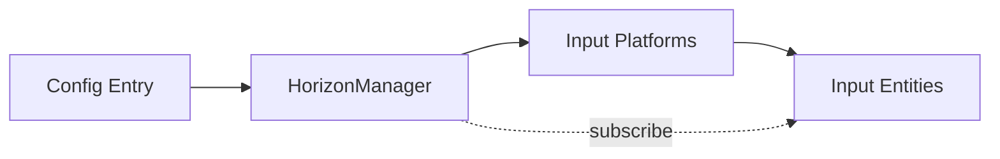
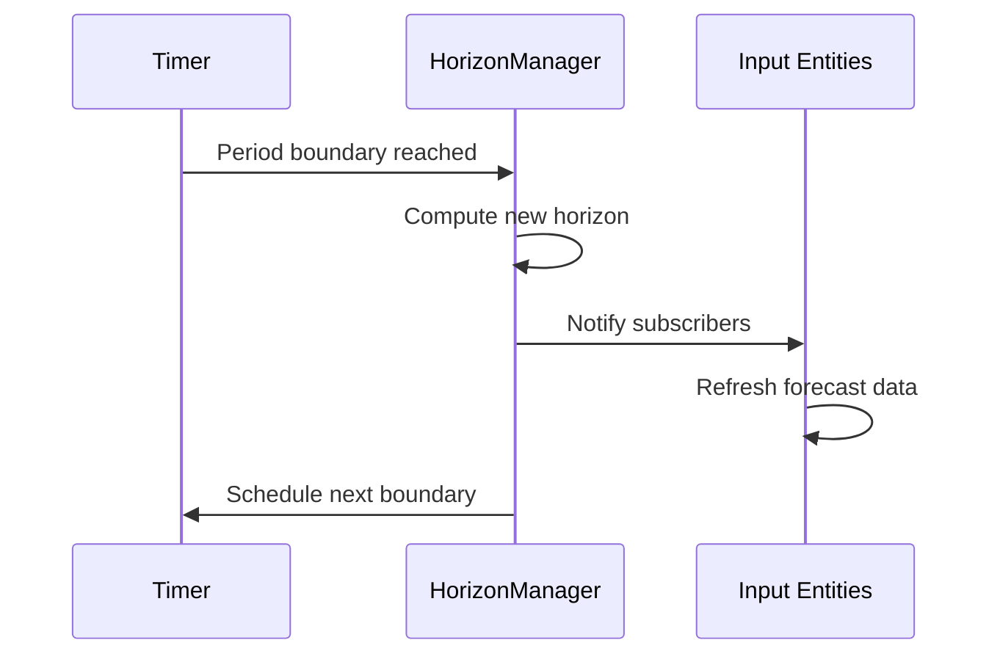

# Horizon Manager

The HorizonManager provides synchronized forecast time windows for all input entities in HAEO.

## Purpose

HAEO's optimization operates over a forecast horizon divided into time intervals (periods).
The HorizonManager ensures all input entities work with consistent timestamps by:

- Computing forecast period boundaries from a horizon preset, or reading them from a forecast sensor
- Updating the horizon at period boundaries (preset) or when the sensor changes (forecast sensor)
- Notifying subscribers when the horizon advances

This coordination prevents race conditions where different inputs might use different time windows.

## Architecture

The HorizonManager is a pure Python class (not a Home Assistant entity) created early in the setup process before any entity platforms load.

```mermaid
graph LR
    CE[Config Entry] --> HM[HorizonManager]
    HM --> IP[Input Platforms]
    IP --> INE[Input Entities]
    HM -.->|subscribe| INE
```

### Creation Timing

The HorizonManager is created during `async_setup_entry()` before platform setup:

1. Hub entry loaded
2. **HorizonManager created** and stored in `runtime_data`
3. Input platforms (Number, Switch) set up
4. Input entities subscribe to HorizonManager
5. Output platforms (Sensor) set up

This ordering ensures input entities can subscribe immediately during their setup.

## Horizon Computation

The hub stores its planning horizon as either a preset value or an entity value, and the HorizonManager handles each mode differently.
The implementation is in `custom_components/haeo/horizon.py` and `custom_components/haeo/core/data/forecast_times.py`.

### Preset mode

A preset (2, 3, 5, or 7 days) produces tiers of 1-, 5-, 30-, and 60-minute periods.
`preset_periods_seconds()` computes the tier counts from the start time so each tier ends on a boundary of the next tier's duration, and the last period is trimmed so the horizon covers exactly the preset's number of days.
Tier counts therefore vary slightly with the minute of the hour the horizon starts.

The HorizonManager floors the start to the smallest period and aligns tiers to the installation wall clock (for example, 12:00, 12:01, 12:02 for 1-minute periods).
Presets use the [Home Assistant configured time zone](https://www.home-assistant.io/docs/configuration/customizing/#time-zone) for this alignment.
Installations with UTC offsets that include half-hour or quarter-hour components therefore keep coarser tiers on local clock hours rather than UTC hours.

### Entity mode

An entity horizon reads its boundaries from a sensor with a HAEO-format `forecast` attribute.
`forecast_boundaries()` treats the time of each forecast point as a period boundary and ignores the values, so n + 1 points define n periods.
It raises `ValueError` when the state is not a HAEO-format forecast or has fewer than two increasing times.

The hub setup and options flows run the same check through `validate_horizon()` in `custom_components/haeo/flows/horizon.py`, and also reject the hub's own horizon sensor, which only reflects the horizon it is given.

If the sensor does not provide a usable forecast when the HorizonManager is created, its constructor raises `ConfigEntryNotReady` so Home Assistant retries the hub setup.
If the sensor later becomes unavailable or stops reporting a usable forecast, the HorizonManager keeps the previous horizon and logs a warning.

### Boundary timestamps

`HorizonManager.get_forecast_timestamps()` returns boundary timestamps as epoch seconds.

Input entities and the coordinator use these values to align data loading with the optimization time grid.

The diagnostic `HaeoHorizonEntity` in `custom_components/haeo/entities/haeo_horizon.py` exposes the same boundaries as timezone-aware `datetime` objects in its `forecast` attribute.

## Subscription Pattern

Input entities subscribe to receive notifications when the horizon changes.
The subscription returns an unsubscribe callable that entities register for automatic cleanup during removal.

### Subscription Lifecycle

1. **Subscribe**: Entity calls `subscribe()` during `async_added_to_hass()`
2. **Receive updates**: Manager calls subscriber callbacks whenever the horizon updates
3. **Unsubscribe**: Cleanup function called during entity removal

## Update scheduling

A preset horizon updates at the start of each smallest period:

```mermaid
sequenceDiagram
    participant Timer
    participant HM as HorizonManager
    participant IE as Input Entities

    Timer->>HM: Period boundary reached
    HM->>HM: Compute new horizon
    HM->>IE: Notify subscribers
    IE->>IE: Refresh forecast data
    HM->>Timer: Schedule next boundary
```

The manager uses Home Assistant's `async_track_point_in_time()` for timer scheduling.
It calculates the next period boundary from current time, reschedules after each boundary crossing, and cancels timers during shutdown.

An entity horizon has no timer.
Instead, the manager subscribes to the sensor with `async_track_state_change_event()`, recomputes the horizon on each state change, and notifies subscribers.
Pausing and stopping the manager remove this listener in the same way they cancel the preset timer.

## Horizon Sensor

A read-only sensor entity displays the current horizon state for debugging:

- **State**: ISO timestamp of horizon start
- **Attributes**: `forecast` (every period boundary), `period_count`, and `smallest_period_seconds`

This sensor is diagnostic only and does not participate in optimization.

## Integration with Input Entities

Input entities use the HorizonManager to:

1. **Get aligned timestamps**: Access the `horizon` property when loading forecast data
2. **Refresh on boundaries**: Subscribe to receive horizon change notifications
3. **Tag loaded data**: Store `horizon_id` to verify alignment during optimization

The coordinator checks that all inputs have matching `horizon_id` before running optimization, ensuring temporal consistency.

## Related Documentation

- :material-import:{ .lg .middle } **Input Entities**

    ---

    How input entities load and expose forecast data.

    [:material-arrow-right: Input entities guide](inputs.md)

- :material-sync:{ .lg .middle } **Coordinator**

    ---

    How the coordinator uses aligned input data.

    [:material-arrow-right: Coordinator guide](coordinator.md)

- :material-sitemap:{ .lg .middle } **Architecture**

    ---

    Overall system design and component interactions.

    [:material-arrow-right: Architecture guide](architecture.md)

