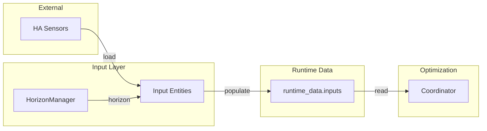

# Input Entities

Input entities are an intermediate layer between external Home Assistant sensors and the optimization model.
They load, transform, and expose forecast data as Number and Switch entities that users can inspect and optionally modify.

## Purpose

HAEO's input entity layer provides:

- **Visibility**: Users see loaded values as standard HA entities
- **Editability**: Values can be modified for what-if analysis or via automation service calls
- **Decoupling**: Data loading happens independently of optimization cycles
- **Alignment**: All inputs share synchronized forecast horizons

## Architecture



Input entities subscribe to the [HorizonManager](horizon-manager.md) and refresh their data when the forecast horizon advances.
The coordinator reads pre-loaded values from `runtime_data.inputs` rather than loading directly from sensors.

## Input Field Map

Each element type declares which configuration fields become input entities via its adapter's `inputs()` method.
The method returns a dict keyed by field name, with `InputFieldInfo` values that describe entity metadata, output type, direction, and time-series behavior.

See the element adapter modules for specific registrations.

## Entity Creation

Input entities are only created for fields configured with "Constant" during element setup.
When a user links to external sensors or selects "None" for optional fields, no HAEO input entity is created for that field.
This keeps the entity list focused on functionality the user has enabled.

**Constant fields**: An entity is created in EDITABLE mode, allowing runtime adjustment of the value.

**Entity-linked fields**: The external sensor is used directly; no HAEO input entity is created.

**None fields**: No entity is created.
The field is omitted from the optimization model entirely.

This behavior is controlled by the ChooseSelector config flow pattern documented in [Config Flow Development](config-flow.md#chooseselector-config-flow-pattern).

## Entity Types

### Number Entities

Number entities represent numeric input parameters such as power limits, energy capacity, prices, and percentages.
They allow user modification when in editable mode.

### Switch Entities

Switch entities represent boolean input parameters.
They toggle between on/off states and are typically editable.

## Configuration Modes

Input entities operate in one of two modes based on how the field was configured:

### Editable Mode

When the configuration specifies a constant value (not an external sensor):

- The entity displays the configured value
- Users can modify the value through the Home Assistant UI
- Service calls can update values for automation scenarios
- Changes persist and affect future optimizations
- Useful for what-if analysis and dynamic adjustments

### Driven Mode

When the configuration specifies an entity ID or list of entity IDs:

- The entity loads data from source sensors using TimeSeriesLoader
- Values update automatically when source sensors change
- The `source_entities` attribute lists the driving sensors
- User modifications via UI are not supported (value comes from sources)

## Entity Attributes

All input entities expose extra state attributes for debugging and automation:

| Attribute      | Description                                    |
| -------------- | ---------------------------------------------- |
| `config_mode`  | `"editable"` or `"driven"`                     |
| `element_name` | Element display name                           |
| `element_type` | Element type (battery, grid, etc.)             |
| `field_name`   | Configuration field name                       |
| `output_type`  | Category (power, energy, price, etc.)          |
| `time_series`  | Whether values vary per period                 |
| `direction`    | Power flow direction if applicable             |
| `forecast`     | Array of `{time, value}` points across horizon |

Driven mode entities also expose `source_entities` listing the entity IDs providing the data.

## Entity Naming

### Entity IDs

Entity IDs follow Home Assistant conventions:

```
number.{element_name}_{field_name}
switch.{element_name}_{field_name}
```

Examples:

- `number.battery_capacity`
- `number.main_grid_price_source_target`
- `switch.solar_curtailment`

### Device Association

Input entities belong to the same device as the element's output sensors, grouping all entities for an element together.

## Forecast Attribute

The `forecast` attribute provides time-series data aligned to the optimization horizon.
Each entry contains an ISO 8601 timestamp and the value for that period.

For scalar (non-time-series) inputs, all periods have the same value.
For time-series inputs, values vary based on loaded forecast data.

## Data Loading Flow

When the horizon changes or source sensors update:

1. HorizonManager notifies entity of new horizon
2. Entity calls TimeSeriesLoader with source entity IDs (driven mode only)
3. Loader extracts, combines, and fuses forecast data
4. Entity stores aligned values and updates HA state
5. Entity writes to `runtime_data.inputs` for coordinator access

## Entity Category

Input entities use `EntityCategory.CONFIG`:

- Excluded from default dashboards and history
- Visible in device pages and entity lists
- Appropriate for configuration-like values

Users can add specific inputs to dashboards if desired for monitoring.

## Related Documentation

<div class="grid cards" markdown>

- :material-timer-outline:{ .lg .middle } **Horizon Manager**

    ---

    Synchronized forecast time windows.

    [:material-arrow-right: Horizon manager guide](horizon-manager.md)

- :material-database:{ .lg .middle } **Data Loading**

    ---

    How TimeSeriesLoader extracts and aligns data.

    [:material-arrow-right: Data loading guide](data-loading.md)

- :material-sync:{ .lg .middle } **Coordinator**

    ---

    How coordinator uses pre-loaded input data.

    [:material-arrow-right: Coordinator guide](coordinator.md)

</div>
