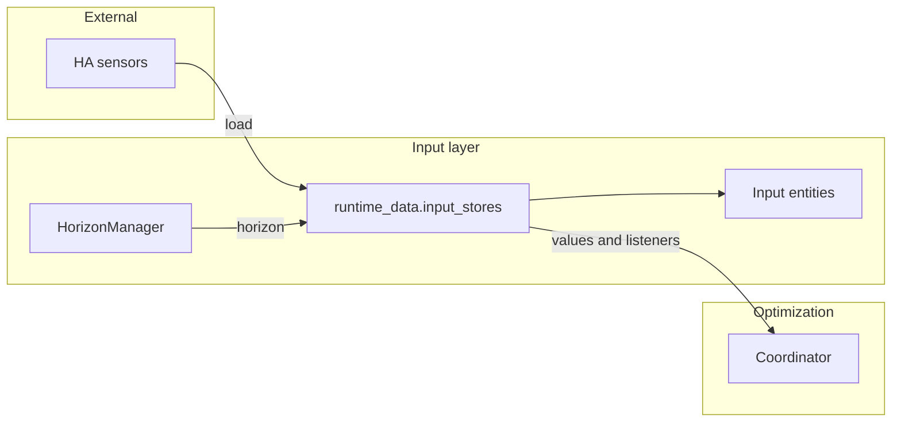

# Input entities

Input entities are an intermediate layer between external Home Assistant sensors and the optimization model.
They expose each configured input as a Number or Switch entity that users can inspect, and edit when it holds a constant.

## Purpose

HAEO's input layer provides:

- **Visibility**: Users see loaded values as standard Home Assistant entities
- **Editability**: Constant values can be changed for what-if analysis or through automations
- **Decoupling**: Data loading happens independently of optimization cycles
- **Alignment**: All inputs share synchronized forecast horizons

## Architecture

```mermaid
graph LR
    subgraph "External"
        Sensors[HA sensors]
    end

    subgraph "Input layer"
        Stores[runtime_data.input_stores]
        IE[Input entities]
        HM[HorizonManager]
    end

    subgraph "Optimization"
        Coord[Coordinator]
    end

    Sensors -->|load| Stores
    HM -->|horizon| Stores
    Stores --> IE
    Stores -->|values and listeners| Coord
```

An `InputStore` ([`core/data/input_store.py`](https://github.com/hass-energy/haeo/blob/main/custom_components/haeo/core/data/input_store.py)) is the single source of truth for one field's value.
`build_input_stores` in [`input_stores.py`](https://github.com/hass-energy/haeo/blob/main/custom_components/haeo/input_stores.py) creates the stores during setup, before any entity exists, and keeps them in `runtime_data.input_stores` keyed by `(element_name, field_path)`.
Each store is bound to a `SubentryStorage`, so an edited constant is written back to the element's subentry.

Two loaders in [`inputs/`](https://github.com/hass-energy/haeo/tree/main/custom_components/haeo/inputs) keep the stores loaded, and the Number and Switch entities only display them, following each store through `add_listener`.
A store therefore loads whether or not its entity is enabled.
The coordinator reads each store's resolved `value` and subscribes to changes with `add_listener`, rather than reading sensors itself.

## Input fields

Which config fields become inputs is derived from each element type's schema.
`get_input_fields()` in [`elements/__init__.py`](https://github.com/hass-energy/haeo/blob/main/custom_components/haeo/elements/__init__.py) builds the `InputFieldInfo` for each field from its field hints, describing the entity description, output type, direction, and time-series behavior.
`get_list_input_fields()` does the same for list fields, such as policy rules.

## Entity creation

Each field takes one of three values in the config flow, through the ChooseSelector pattern documented in [Config flow development](config-flow.md#chooseselector-config-flow-pattern):

- **Constant**: The store holds the value in **editable** mode, and the entity can change it.
- **Entity**: The store loads the selected sensors in **driven** mode, and the entity shows the loaded value read-only.
- **None**: No store or entity is created, and the field is omitted from the model.

Fields whose values are on or off, status and availability fields, become Switch entities, and every other field a Number entity.
A switch over a time series is on when its current period is, and its `forecast` attribute holds each period's value.

An element type with surfaced policy prices also gets mirror entities on its own device that wrap the policy rule's store, so editing either updates the one stored value.

## Loading

Driven stores resolve their sources with `resolve_field`, which extracts, combines, and fuses forecast data.
See the [Data loading guide](data-loading.md) for the pipeline.

Stores load at setup, when their source sensors change, and when the [HorizonManager](horizon-manager.md) advances.
A source update that resolves to the same value, timestamps, and availability as before does not notify the coordinator.

### Holding a reading through a gap

A store keeps the last state with a reading from each of its sources.
When a source has no reading, the store resolves from that last reading instead, alongside the live readings of its other sources and over the current horizon, so the input stays available and the coordinator keeps optimizing for as long as the source is out.
A reading becomes holdable only once a load resolves with it, so a reading the store rejected is never held.
Only a source's own state is held.
A state the calendar input loader annotates with data fetched for the current horizon, a calendar's events or a meter's totals, describes only that horizon, so a calendar whose events no longer cover the horizon, or a meter without a reading, makes its input unavailable at once.

The hold is silent for the hub's `input_hold_seconds` from that moment, 60 seconds unless set otherwise.
It is timed on the monotonic clock, so setting the wall clock does not lengthen or end it.
Once it passes, the store keeps resolving from the held reading and lists the source in `degraded_sources`, with `degraded_since` the wall-clock time the first of them lost its reading.
With `input_hold_seconds` at 0 a source is degraded as soon as it has no reading.
The coordinator reports a solve that used a degraded store as [degraded](coordinator.md#optimization-status) and raises a `degraded_input` repair issue for it.
Last readings are kept only in memory, so after a restart a source that comes up without a reading has none to hold.
`SourceInputLoader` looks such a source up in the recorder once, through `async_last_recorded_reading()` in [`inputs/recorded_reading.py`](https://github.com/hass-energy/haeo/blob/main/custom_components/haeo/inputs/recorded_reading.py), which takes the latest of its last recorded states that has a reading.
It passes that state to `seed_reading()` on each store in `sources_without_last_reading` and reloads them.
A seeded reading is held as if the source lost it at the state's `last_reported` time, so the hold, `held_since`, and the degraded issue's time all count from then, and a restart that took longer than the hold is degraded at once.
The coordinator holds back new `degraded_input` issues for one hold after it is created, so sources whose integrations are still starting are not reported, as described in [the coordinator's inputs](coordinator.md#inputs).
`last_reported` is the last time the source reported that reading, even unchanged, so a steady sensor's reading is not mistaken for an old one, as its `last_updated` would be.
Calendar-driven stores, which hold calendars' events and meters' totals, are loaded by the calendar loader and never seeded.
A source with no reading in memory or in the recorder is never held, so setup still waits for every input, and a store that cannot resolve without one is unavailable and raises the `unavailable_input` issue.
A source that reads again is live at once, and a later gap starts a new hold.

A hold starting or ending leaves the value as it is, so it does not notify the store's `add_listener` listeners, and the coordinator does not re-optimize for it.
A source becoming degraded, or a degraded source reading again, does notify them, even when the value is unchanged, so the coordinator re-optimizes and reports the new status.
It notifies `add_hold_listener` listeners instead: the input entities, which update the attributes naming the held source, and `InputHoldExpiry`.
A source that stays without a reading does not change, so nothing would reload its store when the hold passes.
`InputHoldExpiry` in [`inputs/hold_expiry.py`](https://github.com/hass-energy/haeo/blob/main/custom_components/haeo/inputs/hold_expiry.py) waits for the earliest `hold_expires_at`, and then calls `expire_holds()` on each store and notifies those with newly degraded sources.
A reading already held for the hold or longer, such as a seeded one, is degraded before hold listeners are told, so it has no `hold_expires_at` to wait for.

Diagnostics capture a held source as its last reading with a `haeo_held_since` attribute, the time it lost that reading, so a replay resolves the same value and the held reading is told apart from a live one.

The Home Assistant side of reading inputs lives in [`inputs/`](https://github.com/hass-energy/haeo/tree/main/custom_components/haeo/inputs):

- `ha_state_machine.py` adapts Home Assistant's state machine to the `StateMachine` protocol the core loaders read through.
- `source_loader.py` loads every other store, from its source sensors or its constant.
    Sensors that change together in one pass share one reload.
- `hold_expiry.py` marks a store degraded once a reading it holds through a gap outlasts the hold.
- `recorded_reading.py` looks up a source's last recorded reading, for a source with no reading at startup.
- `calendar_loader.py` loads stores that read calendars, since a calendar's state carries only its current event.
    It fetches events from the horizon's start to a day past its end in the background, and hands them to the core loader as a state attribute, so horizon rolls resolve from events already fetched.
- `meter_history.py` keeps the running totals of meter fields through resets, from recorder statistics and later state changes.
    When the statistics cannot be read, the calendar loader retries in the background after its next load, without holding loads up.

`core/annotated_state.py` merges those calendar events and meter totals into entity states in the same form diagnostics capture, so live runs and replays read inputs the same way.

## Entity attributes

All input entities expose extra state attributes for debugging and automation:

| Attribute      | Description                                                |
| -------------- | ---------------------------------------------------------- |
| `config_mode`  | `editable` or `driven`                                     |
| `element_name` | Element name                                               |
| `element_type` | Element type                                               |
| `field_name`   | Configuration field name                                   |
| `field_path`   | Path to the field within the element's config              |
| `field_type`   | Output type of the field, such as power or price           |
| `time_series`  | Whether values vary per period                             |
| `direction`    | Power flow direction, when the field has one               |
| `forecast`     | `{time, value}` points across the horizon, for time series |

Driven Number entities also expose `source_entities`, listing the entity IDs that provide the data, and driven Switch entities expose `source_entity`, the one entity they follow.

While a driven input holds a reading through a gap, it also exposes `held_source_entity`, the held source that lost its reading first, and `held_since`, when that source lost it.
Both are absent while every source has a reading, so automations can tell a held value from a live one.

## Entity naming and category

Input entities use translated names, and belong to the device of the element they configure.
Their unique IDs come from `element_unique_id` in `unique_id.py`.

Input entities use `EntityCategory.CONFIG`, so they show on device pages rather than default dashboards.

## Related documentation

- :material-timer-outline:{ .lg .middle } **Horizon manager**

    ---

    Synchronized forecast time windows.

    [:material-arrow-right: Horizon manager guide](horizon-manager.md)

- :material-database:{ .lg .middle } **Data loading**

    ---

    How the field resolver extracts and aligns data.

    [:material-arrow-right: Data loading guide](data-loading.md)

- :material-sync:{ .lg .middle } **Coordinator**

    ---

    How the coordinator uses pre-loaded input data.

    [:material-arrow-right: Coordinator guide](coordinator.md)

