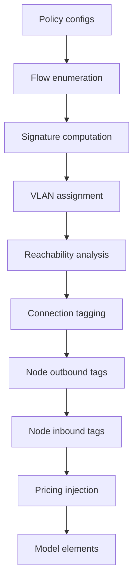

# Policy compilation

This guide explains how user-configured power policies compile into the LP model.
See [Power policies](../modeling/tagged-power.md) for the design rationale.
See [VLAN optimization](vlan-optimization.md) for variable minimization algorithms.

## Overview

Policies are a device-layer concept.
Users configure source-destination pairs with prices and limits.
The compilation pipeline transforms those rules into model-layer constructs.
Those constructs include optimized VLAN assignments, connection tagging, node outbound and inbound tags, and scoped segments.

The compiler uses a default-allow model: policied sources are forced onto their assigned VLAN, while unpolicied sources produce on tag 0.
All sink nodes accept every active VLAN plus tag 0, so both policied and unpolicied power can reach any destination.
Only sources with explicit policies receive non-zero tags, minimizing LP variable growth.

## Pipeline



### Step 1: Flow enumeration

Each policy expands into concrete `(source, destination, price_st, price_ts)` tuples.
Wildcards (`*`) expand to capability-matching nodes only: source wildcards expand to
nodes with `is_source=True`, and destination wildcards expand to nodes with `is_sink=True`.

### Step 2: Signature computation

For each source node, collect the set of `(destination, price)` tuples from all matching policies.
This set is the node's **policy signature**.

### Step 3: VLAN assignment

Group sources by identical signature.
Assign one VLAN per group.
This yields the minimum VLAN count for correct policy behavior.

### Step 4: Reachability analysis

For each VLAN, find connections on directed paths from source nodes to *any* sink node — not just the policy's explicit destinations.
Forward reachability follows connection direction (source → target); backward reachability follows reverse direction (target → source).
Only connections whose endpoints appear in both the forward and backward reachable sets receive variables for that VLAN.
This directed approach prevents tags from leaking onto adjacent connections not on a valid source-to-sink path.

Restricting VLAN membership to policy-specific destinations only would force tagged flow to detour through storage (or be curtailed) whenever the source exceeded its policy destination's capacity, because non-destination sinks would refuse the tag.
That manifests as spurious simultaneous battery charge and discharge — power "laundered" through storage purely to relabel its provenance.
Pricing is still placed only on the cut separating source from its policy-specific destinations (Step 8), so non-destination sinks remain policy-free.

### Step 5: Connection tagging

Apply reachability results so each connection gets the set of VLANs that can traverse it.

### Step 6: Node outbound tags

Set `outbound_tags` on each source node with an assigned VLAN.
The node's `element_power_balance` constraint enforces that only the outbound tags carry produced power.

### Step 7: Node inbound tags

Set `inbound_tags` on each sink node.
All sinks accept tag 0 (unpolicied power) plus all active policy VLANs.
This default-allow approach ensures both policied and unpolicied power can reach any sink.

Junction nodes (neither source nor sink) do not receive inbound tags.
Power on any VLAN can still flow through junction nodes for routing.

### Step 8: Pricing injection

For each policy, compute a sink-side canonical minimum s-t cut on the per-VLAN subgraph and attach scoped pricing segments to the connections in that cut.
Sources of the cut are the policy's source nodes; sinks are the policy's destination nodes.
The algorithm is Edmonds–Karp max-flow with unit edge capacities; the sink-side canonical cut is recovered from the residual graph by reverse BFS from the super-sink.

Unit capacities and the sink-side choice together guarantee:

- Every source-to-destination path on the VLAN crosses exactly one cut edge, so a unit of tagged flow pays the policy price exactly once.
    No stacking from overlapping sub-cuts, and no flows that bypass pricing.
- Minimum cut cardinality, so pricing is attached to the fewest connections possible.
    This extends cleanly to power-limit policies, which become a single $\sum_{e \in \text{cut}} P^{tag}_{e,t} \le X$ constraint.
- Natural collapse to intuitive placements: target-inbound edges for a specific destination, source-outbound edges for a single-outbound source targeting a wildcard, and a shared bottleneck (e.g. an inverter) when many sources and many destinations converge through a narrower middle.

A source that also appears in the destination set (e.g. a battery is both source and sink after wildcard expansion) has only the self-loop removed from the destination set; other destinations are still cut normally.
Each injected segment's `tag` matches the source VLAN, and `price_source_target` and `price_target_source` map from the policy's directional prices.

## Architecture

### Where compilation runs

Compilation lives in `custom_components/haeo/core/adapters/policy_compilation.py`.
It runs as a post-processing step in `collect_model_elements()`.

### Adapter interaction

The policy adapter produces rule configs, not model elements.
`collect_model_elements()` extracts those rules and passes them to the compilation pipeline.
The pipeline updates other adapters' model element configs by adding connection tags, node `outbound_tags` values, and tag costs.

### Model layer isolation

The model layer is policy-unaware.
It operates on integer tags and scoped segments.
All policy semantics are resolved in the compilation layer.

## Example

```
Nodes: Grid, Solar, Battery, Switchboard, Load
Policies:
  Grid -> Load: $0.05/kWh
  Solar -> Load: $0.02/kWh
```

| Step             | Result                                                                          |
| ---------------- | ------------------------------------------------------------------------------- |
| Flow enumeration | {(Grid,Load,0.05), (Solar,Load,0.02)}                                           |
| Signatures       | Grid and Solar have different signatures; others have empty signatures          |
| VLANs            | Grid=1, Solar=2, others stay on tag 0                                           |
| Reachability     | VLAN 1 on connections from Grid to every sink; VLAN 2 on connections from Solar |
| Connection tags  | Each connection carries only VLANs for paths through it                         |
| Outbound tags    | Grid emits VLAN 1, Solar emits VLAN 2, Battery emits tag 0                      |
| Inbound tags     | Load accepts tag 0, VLAN 1, and VLAN 2                                          |
| Pricing          | Min-cut for each VLAN is SW→Load: pricing(tag=1,$0.05) and pricing(tag=2,$0.02) |

Result: Solar power is preferred over grid power because it has lower policy cost.
Battery power flows freely on tag 0 at zero policy cost.

## Testing

Tests live in `custom_components/haeo/core/adapters/tests/test_policy_compilation.py`.

- **Signature computation**: correct signatures from explicit policies only.
- **VLAN assignment**: only policied sources get non-zero VLANs.
- **Reachability**: directed connection tagging for tree topologies.
- **Source enforcement**: `outbound_tags` set on policied sources and unpolicied source-capable nodes.
- **Default-allow**: unpolicied sources flow to policied destinations at zero cost on tag 0.
- **No bypass**: policied sources cannot avoid policy costs via tag 0.
- **End-to-end**: full network optimization with policies produces correct costs.

## Related

- [Power policies](../modeling/tagged-power.md) for design and mathematical formulation.
- [VLAN optimization](vlan-optimization.md) for variable minimization algorithms.
- [Adapter layer](adapter-layer.md) for adapter architecture.
