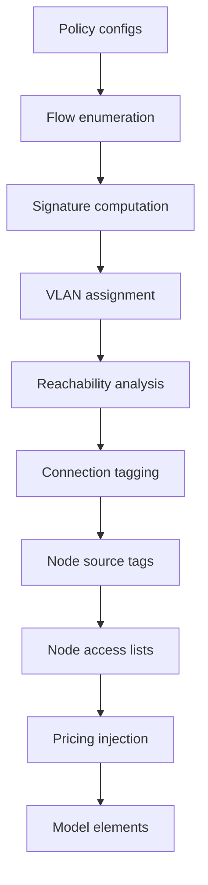

# Policy compilation

This guide explains how user-configured power policies compile into the LP model.
See [Power policies](../modeling/tagged-power.md) for the design rationale.
See [VLAN optimization](vlan-optimization.md) for variable minimization algorithms.

## Overview

Policies are a device-layer concept.
Users configure source-destination pairs with prices and limits.
The compilation pipeline transforms those rules into model-layer constructs.
Those constructs include optimized VLAN assignments, connection tagging, node access lists, and scoped segments.

When any policy exists, the compiler prepends an implicit `* -> *` rule with no price.
This ensures all source-destination pairs have VLAN paths, making unpolicied flows free.
The implicit rule follows the same compilation pipeline as user-configured policies.

## Pipeline



### Step 1: Flow enumeration

Each policy expands into concrete `(source, destination, price_st, price_ts)` tuples.
Wildcards (`*`) expand to capability-matching nodes only: source wildcards expand to
nodes with `is_source=True`, and destination wildcards expand to nodes with `is_sink=True`.

### Step 2: Signature computation

For each source node, collect the set of `(destination, price)` tuples from all matching policies.
This set is the node's **policy signature**.

### Step 3: VLAN assignment

Group sources by identical signature.
Assign one VLAN per group.
This yields the minimum VLAN count for correct policy behavior.

### Step 4: Reachability analysis

For each VLAN, find connections on paths from source nodes to destination nodes.
Only reachable connections receive variables for that VLAN.

### Step 5: Connection tagging

Apply reachability results so each connection gets the set of VLANs that can traverse it.

### Step 6: Node outbound tags

Set `outbound_tags` on each source node with an assigned VLAN.
The node's `element_power_balance` constraint enforces that only the outbound tags carry produced power.

### Step 7: Node inbound tags

Compute which VLANs each node can consume.

- A node can consume VLAN `v` if any policy has that node as a destination and the source matches VLAN `v`.
- The implicit `* -> *` rule ensures every node is a destination for every source VLAN.

Power on non-consumable VLANs can still flow through the node for routing.
That power cannot terminate at the node.

### Step 8: Pricing injection

For each policy, add a scoped pricing segment at the destination connection.
The segment's `tag` matches the source VLAN.

## Architecture

### Where compilation runs

Compilation lives in `custom_components/haeo/core/adapters/policy_compilation.py`.
It runs as a post-processing step in `collect_model_elements()`.

### Adapter interaction

The policy adapter produces rule configs, not model elements.
`collect_model_elements()` extracts those rules and passes them to the compilation pipeline.
The pipeline updates other adapters' model element configs by adding connection tags, node `outbound_tags` values, and tag costs.

### Model layer isolation

The model layer is policy-unaware.
It operates on integer tags and scoped segments.
All policy semantics are resolved in the compilation layer.

## Example

```
Nodes: Grid, Solar, Battery, Switchboard, Load
Policies:
  Grid -> Load: $0.05/kWh
  Solar -> Load: $0.02/kWh
```

| Step             | Result                                                                |
| ---------------- | --------------------------------------------------------------------- |
| Flow enumeration | Implicit `* -> *` (no price) + {(Grid,Load,0.05), (Solar,Load,0.02)}  |
| Signatures       | Each node has a unique signature (implicit rule + explicit policies)  |
| VLANs            | Each node gets a distinct VLAN                                        |
| Reachability     | All VLANs reach all connections                                       |
| Connection tags  | All connections carry all VLANs                                       |
| Outbound tags    | Each node emits only its own VLAN                                     |
| Inbound tags     | Each node consumes all VLANs                                          |
| Pricing          | SW->Load: pricing(tag=grid_vlan,$0.05), pricing(tag=solar_vlan,$0.02) |

Result: Solar power is preferred over grid power because it has lower policy cost.
Battery power flows freely at zero policy cost through its implicit rule VLAN.

## Testing

Tests live in `custom_components/haeo/core/adapters/tests/test_policy_compilation.py`.

- **Signature computation**: correct signatures with implicit allow-all rule.
- **VLAN assignment**: all nodes get non-zero VLANs.
- **Reachability**: correct connection tagging for tree topologies.
- **Source enforcement**: `outbound_tags` set on all nodes.
- **Default-allow**: unpolicied sources flow to policied destinations at zero cost.
- **No bypass**: policied sources cannot avoid policy costs.
- **End-to-end**: full network optimization with policies produces correct costs.

## Related

- [Power policies](../modeling/tagged-power.md) for design and mathematical formulation.
- [VLAN optimization](vlan-optimization.md) for variable minimization algorithms.
- [Adapter layer](adapter-layer.md) for adapter architecture.
