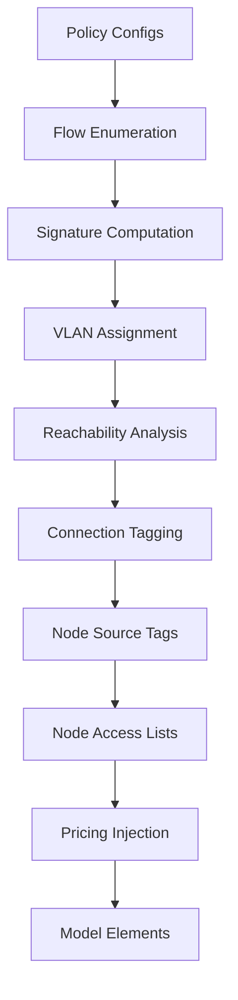

# Policy Compilation

This guide explains how user-configured power policies compile into the LP model.
See [Power Policies](../modeling/tagged-power.md) for the design rationale and
[VLAN Optimization](vlan-optimization.md) for the variable minimization algorithms.

## Overview

Policies are a device-layer concept. Users configure source–destination pairs with
prices and limits. The compilation pipeline transforms these into model-layer constructs:
optimized VLAN assignments, connection tagging, node access lists, and scoped segments.

## Pipeline



### Step 1: Flow Enumeration

Each policy expands into concrete `(source, destination, price_st, price_ts)` tuples.
Wildcards (`*`) expand to all nodes.

### Step 2: Signature Computation

Per source node, collect the set of `(destination, price)` tuples from all matching policies.
This is the node's **policy signature**.

### Step 3: VLAN Assignment

Group sources by identical signature → assign one VLAN per group.
This is the **minimum** number of VLANs (see [VLAN Optimization](vlan-optimization.md)).

### Step 4: Reachability Analysis

For each VLAN, find connections on paths from source nodes to destination nodes.
Only reachable connections get that VLAN's variables.

### Step 5: Connection Tagging

Apply the reachability results: each connection gets its set of reachable VLANs.

### Step 6: Node Source Tags

Set `source_tag` on each source node that has a VLAN assigned.
The Node's `node_tag_power_balance` constraint enforces that only the source's own tag
carries outbound power.

### Step 7: Node Access Lists

Compute which VLANs each node can consume:

- A node can consume VLAN `v` if any policy has that node as a destination and
    the source matches VLAN `v`.

Power on non-consumable VLANs can still **flow through** the node (routing)
but cannot terminate there.

### Step 8: Pricing Injection

For each policy, add a scoped pricing segment at the destination connection.
The segment's `tag` parameter matches the source VLAN.

## Architecture

### Where Compilation Lives

`core/adapters/tariff_compilation.py` (to be renamed `policy_compilation.py`).
Post-processing step in `collect_model_elements()`.

### Adapter Interaction

The policy adapter produces **rule configs**, not model elements.
`collect_model_elements()` extracts rules from policy adapters and passes them
to the compilation pipeline. The pipeline modifies the other adapters' model
element configs (adding tags to connections, source_tag to nodes, segments).

### Model Layer Isolation

The model layer (Segment, Connection, Node, Network) is **policy-unaware**.
It operates on integer tags and scoped segments. All policy semantics are
resolved at the compilation layer.

## Example

```
Nodes: Grid, Solar, Battery, Switchboard, Load
Policies:
  Grid → Load: $0.05/kWh
  Solar → Load: $0.02/kWh
```

| Step             | Result                                                              |
| ---------------- | ------------------------------------------------------------------- |
| Flow enumeration | {(Grid,Load,0.05), (Solar,Load,0.02)}                               |
| Signatures       | Grid={(Load,0.05)}, Solar={(Load,0.02)}, Battery={}, SW={}, Load={} |
| VLANs            | Grid=1, Solar=2, others=0. K=3                                      |
| Reachability     | VLAN 1: Grid→SW, SW→Load. VLAN 2: Solar→SW, SW→Load                 |
| Connection tags  | Grid→SW: {0,1}. Solar→SW: {0,2}. SW→Load: {0,1,2}. Battery→SW: \{0} |
| Source tags      | Grid: source_tag=1, Solar: source_tag=2                             |
| Access lists     | Load: consumes {1,2}. SW: forwards all. Battery: consumes \{0}      |
| Pricing          | SW→Load: pricing(tag=1,$0.05), pricing(tag=2,$0.02)                 |

Result: Solar power ($0.02) preferred over Grid ($0.05). Battery power (no policy)
can't reach Load (VLAN 0 not in Load's access list). Battery can only consume
non-policy power (VLAN 0).

## Testing

Tests in `core/adapters/tests/test_tariff_compilation.py`:

1. **Signature computation**: Correct merging of identical signatures
2. **VLAN assignment**: Minimum VLANs for various policy sets
3. **Reachability**: Correct connection tagging for tree topologies
4. **Source enforcement**: `source_tag` set on correct nodes
5. **End-to-end**: Full network optimization with policies produces correct costs

## Related

- [Power Policies](../modeling/tagged-power.md) — design and mathematical formulation
- [VLAN Optimization](vlan-optimization.md) — variable minimization algorithms
- [Adapter Layer](adapter-layer.md) — adapter architecture
