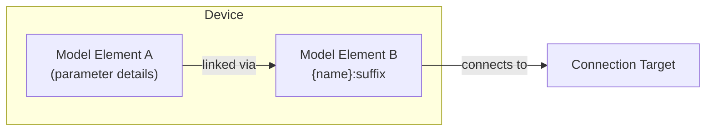

# [Device Element Name]

Brief description of this device element's purpose and what it models (1-2 sentences).
Focus on the user-facing functionality and the physical system being represented.

## Model Elements Created

| Model Element                                                                 | Name            | Parameters From Configuration |
| ----------------------------------------------------------------------------- | --------------- | ----------------------------- |
| [Model Element A](../../modeling/model-layer/elements/energy-storage.md)      | `{name}`        | List key parameters passed    |
| [Model Element B](../../modeling/model-layer/connections/power-connection.md) | `{name}:suffix` | List key parameters passed    |

!!! note "Template Instructions"

    - Show only what THIS device creates in the "Device" subgraph
    - Place external connection targets (nodes) OUTSIDE the subgraph
    - Don't show the Device Layer element itself (implied by page context)
    - Keep model element labels concise

## Devices Created

Describe the Home Assistant devices created by this element.
Most elements create a single device, but some may create multiple.

| Device    | Name            | Created When              | Purpose                         |
| --------- | --------------- | ------------------------- | ------------------------------- |
| Primary   | `{name}`        | Always                    | Main device functionality       |
| Secondary | `{name}:suffix` | Conditional configuration | Additional device functionality |

## Parameter Mapping

The adapter transforms user configuration into model parameters.
Show the key mappings that aren't obvious.

| User Configuration | Model Element   | Model Parameter    | Notes                      |
| ------------------ | --------------- | ------------------ | -------------------------- |
| `config_field`     | Model Element A | $p_{\text{param}}$ | Transformation description |
| `another_field`    | Model Element B | $q_{\text{param}}$ | Transformation description |

## Sensors Created

### Sensor Summary

List all sensors this device creates, organized by device.

| Sensor           | Unit | Update    | Description                   |
| ---------------- | ---- | --------- | ----------------------------- |
| `sensor_name`    | kW   | Real-time | Description of sensor purpose |
| `another_sensor` | kWh  | Real-time | Description of sensor purpose |

See [Element Configuration](../../user-guide/elements/%7Belement%7D.md) for detailed sensor and configuration documentation.

## Configuration Example

Provide realistic configuration examples using table format showing common use cases.

### Basic Configuration

| Field              | Value        |
| ------------------ | ------------ |
| **Name**           | Example Name |
| **Required Field** | value        |
| **Optional Field** | value        |
| **Connection**     | node_name    |

## Typical Use Cases

Describe 2-3 common scenarios where users would configure this element:

**Use Case 1**: Brief description of scenario and configuration approach.

**Use Case 2**: Brief description of scenario and configuration approach.

## Physical Interpretation

Explain how this device element maps to real-world hardware or system behavior.
Focus on what the user is modeling, not mathematical formulation.

### Configuration Guidelines

Provide practical advice for setting configuration values:

- Guideline 1: When to use certain values or settings
- Guideline 2: Common mistakes and how to avoid them
- Guideline 3: Performance or accuracy considerations

## Next Steps

!!! note "Template Instructions"

    Curate 3-4 Next Steps cards for readers of this page.
    Link to related Device Layer elements, Model Layer documentation, or user guides.

- :material-connection:{ .lg .middle } **Connect to network**

    ---

    Learn how to connect this element to other elements in your network.

    [:material-arrow-right: Elements overview](../../user-guide/elements/index.md)

- :material-chart-line:{ .lg .middle } **Understand forecasts**

    ---

    Learn how sensor data and forecasts affect optimization.

    [:material-arrow-right: Forecasts and sensors guide](../../user-guide/forecasts-and-sensors.md)

- :material-math-integral:{ .lg .middle } **Model Layer details**

    ---

    Understand the mathematical formulation of this element.

    [:material-arrow-right: Model Layer documentation](../../modeling/model-layer/index.md)

