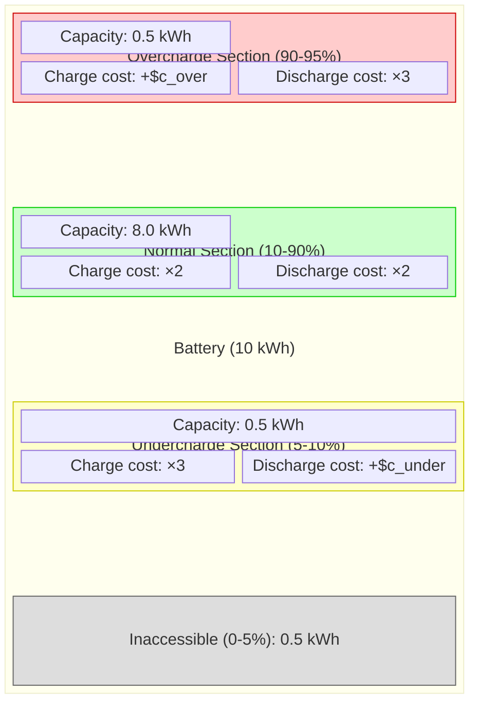

# Battery Modeling

This page explains how HAEO models battery storage systems using linear programming with a multi-section approach.

## Overview

A battery in HAEO is modeled as an energy storage device with:

- **Energy capacity**: Maximum stored energy
- **Power constraints**: Maximum charge/discharge rates
- **Multi-section SOC tracking**: Independent sections with cost-based operating preferences
- **Efficiency losses**: Energy lost during charge/discharge cycles
- **Flexible operating ranges**: Economic incentives guide operation across SOC ranges

## Multi-Section Model Approach

HAEO uses a **multi-section battery model** where the battery's state of charge range is divided into independent virtual sections.
Each section has its own cumulative energy variables and cost structure that guides optimizer behavior:

1. **Undercharge section** (if configured): `[undercharge_percentage, min_charge_percentage]`
2. **Normal section** (always present): `[min_charge_percentage, max_charge_percentage]`
3. **Overcharge section** (if configured): `[max_charge_percentage, overcharge_percentage]`

### Visual Representation

The following diagram shows how a battery with all three sections is structured:



**Cost multiplier notation**: The `×N` values multiply the `early_charge_incentive` parameter.
Higher multipliers create stronger economic preferences for using those sections first or last.

### Section Independence

**Key design principle**: Sections are **independent** — they have no explicit ordering constraints.
The optimizer can charge or discharge any section at any time, subject only to:

1. Each section's own capacity bounds
2. Shared power limits across all sections
3. Economic costs that create behavioral preferences

**Cost-based guidance**: Different cost multipliers create economic incentives:

- **Charging preference**: Lower costs encourage filling lower sections first (undercharge has 3× early charge incentive, normal has 2×, overcharge has 1× plus penalty)
- **Discharging preference**: Lower costs encourage emptying higher sections first (overcharge has 3× late discharge incentive, normal has 2×, undercharge has 1× plus penalty)

This approach allows flexible operation where the optimizer can make economically rational trade-offs (e.g., charging the overcharge section when grid prices are extremely low, even if the normal section isn't full).

### Semantic Boundaries

- **`undercharge_percentage`** and **`overcharge_percentage`** are **economic boundaries** (outer bounds) with discharge and charge penalties respectively
- **`min_charge_percentage`** and **`max_charge_percentage`** are **preferred operating range** (inner bounds) with no penalties

**Example configuration**:

```
undercharge=5% < min=10% < max=90% < overcharge=95%
```

This creates three sections where operation in the undercharge and overcharge zones is economically discouraged but not prohibited.

## Model Formulation

### Decision Variables

For each section $n$ and time step $t \in \{0, 1, \ldots, T\}$ (note: $T+1$ time points for energy state):

- $E_{\text{in}}^n(t)$: Cumulative energy charged into section $n$ (kWh, monotonically increasing)
- $E_{\text{out}}^n(t)$: Cumulative energy discharged from section $n$ (kWh, monotonically increasing)

**Initial conditions**:

- $E_{\text{in}}^n(0)$: Set based on initial SOC distribution across sections (constant, not a variable)
- $E_{\text{out}}^n(0) = 0$: All sections start with zero cumulative discharge

### Parameters

**Required parameters**:

- $C$: Battery capacity (kWh) - `capacity`
- $\text{SOC}_{\text{initial}}$: Initial state of charge (%) - `initial_charge_percentage`
- $\text{SOC}_{\text{min}}$: Preferred minimum state of charge (%) - `min_charge_percentage` (default: 10%)
- $\text{SOC}_{\text{max}}$: Preferred maximum state of charge (%) - `max_charge_percentage` (default: 90%)
- $P_{\text{charge}}^{\max}$: Maximum charging power (kW) - `max_charge_power`
- $P_{\text{discharge}}^{\max}$: Maximum discharging power (kW) - `max_discharge_power`
- $\eta$: One-way efficiency (0-100) - `efficiency` (default: 99%)
- $\Delta t$: Time step duration (hours) - `period`
- $\epsilon$: Early charge incentive (\$/kWh) - `early_charge_incentive` (default: 0.001)

**Optional section boundary parameters**:

- $\text{SOC}\_{\text{undercharge}}$: Economic minimum state of charge (%) - `undercharge_percentage`
- $\text{SOC}\_{\text{overcharge}}$: Economic maximum state of charge (%) - `overcharge_percentage`
- $c\_{\text{undercharge}}$: Cost penalty for discharging in undercharge section (\$/kWh) - `undercharge_cost`
- $c\_{\text{overcharge}}$: Cost penalty for charging in overcharge section (\$/kWh) - `overcharge_cost`
- $c\_{\text{discharge}}$: Base discharge cost (\$/kWh) - `discharge_cost` (default: 0)

### Constraints

All constraints are applied independently per section unless otherwise noted.

#### 1. Monotonicity Constraints

Cumulative energy variables can only increase over time (prevents energy flowing backward):

$$
\begin{align}
E_{\text{in}}^n(t+1) &\geq E_{\text{in}}^n(t) \quad \forall n, t \in [0, T-1] \\
E_{\text{out}}^n(t+1) &\geq E_{\text{out}}^n(t) \quad \forall n, t \in [0, T-1]
\end{align}
$$

This ensures energy flows are unidirectional (charging increases $E_{\text{in}}$, discharging increases $E_{\text{out}}$).

#### 2. Section Capacity Constraints

Each section's net energy must stay within its virtual capacity:

$$
0 \leq E_{\text{in}}^n(t) - E_{\text{out}}^n(t) \leq C^n(t) \quad \forall n, t \in [1, T]
$$

Where $C^n$ is the virtual capacity of section $n$:

$$
C^n = C \cdot \frac{\text{SOC}\_{\text{upper}}^n - \text{SOC}\_{\text{lower}}^n}{100}
$$

**Section capacity calculations** (for a 10 kWh battery with `[5%-10%-90%-95%]` configuration):

- Undercharge: $C^{\text{undercharge}} = 10 \cdot (0.10 - 0.05) = 0.5$ kWh
- Normal: $C^{\text{normal}} = 10 \cdot (0.90 - 0.10) = 8.0$ kWh
- Overcharge: $C^{\text{overcharge}} = 10 \cdot (0.95 - 0.90) = 0.5$ kWh

#### 3. Power Balance Constraint

The sum of net energy changes across all sections equals the power input from the network (with efficiency):

$$
P_{\text{connection}}(t) \cdot \frac{\eta}{100} \cdot \Delta t = \sum_{n} \left[ \left( E_{\text{in}}^n(t+1) - E_{\text{in}}^n(t) \right) - \left( E_{\text{out}}^n(t+1) - E_{\text{out}}^n(t) \right) \right]
$$

for all $t \in [0, T-1]$.

Where:

- $P_{\text{connection}}(t)$ is the power from network connections (positive = charging, negative = discharging)
- $\eta$ is the one-way efficiency percentage (applied symmetrically to both charge and discharge)

**Efficiency application**: The efficiency multiplier applies to the connection power, causing:

- **When charging** ($P_{\text{connection}} > 0$): Less energy stored than power consumed (efficiency loss)
- **When discharging** ($P_{\text{connection}} < 0$): Less power delivered than energy extracted (efficiency loss)

#### 4. Power Limit Constraints

Total charging and discharging power across all sections is limited:

$$
\begin{align}
\sum_{n} P_{\text{charge}}^n(t) &\leq P_{\text{charge}}^{\max}(t) \quad \forall t \\
\sum_{n} P_{\text{discharge}}^n(t) &\leq P_{\text{discharge}}^{\max}(t) \quad \forall t
\end{align}
$$

Where section power is computed from energy deltas:

$$
\begin{align}
P_{\text{charge}}^n(t) &= \frac{E_{\text{in}}^n(t+1) - E_{\text{in}}^n(t)}{\Delta t} \\
P_{\text{discharge}}^n(t) &= \frac{E_{\text{out}}^n(t+1) - E_{\text{out}}^n(t)}{\Delta t}
\end{align}
$$

#### 5. Time-Slicing Constraint

Prevents simultaneous full-power charging and discharging (which would waste energy):

$$
\frac{\sum_{n} P_{\text{charge}}^n(t)}{P_{\text{charge}}^{\max}(t)} + \frac{\sum_{n} P_{\text{discharge}}^n(t)}{P_{\text{discharge}}^{\max}(t)} \leq 1.0 \quad \forall t
$$

This allows partial cycling (e.g., 50% charge rate + 50% discharge rate) but prevents operating both at maximum simultaneously.

**Note**: This constraint is only applied when both power limits are configured and non-zero.

#### 6. Initial Energy Distribution

Initial energy from $\text{SOC}_{\text{initial}}$ is distributed across sections from bottom to top.

Given initial SOC, first calculate accessible energy:

$$
E_{\text{accessible}}(0) = C \cdot \max\left(0, \frac{\text{SOC}_{\text{initial}} - \text{SOC}_{\text{undercharge}}}{100}\right)
$$

Then fill sections sequentially:

1. **Undercharge section** (if configured): $E_{\text{in}}^{\text{undercharge}}(0) = \min(E_{\text{accessible}}(0), C^{\text{undercharge}})$
2. **Normal section**: $E_{\text{in}}^{\text{normal}}(0) = \min(\text{remaining}, C^{\text{normal}})$
3. **Overcharge section** (if configured): $E_{\text{in}}^{\text{overcharge}}(0) = \min(\text{remaining}, C^{\text{overcharge}})$

All sections have $E_{\text{out}}^n(0) = 0$.

**Example**: 50% SOC in a battery with sections `[5%-10%-90%-95%]` and capacity 10 kWh:

- Accessible energy: $10 \cdot (0.50 - 0.05) = 4.5$ kWh
- Undercharge (0.5 kWh capacity): Gets 0.5 kWh (full)
- Normal (8.0 kWh capacity): Gets 4.0 kWh (partial fill, 50% of its capacity)
- Overcharge (0.5 kWh capacity): Gets 0 kWh (empty)

### Cost Contribution

Battery operation costs are calculated per section based on energy flow:

$$
\text{Battery Cost} = \sum_{n} \sum_{t=0}^{T-1} \left[ \Delta E_{\text{in}}^n(t) \cdot c_{\text{charge}}^n(t) + \Delta E_{\text{out}}^n(t) \cdot c_{\text{discharge}}^n(t) \right]
$$

Where:

- $\Delta E_{\text{in}}^n(t) = E_{\text{in}}^n(t+1) - E_{\text{in}}^n(t)$ is the energy charged into section $n$ during timestep $t$
- $\Delta E_{\text{out}}^n(t) = E_{\text{out}}^n(t+1) - E_{\text{out}}^n(t)$ is the energy discharged from section $n$ during timestep $t$

#### Cost Structure by Section

The costs use multipliers of the `early_charge_incentive` parameter $\epsilon$ to create time-varying preferences.

**Time-varying incentive components**:

$$
\begin{align}
c_{\text{charge-early}}(t) &= -\epsilon \cdot \frac{t}{T-1} \quad \text{(linear from } -\epsilon \text{ to } 0\text{)} \\
c_{\text{discharge-late}}(t) &= \epsilon \cdot \frac{t}{T-1} \quad \text{(linear from } 0 \text{ to } \epsilon\text{)}
\end{align}
$$

**Undercharge section** (if configured):

$$
\begin{align}
c_{\text{charge}}^{\text{undercharge}}(t) &= 3 \cdot c_{\text{charge-early}}(t) \\
c_{\text{discharge}}^{\text{undercharge}}(t) &= 1 \cdot c_{\text{discharge-late}}(t) + c_{\text{discharge}}
\end{align}
$$

- **Charge cost**: Strong early-charging preference (3× multiplier, most negative)
- **Discharge cost**: Base discharge cost $c_{\text{discharge}}$ with weak late-discharge incentive (1× multiplier)

!!! bug "Implementation Note"

The `undercharge_cost` parameter is currently not applied in the cost calculation (potential bug).
Only the base `discharge_cost` is used for the undercharge section.

**Normal section** (always present):

$$
\begin{align}
c_{\text{charge}}^{\text{normal}}(t) &= 2 \cdot c_{\text{charge-early}}(t) \\
c_{\text{discharge}}^{\text{normal}}(t) &= 2 \cdot c_{\text{discharge-late}}(t) + c_{\text{discharge}}
\end{align}
$$

- **Charge cost**: Moderate early-charging preference (2× multiplier)
- **Discharge cost**: Base discharge cost $c_{\text{discharge}}$ (e.g., degradation cost)

**Overcharge section** (if configured):

$$
\begin{align}
c_{\text{charge}}^{\text{overcharge}}(t) &= 1 \cdot c_{\text{charge-early}}(t) + c_{\text{overcharge}} \\
c_{\text{discharge}}^{\text{overcharge}}(t) &= 3 \cdot c_{\text{discharge-late}}(t) + c_{\text{discharge}}
\end{align}
$$

- **Charge cost**: User-configured penalty $c_{\text{overcharge}}$ to discourage overcharging
- **Discharge cost**: Strong late-discharging preference (3× multiplier, most positive, makes discharging attractive)

#### Economic Behavior

The multiplier structure creates natural economic preferences:

**Charging order** (lower cost = more attractive):

1. Undercharge section: 3× early charge incentive (strongest preference)
2. Normal section: 2× early charge incentive
3. Overcharge section: 1× early charge incentive + penalty

The optimizer will naturally prefer filling lower sections first when all else is equal, but can economically justify charging the overcharge section if grid prices are low enough to overcome the penalty.

**Discharging order** (lower cost = more attractive):

1. Overcharge section: 3× late discharge incentive (strongest preference)
2. Normal section: 2× late discharge incentive
3. Undercharge section: 1× late discharge incentive + penalty

The optimizer will naturally prefer emptying higher sections first, but can economically justify discharging from the undercharge section if grid prices are high enough to overcome the penalty.

**Key insight**: This is **cost-based guidance**, not hard constraints.
The optimizer can use any section at any time if the economic conditions (grid prices, solar availability) justify it.

#### Example Cost Calculation

For a battery with $\epsilon = 0.001$ \$/kWh, $c_{\text{undercharge}} = 1.50$ \$/kWh, and $c_{\text{overcharge}} = 1.00$ \$/kWh over 48 periods:

**At $t=0$ (first period)**:

- Undercharge charge: $3 \times (-0.001) = -0.003$ \$/kWh (pays you to charge)
- Normal charge: $2 \times (-0.001) = -0.002$ \$/kWh
- Overcharge charge: $1 \times (-0.001) + 1.00 = 0.999$ \$/kWh (penalty)

**At $t=47$ (last period)**:

- Overcharge discharge: $3 \times 0.001 = 0.003$ \$/kWh (nearly free)
- Normal discharge: $2 \times 0.001 = 0.002$ \$/kWh
- Undercharge discharge: $1 \times 0.001 + 1.50 = 1.501$ \$/kWh (penalty)

The small incentive values (tenths of cents) break ties when grid prices are equal, while the larger penalty values (\$1+/kWh) require significant price differentials to overcome.

## Physical Interpretation

### Multi-Section Energy Tracking

The multi-section model tracks cumulative energy flows rather than absolute stored energy:

**Section net energy** = **Cumulative charged** ($E_{\text{in}}$) - **Cumulative discharged** ($E_{\text{out}}$)

This approach:

- Eliminates the need for slack variables
- Handles different operating zones through cost structure rather than hard constraints
- Uses only linear constraints (no binary variables required)
- Enables efficient LP solving even with multiple sections

### State of Charge Calculation

Total battery SOC is computed from all sections:

$$
\text{SOC}(t) = \frac{E_{\text{inaccessible}} + \sum_n \left( E_{\text{in}}^n(t) - E_{\text{out}}^n(t) \right)}{C} \times 100
$$

Where $E_{\text{inaccessible}}$ is the energy below the lowest section boundary (e.g., energy from 0% to `undercharge_percentage`).

### Energy Flow Example

Consider a 10 kWh battery with configuration `[5%-10%-90%-95%]`:

**Charging from 8% to 92%** (assuming low grid prices):

The optimizer will economically prefer:

1. Fill undercharge section (5-10%): 0.2 kWh to reach 10% (strongest charge preference, 3×)
2. Fill normal section (10-90%): 8.0 kWh to reach 90% (moderate preference, 2×)
3. Partial fill overcharge section (90-92%): 0.2 kWh (requires overcoming \$1/kWh penalty)

Cost guidance naturally creates this order, but the optimizer could charge sections in different order if grid prices made it economical.

**Discharging from 92% to 8%** (assuming high grid prices):

The optimizer will economically prefer:

1. Empty overcharge section first (92-90%): -0.2 kWh (strongest discharge preference, 3×)
2. Empty normal section (90-10%): -8.0 kWh (moderate preference, 2×)
3. Partial empty undercharge section (10-8%): -0.2 kWh (requires overcoming \$1.50/kWh penalty)

**Key difference from hard constraints**: If grid prices spike, the optimizer might discharge from the undercharge section even when the overcharge or normal sections have energy, because the grid revenue exceeds the penalty cost.

### Power Balance Integration

The battery participates in network power balance through the connection power:

$$
P_{\text{connection}}(t) = \sum_{n} \left( P_{\text{charge}}^n(t) - P_{\text{discharge}}^n(t) \right)
$$

Where:

- **Positive** $P_{\text{connection}}$: Battery is charging (consuming power from network)
- **Negative** $P_{\text{connection}}$: Battery is discharging (providing power to network)

The power balance constraint (Constraint 3) links this to internal energy changes with efficiency applied.

## Numerical Considerations

### Units

HAEO uses kW for power and kWh for energy:

- **Capacity**: 10 kWh (not 10000 Wh)
- **Power**: 5 kW (not 5000 W)
- **Time**: hours (not seconds)

This keeps variables in similar numerical ranges (0.001 to 1000) which:

- Improves solver performance
- Reduces numerical errors
- Makes debugging easier

See the [units documentation](../developer-guide/units.md) for detailed explanation.

### Efficiency Modeling

HAEO applies one-way efficiency as a simple multiplier:

$$
\text{Net internal energy change} = P_{\text{connection}}(t) \cdot \frac{\eta}{100} \cdot \Delta t
$$

This means:

- **When charging** ($P_{\text{connection}} > 0$): $\eta$ of the power becomes stored energy (e.g., 99% efficiency means 1% loss)
- **When discharging** ($P_{\text{connection}} < 0$): $\eta$ of the power is delivered (e.g., 99% efficiency means 1% loss)

**Round-trip efficiency**: If configured with 99% one-way efficiency:

- Charge 1 kWh → stores 0.99 kWh (1% loss)
- Discharge that 0.99 kWh → delivers 0.9801 kWh (1% loss again)
- Round-trip: 98.01% efficiency

**Configuration tip**: If you know your round-trip efficiency (e.g., 95%), use that value directly.
The model will apply losses on both charge and discharge, resulting in approximately $\sqrt{0.95} \approx 97.5\%$ one-way behavior.

## Configuration Impact

### Capacity and SOC Range

- **Capacity**: Larger batteries provide more energy arbitrage opportunities but require longer charge/discharge windows
- **Normal section range** (`min_charge_percentage` to `max_charge_percentage`): Wider range gives more flexibility with no economic penalty
- **Section boundaries** (`undercharge_percentage`, `overcharge_percentage`): Extending boundaries allows conditional operation when economically justified

### Cost Configuration

The cost parameters create economic trade-offs rather than hard limits:

**Early charge incentive** (`early_charge_incentive`):

- Default: 0.001 \$/kWh (0.1 cents)
- Creates time-varying preferences within the optimization horizon
- Multiplied by section factors (3×, 2×, 1×) to guide charging/discharging order
- Should be small (< 0.01 \$/kWh) to avoid dominating actual price signals

**Undercharge cost** (`undercharge_cost`):

- Penalty for discharging below `min_charge_percentage`
- Higher values more strongly protect against deep discharge
- Set relative to grid price range: if grid varies \$0.05-\$0.50/kWh, setting \$0.10/kWh allows deep discharge when grid prices are \$0.10/kWh above typical levels
- Typical range: \$0.50-\$2.00/kWh depending on battery degradation concerns

**Overcharge cost** (`overcharge_cost`):

- Penalty for charging above `max_charge_percentage`
- Higher values more strongly avoid high SOC levels
- Set relative to value of excess solar or low grid prices
- Typical range: \$0.50-\$2.00/kWh depending on battery longevity concerns

**Discharge cost** (`discharge_cost`):

- Base cost applied to all discharge operations (across all sections)
- Models battery degradation from cycling
- Typical range: \$0.00-\$0.05/kWh

**Example scenario**: For a battery with grid prices varying \$0.05-\$0.50/kWh:

- Set `undercharge_cost=0.15`: Battery discharges into undercharge section when grid prices exceed \$0.20/kWh (0.05 baseline + 0.15 penalty)
- Set `overcharge_cost=0.10`: Battery charges into overcharge section when grid prices drop below \$0.00/kWh or when excess solar is available

### Power Limits

- Tighter limits slow schedule response and reduce arbitrage opportunities
- Higher limits require capable inverter hardware
- Asymmetric limits model different charge/discharge capabilities (common with some inverters)
- Time-slicing constraint prevents wasteful simultaneous charging and discharging

### Efficiency

- Applied as simple multiplier: $\eta/100$ to connection power
- Affects all sections equally
- Higher efficiency directly reduces energy losses and operational costs
- Creates natural economic disincentive for unnecessary cycling

## Related Documentation

- [Battery Configuration Guide](../user-guide/elements/battery.md) - User-facing configuration
- [Modeling Overview](index.md) - Overall optimization formulation
- [Units Documentation](../developer-guide/units.md) - Why we use kW/kWh

[:material-arrow-right: Continue to Grid Modeling](grid.md)
