# Battery Modeling

This page explains how HAEO models battery storage systems using linear programming.

## Overview

A battery in HAEO is modeled as an energy storage device with:

- **Energy capacity**: Maximum stored energy
- **Power constraints**: Maximum charge/discharge rates
- **State of charge (SOC) tracking**: Energy level over time
- **Efficiency losses**: Energy lost during charge/discharge cycles
- **Operating range**: Minimum and maximum SOC limits

## Model Formulation

### Decision Variables

For each time step $t \in \{0, 1, \ldots, T-1\}$:

- $P_{\text{charge}}(t)$: Charging power (kW)
- $P_{\text{discharge}}(t)$: Discharging power (kW)
- $E(t)$: Energy stored in battery (kWh)

### Parameters

The battery model requires these configuration parameters:

- $C$: Battery capacity (kWh) - `capacity`
- $E_{\text{initial}}$: Initial energy level (kWh) - derived from `initial_charge_percentage`
- $\text{SOC}_{\min}$: Minimum state of charge (%) - `min_charge_percentage` (default: 10%)
- $\text{SOC}_{\max}$: Maximum state of charge (%) - `max_charge_percentage` (default: 90%)
- $P_{\text{charge}}^{\max}$: Maximum charging power (kW) - `max_charge_power`
- $P_{\text{discharge}}^{\max}$: Maximum discharging power (kW) - `max_discharge_power`
- $\eta$: Round-trip efficiency (0-1) - `efficiency` (default: 0.99)
- $\Delta t$: Time step duration (hours) - `period`

### Constraints

#### Energy Balance

The core of the battery model is the energy balance constraint.
It relates the battery's energy level across time steps:

$$
E(t+1) = E(t) + \left( P_{\text{charge}}(t) \cdot \sqrt{\eta} - \frac{P_{\text{discharge}}(t)}{\sqrt{\eta}} \right) \cdot \Delta t
$$

**Efficiency modeling**: The round-trip efficiency $\eta$ is split symmetrically between charging and discharging.
Using $\sqrt{\eta}$ for both operations ensures the combined round-trip efficiency equals $\eta$ exactly.

#### Initial Condition

The initial energy level is fixed (not optimized):

$$
E(0) = E_{\text{initial}} = C \cdot \frac{\text{initial\_charge\_percentage}}{100}
$$

#### SOC Limits

Energy must stay within the operational range to protect battery health:

$$
C \cdot \frac{\text{SOC}_{\min}}{100} \leq E(t) \leq C \cdot \frac{\text{SOC}_{\max}}{100} \quad \forall t
$$

#### Power Limits

Charging and discharging have maximum rates determined by the inverter and battery specifications:

$$
\begin{align}
0 \leq P_{\text{charge}}(t) &\leq P_{\text{charge}}^{\max} \\
0 \leq P_{\text{discharge}}(t) &\leq P_{\text{discharge}}^{\max}
\end{align}
$$

**Note**: The optimizer naturally avoids simultaneous charging and discharging as it would waste energy due to efficiency losses.

### Cost Contribution

Battery operation can include charge and discharge costs.
They model degradation:

$$
\text{Battery Cost} = \sum_{t=0}^{T-1} \left( P_{\text{charge}}(t) \cdot c_{\text{charge}} + P_{\text{discharge}}(t) \cdot c_{\text{discharge}} \right) \cdot \Delta t
$$

Where $c_{\text{charge}}$ and $c_{\text{discharge}}$ (in \$/kWh) represent the marginal cost of battery usage.

## Physical Interpretation

### Energy Balance

The energy balance equation captures the fundamental physics:

**Energy increase** = **Energy charged** - **Energy discharged** - **Losses**

Losses occur during both charging and discharging:

- **Charging**: Only $\eta\_{\text{charge}}$ of input energy is stored
- **Discharging**: Only $\eta\_{\text{discharge}}$ of stored energy is output

For symmetric modeling: $\eta*{\text{charge}} = \eta*{\text{discharge}} = \sqrt{\eta}$

This gives round-trip efficiency: $\eta*{\text{charge}} \times \eta*{\text{discharge}} = \eta$

### State of Charge

State of charge as a percentage:

$$
\text{SOC}(t) = \frac{E(t)}{C} \times 100
$$

HAEO tracks energy $E(t)$ directly, but SOC sensors report percentages.

### Power Balance Integration

The battery participates in network power balance as:

- **Positive terminal**: Discharge power (production)
- **Negative terminal**: Charge power (consumption)

Net power from battery perspective:

$$
P_{\text{battery}}(t) = P_{\text{discharge}}(t) - P_{\text{charge}}(t)
$$

## Example: Overnight Charging Strategy

Consider a battery with:

- Capacity: 10 kWh
- SOC range: 20-90%
- Max charge/discharge: 5 kW
- Efficiency: 95%
- Time-of-use pricing

```mermaid
gantt
    title Optimal Battery Operation
    dateFormat HH:mm
    axisFormat %H:%M

    section Grid Price
    Off-Peak $0.12/kWh: 00:00, 07:00
    Peak $0.35/kWh: 07:00, 22:00
    Off-Peak $0.12/kWh: 22:00, 24:00

    section Battery SOC
    20% (Start): milestone, 00:00, 0h
    Charging to 90%: 00:00, 03:00
    90% (Hold): 03:00, 17:00
    Discharging to 20%: 17:00, 22:00
    20% (End): milestone, 22:00, 0h
```

### Optimization Logic

1. **00:00-03:00**: Charge from 20% to 90% during off-peak prices

    - Energy needed: $0.70 \times 10 = 7$ kWh
    - Grid import: $7 / 0.95 = 7.37$ kWh (accounting for losses)
    - Cost: $7.37 \times 0.12 = \$0.88$

2. **03:00-17:00**: Hold at 90%, wait for peak prices

3. **17:00-22:00**: Discharge from 90% to 20% during peak prices

    - Energy released: $7$ kWh
    - Export/offset: $7 \times 0.95 = 6.65$ kWh
    - Savings: $6.65 \times 0.35 = \$2.33$

4. **Net benefit**: $\$2.33 - \$0.88 = \$1.45$ per day

## Numerical Considerations

### Units

HAEO uses kW for power and kWh for energy:

- **Capacity**: 10 kWh (not 10000 Wh)
- **Power**: 5 kW (not 5000 W)
- **Time**: hours (not seconds)

This keeps variables in similar numerical ranges (0.001 to 1000) which:

- Improves solver performance
- Reduces numerical errors
- Makes debugging easier

See the [units documentation](../developer-guide/units.md) for detailed explanation.

### Efficiency Modeling

HAEO uses square-root efficiency to model symmetric losses:

$$
\eta_{\text{effective}} = \sqrt{\eta}
$$

**Example**: For 95% round-trip efficiency:

- Charge efficiency: $\sqrt{0.95} = 0.9747$
- Discharge efficiency: $1/\sqrt{0.95} = 1.026$
- Round-trip: $0.9747 \times (1/1.026) = 0.95$

This approach:

- Splits losses equally between charge and discharge
- Maintains exact round-trip efficiency
- Allows LP formulation (linear constraints)

## Configuration Impact

### Capacity

Larger capacity allows:

- More energy storage
- Greater peak shaving capability
- Longer duration operation

But requires:

- More time to charge/discharge fully
- Higher initial cost

### SOC Range

**Wider range (e.g., 10-100%)**:

- ✅ More usable capacity
- ❌ Faster battery degradation

**Narrower range (e.g., 20-90%)**:

- ✅ Longer battery life
- ❌ Less usable capacity

### Power Limits

**Higher limits**:

- ✅ Faster charge/discharge
- ✅ Better peak shaving
- ❌ May require larger inverter

**Lower limits**:

- ✅ Gentler on battery
- ❌ Slower response to price changes

### Efficiency

Higher efficiency:

- ✅ Less energy lost to heat
- ✅ More economical cycling
- ✅ Better overall system performance

Typical battery efficiencies:

| Chemistry         | Round-trip Efficiency |
| ----------------- | --------------------- |
| Lithium-ion (NMC) | 95-98%                |
| Lithium-ion (LFP) | 92-96%                |
| Lead-acid         | 80-85%                |
| Flow battery      | 65-85%                |

## Related Documentation

- [Battery Configuration Guide](../user-guide/elements/battery.md) - User-facing configuration
- [Modeling Overview](index.md) - Overall optimization formulation
- [Units Documentation](../developer-guide/units.md) - Why we use kW/kWh

[:octicons-arrow-right-24: Continue to Grid Modeling](grid.md)
