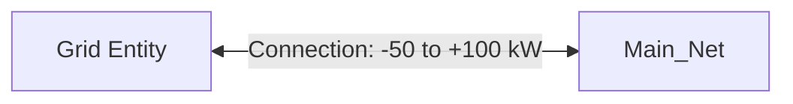
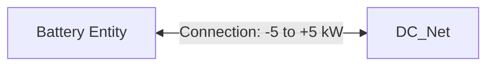
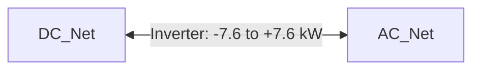
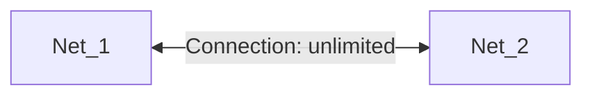
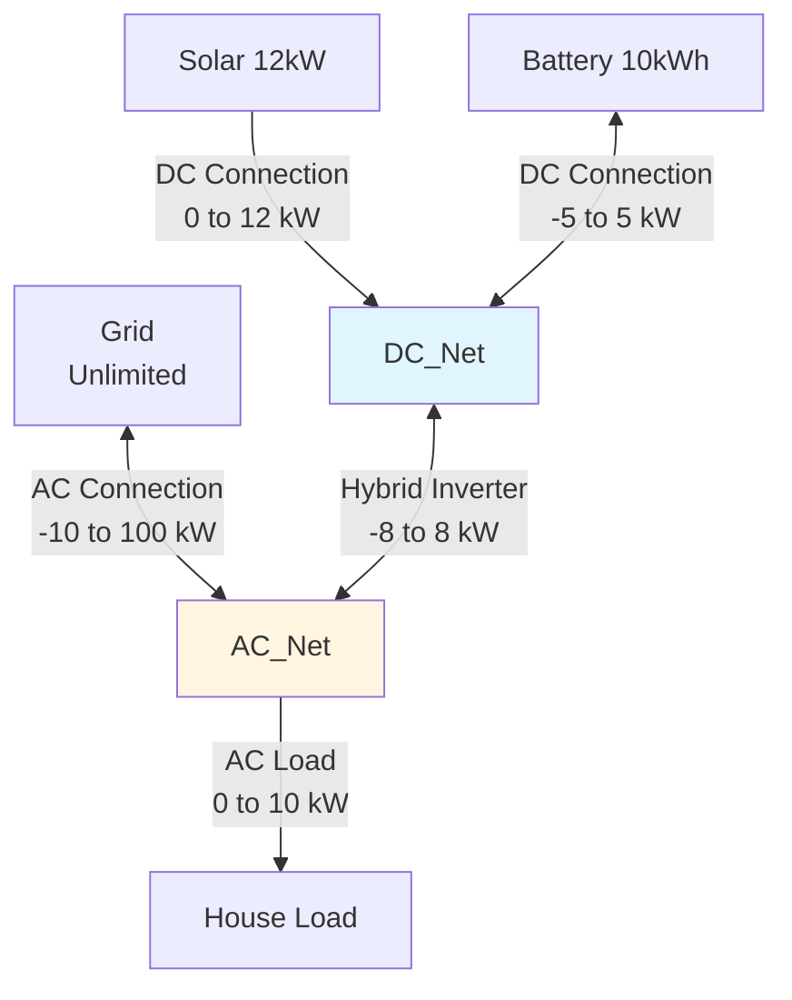

# Connection Modeling

This page explains how HAEO models connections (power flow paths) between entities using linear programming.

## Overview

A connection in HAEO represents a **power flow path** between two entities in the network.
Connections enable:

- **Power transfer**: Moving power from one entity to another
- **Bidirectional flow**: Power can flow in either direction (if configured)
- **Power limits**: Maximum and minimum power flow constraints
- **Network topology**: Defining how entities interconnect

Connections are the "wires" that link entities together, allowing power to flow where needed while respecting physical constraints like wire capacity or inverter ratings.

## Model Formulation

### Decision Variables

For each time step $t \in \{0, 1, \ldots, T-1\}$, each connection creates optimization variables:

- $P_c(t)$: Power flow on connection $c$ at time $t$ (kW) - implemented as `{name}_power_{t}`

These variables are created using PuLP's `LpVariable` with bounds that enforce the power flow limits.

**Sign convention**:

- **Positive** $P_c(t)$: Power flows from source to target
- **Negative** $P_c(t)$: Power flows from target to source (if bidirectional)

### Parameters

The connection model requires these configuration parameters:

- $\text{source}$: Name of the source entity
- $\text{target}$: Name of the target entity
- $P_{\min}$: Minimum power flow (kW) - `min_power` (optional, can be negative)
- $P_{\max}$: Maximum power flow (kW) - `max_power` (optional)
- $\Delta t$: Time step duration (hours) - `period`
- $T$: Number of time periods - `n_periods`

**Flow direction control**:

- $P_{\min} \geq 0$: Unidirectional (source → target only)
- $P_{\min} < 0$: Bidirectional (flow can reverse)
- $P_{\min} = \text{None}$: No lower limit (effectively unlimited reverse flow)
- $P_{\max} = \text{None}$: No upper limit (unlimited forward flow)

### Constraints

#### Power Flow Limits

The primary constraint is the power flow bounds:

$$
P_{\min} \leq P_c(t) \leq P_{\max} \quad \forall t
$$

**When both limits are set**:

```python
power[t] = LpVariable(
    name=f"{name}_power_{t}",
    lowBound=min_power,
    upBound=max_power
)
```

**When only max is set** ($P_{\min} = \text{None}$):

$$
P_c(t) \leq P_{\max} \quad \text{(can be arbitrarily negative)}
$$

**When only min is set** ($P_{\max} = \text{None}$):

$$
P_c(t) \geq P_{\min} \quad \text{(can be arbitrarily positive)}
$$

**When neither is set** (unlimited):

$$
-\infty < P_c(t) < +\infty \quad \text{(fully flexible)}
$$

#### Power Balance Integration

Connections participate in the power balance equations of their source and target entities:

**At source entity** (or source net):

- Connection removes power (counted as consumption or outflow)
- Contributes $P_c(t)$ to power balance

**At target entity** (or target net):

- Connection adds power (counted as production or inflow)
- Contributes $P_c(t)$ to power balance

**For net entities**:

Source net:

$$
\sum_{\text{inflows to source}} P_{\text{in}}(t) = \sum_{\text{outflows from source}} P_{\text{out}}(t) + P_c(t)
$$

Target net:

$$
P_c(t) + \sum_{\text{inflows to target}} P_{\text{in}}(t) = \sum_{\text{outflows from target}} P_{\text{out}}(t)
$$

### Cost Contribution

Connections themselves have **no direct cost**:

$$
C_{\text{connection}} = 0
$$

However, connections can have **indirect costs** if they model lossy conversions (not yet implemented in current HAEO).

**Future consideration**: Connection efficiency losses could be modeled similar to battery efficiency.

## Physical Interpretation

### Wiring and Power Paths

Connections represent physical electrical paths:

**AC wiring**:

- Standard household circuits
- Three-phase industrial feeds
- Limited by wire gauge and breaker rating

**DC wiring**:

- Solar to inverter
- Battery to charge controller
- Limited by cable size and voltage drop

**Inverters**:

- AC ↔ DC conversion
- Power electronics with ratings
- May have bidirectional capability

**Transformers**:

- Voltage level changes
- Power capacity limits
- Typically bidirectional

### Directionality

**Unidirectional connections** ($P_{\min} \geq 0$):

- Solar panels → Inverter (generation only)
- Load connection (consumption only)
- One-way valves in power flow

**Bidirectional connections** ($P_{\min} < 0$):

- Grid connection (import/export)
- Battery connection (charge/discharge)
- Hybrid inverter (AC ↔ DC)

### Power Limits

**Why limits exist**:

1. **Wire capacity**: Ampacity limits based on wire gauge
2. **Inverter rating**: Maximum power throughput
3. **Protection devices**: Circuit breaker or fuse ratings
4. **Regulatory limits**: Utility-imposed export limits
5. **Equipment specifications**: Manufacturer limits

**Example values**:

| Connection Type          | Typical Min | Typical Max | Bidirectional? |
| ------------------------ | ----------- | ----------- | -------------- |
| Residential grid         | -10 kW      | 100 kW      | Yes            |
| Solar inverter           | 0 kW        | 10 kW       | No             |
| Battery inverter         | -5 kW       | 5 kW        | Yes            |
| Hybrid inverter          | -7.6 kW     | 7.6 kW      | Yes            |
| Load circuit             | 0 kW        | 3 kW        | No             |
| DC-DC converter          | -2 kW       | 2 kW        | Sometimes      |

## Use Cases

### Use Case 1: Grid Connection

**Scenario**: Main grid connection to home



**Configuration**:

- Source: `Grid`
- Target: `Main_Net`
- Min power: -50 kW (export limit)
- Max power: 100 kW (import limit, service capacity)

**Behavior**:

- **Positive flow**: Grid imports power to home (grid → net)
- **Negative flow**: Grid exports power from home (grid ← net)
- Limits reflect physical service capacity and utility restrictions

### Use Case 2: Unidirectional Solar

**Scenario**: Solar panels cannot consume power


**Configuration**:

- Source: `Solar`
- Target: `DC_Net`
- Min power: 0 kW (cannot consume)
- Max power: 8 kW (inverter rating)

**Behavior**:

- **Only positive flow**: Solar can only generate (solar → net)
- **Never negative**: Cannot send power back to solar panels
- Max limit prevents exceeding inverter capacity

### Use Case 3: Bidirectional Battery

**Scenario**: Battery charges and discharges



**Configuration**:

- Source: `Battery`
- Target: `DC_Net`
- Min power: -5 kW (charge at 5 kW)
- Max power: 5 kW (discharge at 5 kW)

**Behavior**:

- **Positive flow**: Battery discharges (battery → net)
- **Negative flow**: Battery charges (battery ← net)
- Symmetric limits (typical for batteries)

### Use Case 4: Hybrid Inverter

**Scenario**: AC/DC conversion between DC bus and AC panel



**Configuration**:

- Source: `DC_Net`
- Target: `AC_Net`
- Min power: -7.6 kW (AC to DC conversion)
- Max power: 7.6 kW (DC to AC conversion)

**Behavior**:

- **Positive flow**: DC → AC (inverting)
- **Negative flow**: AC → DC (rare, requires bidirectional inverter)
- Same rating both directions (typical for hybrid inverters)

### Use Case 5: Unlimited Connection

**Scenario**: Virtual connection with no practical limits



**Configuration**:

- Source: `Net_1`
- Target: `Net_2`
- Min power: None (unlimited reverse)
- Max power: None (unlimited forward)

**Behavior**:

- **No constraints**: Power flow is completely flexible
- **Use when**: No physical bottleneck between points
- **Solver decides**: Optimal flow based on other constraints

## Example: Complete Home System

Consider a complete home energy system with multiple connections:

**System topology**:



**Connection table**:

| Connection       | Source   | Target     | Min (kW) | Max (kW) | Purpose                   |
| ---------------- | -------- | ---------- | -------- | -------- | ------------------------- |
| Grid_to_AC       | Grid     | AC_Net     | -10      | 100      | Grid import/export        |
| AC_to_Load       | AC_Net   | Load       | 0        | 10       | House consumption         |
| Solar_to_DC      | Solar    | DC_Net     | 0        | 12       | Solar generation          |
| Battery_to_DC    | Battery  | DC_Net     | -5       | 5        | Battery charge/discharge  |
| DC_to_AC         | DC_Net   | AC_Net     | -8       | 8        | Hybrid inverter           |

**Scenario: Sunny midday with moderate load**

- Solar generating: 10 kW
- House load: 4 kW
- Grid import price: $0.30/kWh
- Grid export price: $0.08/kWh

**Optimal power flows**:

1. `Solar_to_DC`: +10 kW (solar → DC_Net)
2. `Battery_to_DC`: +2 kW (battery discharge to DC_Net)
3. `DC_to_AC`: +8 kW (DC → AC, at inverter limit)
4. `AC_to_Load`: +4 kW (AC_Net → load)
5. `Grid_to_AC`: -4 kW (export to grid: AC_Net → grid)

**Power balance verification**:

At DC_Net:

$$
10 + 2 = 8 + 0 + 0 \quad \checkmark \quad \text{(inflows = outflows)}
$$

At AC_Net:

$$
8 + 0 = 4 + 4 \quad \checkmark \quad \text{(inflows = outflows)}
$$

**Why this strategy?**

- Maximize DC→AC transfer (use cheap battery + free solar)
- Export excess to grid (better than curtailing solar)
- Inverter at max capacity (bottleneck constraint)

## Implementation Details

### Variable Creation

Connections create LP variables with bounds:

```python
self.power = [
    LpVariable(
        name=f"{name}_power_{i}",
        lowBound=min_power,    # Can be None, 0, or negative
        upBound=max_power       # Can be None or positive
    )
    for i in range(n_periods)
]
```

### Network Integration

When building the network, connections:

1. **Register with source entity**: Add to outbound connections
2. **Register with target entity**: Add to inbound connections
3. **Contribute to power balance**: Variables appear in net entity constraints

### Validation

HAEO validates connections during network building:

- Source entity exists
- Target entity exists
- No self-connections (source ≠ target)
- Min ≤ Max (if both specified)

## Numerical Considerations

### Units

Connections use kW for power:

- **Min power**: -5 kW (not -5000 W)
- **Max power**: 10 kW (not 10000 W)
- **Time**: hours (not seconds)

### Solver Performance

Connections add:

- **Variables**: $T$ power flow variables per connection
- **Bound constraints**: Implicitly handled by variable bounds
- **Balance constraints**: Contribute to existing net entity constraints

**Impact**: Connections have modest computational cost - each adds $T$ variables.

### Limit Selection

**Too tight limits**:

- ❌ May cause infeasible optimizations
- ❌ Constrain system unnecessarily
- Use only when physically required

**Too loose limits**:

- ✅ Always feasible (if realistic)
- ✅ Flexible optimization
- ❌ May not reflect reality
- Use when physical limits are large

**Best practice**: Set limits to actual equipment ratings.

## Configuration Impact

### Bidirectional vs Unidirectional

**Bidirectional** ($P_{\min} < 0$):

- ✅ Flexible power flow
- ✅ Represents real AC/DC systems
- ✅ Enables reverse flow when beneficial
- Use for: Grid, batteries, hybrid inverters

**Unidirectional** ($P_{\min} \geq 0$):

- ✅ Simpler model
- ✅ Represents one-way equipment
- ✅ Prevents non-physical flows
- Use for: Solar, loads, one-way converters

### Symmetric vs Asymmetric Limits

**Symmetric** ($|P_{\min}| = P_{\max}$):

- Typical for batteries: -5 kW to +5 kW
- Typical for inverters: -7.6 kW to +7.6 kW
- Same capacity both directions

**Asymmetric** ($|P_{\min}| \neq P_{\max}$):

- Grid: -10 kW export, +100 kW import
- Hybrid systems with different ratings
- Reflects different capabilities per direction

### Unlimited Connections

**When to use**:

- Virtual connections between net entities
- No physical bottleneck
- Modeling convenience

**When not to use**:

- Real equipment with ratings
- Want realistic constraint modeling
- Debugging (limits help identify issues)

## Related Documentation

- [Connections Configuration Guide](../user-guide/connections.md) - User-facing configuration
- [Net Entity Modeling](net-entity.md) - How connections integrate with nets
- [Power Balance](power-balance.md) - How connection flows participate in balance equations
- [Network Architecture](../developer-guide/architecture.md) - Implementation details

## Next Steps

Explore related modeling topics:

- [Power Balance](power-balance.md) - How connections integrate into network equations
- [Net Entity Modeling](net-entity.md) - Where connections terminate
- [Objective Function](objective-function.md) - How power flows affect costs

[:octicons-arrow-right-24: Continue to Objective Function](objective-function.md)
