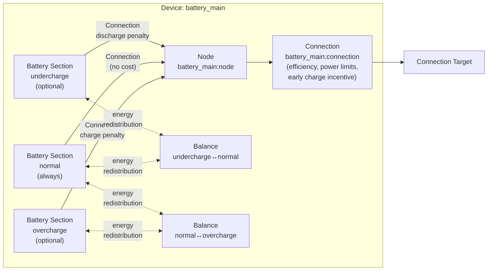
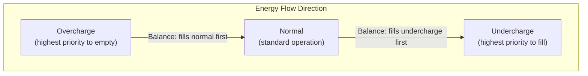

# Battery Modeling

The Battery device composes multiple [Battery model](../model-layer/battery.md) sections connected through a central [Node](node.md), with [Balance Connections](../model-layer/battery-balance-connection.md) enforcing proper energy ordering and [Connections](../model-layer/connection.md) applying costs and power limits.

## Model Elements Created



The adapter creates 5-11 model elements depending on configuration:

| Model Element                                                            | Name                                      | Parameters From Configuration                                              |
| ------------------------------------------------------------------------ | ----------------------------------------- | -------------------------------------------------------------------------- |
| [Battery](../model-layer/battery.md)                                     | \`\{name}:undercharge\` (optional)        | Capacity: \`(min% - undercharge%) * capacity\`, initial charge distributed |
| [Battery](../model-layer/battery.md)                                     | \`\{name}:normal\` (always)               | Capacity: \`(max% - min%) * capacity\`, initial charge distributed         |
| [Battery](../model-layer/battery.md)                                     | \`\{name}:overcharge\` (optional)         | Capacity: \`(overcharge% - max%) * capacity\`, initial charge distributed  |
| [Node](node.md)                                                          | \`\{name}:node\`                          | Pure junction (no power generation/consumption)                            |
| [Connection](../model-layer/connection.md)                               | \`\{name}:undercharge:to_node\`           | Discharge price: undercharge cost penalty                                  |
| [Connection](../model-layer/connection.md)                               | \`\{name}:normal:to_node\`                | No pricing (pure passthrough)                                              |
| [Connection](../model-layer/connection.md)                               | \`\{name}:overcharge:to_node\`            | Charge price: overcharge cost penalty                                      |
| [BatteryBalanceConnection](../model-layer/battery-balance-connection.md) | \`\{name}:balance:undercharge_to_normal\` | Links undercharge ↔ normal for redistribution                              |
| [BatteryBalanceConnection](../model-layer/battery-balance-connection.md) | \`\{name}:balance:normal_to_overcharge\`  | Links normal ↔ overcharge for redistribution                               |
| [Connection](../model-layer/connection.md)                               | \`\{name}:connection\`                    | Efficiency, power limits, early charge/discharge incentive                 |

## Architecture Details

### Section Capacity Calculation

For a 10 kWh battery with configuration \`[5%-10%-90%-95%]\`:

- **Inaccessible energy**: 0-5% = 0.5 kWh (below undercharge, cannot be accessed)
- **Undercharge section**: 5-10% = 0.5 kWh
- **Normal section**: 10-90% = 8.0 kWh
- **Overcharge section**: 90-95% = 0.5 kWh

### Initial Charge Distribution

Initial charge is distributed bottom-up across sections:

1. Calculate accessible energy: \`(initial_soc% - undercharge%) * capacity\`
2. Fill undercharge section up to its capacity
3. Fill normal section with remaining energy up to its capacity
4. Fill overcharge section with any remaining energy

**Example**: 50% SOC in a \`[5%-10%-90%-95%]\` battery:

- Accessible: (50% - 5%) × 10 kWh = 4.5 kWh
- Undercharge gets: 0.5 kWh (full)
- Normal gets: 4.0 kWh (partial, 50% of its 8 kWh capacity)
- Overcharge gets: 0 kWh (empty)

### Section Ordering with Balance Connections

Balance connections enforce proper energy ordering between sections.
They ensure energy fills from bottom to top: undercharge → normal → overcharge.

#### How Balance Connections Work

When sections have dynamic capacity that can change over time:

1. **Upward transfer** (forced): When a section's capacity shrinks, excess energy must move up to the section above
2. **Downward transfer** (constrained): Energy flows back down to fill available capacity in lower sections



The key constraints are:

1. Downward power ≥ upward power (compensate any forced upward transfer)
2. Downward energy ≥ available capacity in lower section (fill before retaining above)

These constraints, combined with each section's SOC max limit, guarantee:

- Lower sections fill to capacity before upper sections retain energy
- Energy never gets "stuck" in upper sections when lower sections have room

See [Battery Balance Connection Model](../model-layer/battery-balance-connection.md) for the mathematical formulation.

#### Dynamic Capacity Example

Consider a battery where capacity decreases over the horizon (modeling degradation or time-of-use restrictions):

```mermaid
xychart-beta
    title "Section Capacity Over Time"
    x-axis "Period" [0, 1, 2, 3]
    y-axis "Capacity (kWh)" 0 --> 10
    line "Normal Section" [8, 7, 6, 6]
```

At period 1, normal section shrinks from 8 kWh to 7 kWh:

1. Any energy above 7 kWh must move up to overcharge
2. Balance connection forces downward transfer to return energy if overcharge has excess and normal has room
3. SOC max constraint on normal prevents overfilling

This ensures energy redistributes correctly as capacities change, without requiring user intervention.

### Cost-Based Operating Preferences

Connection prices create economic incentives for section usage:

**Section-to-node connections** apply penalties only at the boundaries:

- **Undercharge → Node**: Discharge penalty (discourages using reserve)
- **Normal → Node**: No cost (free passthrough)
- **Overcharge → Node**: Charge penalty (discourages storing in degradation zone)

**External connection** applies time-varying incentives:

- **Charge incentive**: Negative cost (benefit) that decreases over time (-incentive → 0)
- **Discharge cost**: Positive cost that increases over time (incentive → 2×incentive)

These small values (default 0.001 \$/kWh) break ties when grid prices are equal, encouraging:

- Earlier charging when costs are equal
- Later discharge when revenues are equal

**Key insight**: Ordering is enforced by balance connections (hard constraints), not by cost incentives.
The cost structure adds economic preferences on top of the physical constraints.

### Early Charge/Discharge Incentives

The \`early_charge_incentive\` parameter (default 0.001 \$/kWh) creates time-varying preferences on the **external connection only**:

| Time  | Charge Cost  | Discharge Cost |
| ----- | ------------ | -------------- |
| t=0   | -incentive   | +incentive     |
| t=T/2 | -incentive/2 | +1.5×incentive |
| t=T   | 0            | +2×incentive   |

This encourages charging early in the horizon and discharging later, which helps with:

- Building reserves before peak price periods
- Maximizing arbitrage opportunities over the full horizon

## Devices Created

Battery creates 1-4 devices in Home Assistant depending on configuration:

| Device      | Name                    | Created When                          | Purpose                                       |
| ----------- | ----------------------- | ------------------------------------- | --------------------------------------------- |
| Aggregate   | \`\{name}\`             | Always                                | Total power, energy, SOC across all sections  |
| Undercharge | \`\{name}:undercharge\` | \`undercharge_percentage\` configured | Undercharge section metrics and shadow prices |
| Normal      | \`\{name}:normal\`      | Multi-section operation active        | Normal section metrics and shadow prices      |
| Overcharge  | \`\{name}:overcharge\`  | \`overcharge_percentage\` configured  | Overcharge section metrics and shadow prices  |

## Parameter Mapping

The adapter transforms user configuration into model parameters:

| User Configuration            | Model Element(s)               | Model Parameter                                               | Notes                             |
| ----------------------------- | ------------------------------ | ------------------------------------------------------------- | --------------------------------- |
| \`capacity\`                  | Battery sections               | Section capacities based on percentage ranges                 | Distributed across sections       |
| \`initial_charge_percentage\` | Battery sections               | \`initial_charge\` distributed bottom-up                      | Fills sections sequentially       |
| \`min_charge_percentage\`     | Battery sections               | Defines normal section lower bound                            | Inner bound (preferred min)       |
| \`max_charge_percentage\`     | Battery sections               | Defines normal section upper bound                            | Inner bound (preferred max)       |
| \`undercharge_percentage\`    | Battery sections               | Defines undercharge section lower bound                       | Outer bound (hard min)            |
| \`overcharge_percentage\`     | Battery sections               | Defines overcharge section upper bound                        | Outer bound (hard max)            |
| \`early_charge_incentive\`    | External connection            | Time-varying \`price_target_source\`, \`price_source_target\` | Creates time-varying preferences  |
| \`undercharge_cost\`          | Undercharge-to-node connection | \`price_source_target\` (discharge penalty)                   | Penalty for undercharge discharge |
| \`overcharge_cost\`           | Overcharge-to-node connection  | \`price_target_source\` (charge penalty)                      | Penalty for overcharge charging   |
| \`efficiency\`                | External connection            | \`efficiency_source_target\`, \`efficiency_target_source\`    | Applied to both directions        |
| \`max_charge_power\`          | External connection            | \`max_power_target_source\`                                   | Network to battery                |
| \`max_discharge_power\`       | External connection            | \`max_power_source_target\`                                   | Battery to network                |
| \`discharge_cost\`            | External connection            | Added to \`price_source_target\`                              | Base degradation cost             |

## Output Mapping

The adapter aggregates model outputs to user-friendly sensor names:

**Aggregate device outputs**:

| Model Output(s)                            | Sensor Name         | Description                |
| ------------------------------------------ | ------------------- | -------------------------- |
| Sum of section \`BATTERY_POWER_CHARGE\`    | \`power_charge\`    | Charge power               |
| Sum of section \`BATTERY_POWER_DISCHARGE\` | \`power_discharge\` | Discharge power            |
| Sum of section \`BATTERY_ENERGY_STORED\`   | \`energy_stored\`   | Energy stored              |
| Calculated from total energy and capacity  | \`state_of_charge\` | State of charge            |
| Node \`SOURCE_SINK_POWER_BALANCE\`         | \`power_balance\`   | Power balance shadow price |

**Section device outputs** (undercharge, normal, overcharge):

| Model Output(s)                               | Sensor Name         | Description                      |
| --------------------------------------------- | ------------------- | -------------------------------- |
| Section \`BATTERY_ENERGY_STORED\`             | \`energy_stored\`   | Energy stored in this section    |
| Section \`BATTERY_POWER_CHARGE\`              | \`power_charge\`    | Charge power in this section     |
| Section \`BATTERY_POWER_DISCHARGE\`           | \`power_discharge\` | Discharge power in this section  |
| Connection \`CONNECTION_PRICE_TARGET_SOURCE\` | \`charge_price\`    | Charge price for this section    |
| Connection \`CONNECTION_PRICE_SOURCE_TARGET\` | \`discharge_price\` | Discharge price for this section |
| Section \`BATTERY_ENERGY_IN_FLOW\`            | \`energy_in_flow\`  | Energy in flow shadow price      |
| Section \`BATTERY_ENERGY_OUT_FLOW\`           | \`energy_out_flow\` | Energy out flow shadow price     |
| Section \`BATTERY_SOC_MAX\`                   | \`soc_max\`         | SOC max shadow price             |
| Section \`BATTERY_SOC_MIN\`                   | \`soc_min\`         | SOC min shadow price             |

See [Battery Configuration](../../user-guide/elements/battery.md#sensors-created) for complete sensor documentation.

## Configuration Impact

### Section Configuration

- **No extended sections** (default): Single normal section with simple behavior
- **Undercharge section**: Allows conditional deep discharge when economically justified
- **Overcharge section**: Allows conditional high SOC when economically justified
- **Both sections**: Maximum flexibility with economic protection at extremes

### Cost Configuration

**Early charge incentive** (\`early_charge_incentive\`):

- Default: 0.001 \$/kWh (0.1 cents)
- Applied only to external connection (not between sections)
- Creates time-varying preference for early charging, late discharging
- Should be small (< 0.01 \$/kWh) to avoid dominating actual price signals

**Undercharge cost** (\`undercharge_cost\`):

- Penalty for discharging below \`min_charge_percentage\`
- Set relative to grid price range
- Typical range: \$0.50-\$2.00/kWh depending on battery degradation concerns

**Overcharge cost** (\`overcharge_cost\`):

- Penalty for charging above \`max_charge_percentage\`
- Set relative to value of excess solar or low grid prices
- Typical range: \$0.50-\$2.00/kWh depending on battery longevity concerns

**Discharge cost** (\`discharge_cost\`):

- Base cost applied to all discharge operations
- Models battery degradation from cycling
- Typical range: \$0.00-\$0.05/kWh

## Next Steps

<div class="grid cards" markdown>

- :material-file-document:{ .lg .middle } **Battery configuration**

    ---

    Configure batteries in your Home Assistant setup.

    [:material-arrow-right: Battery configuration](../../user-guide/elements/battery.md)

- :material-battery-charging:{ .lg .middle } **Battery model**

    ---

    Mathematical formulation for single-section battery storage.

    [:material-arrow-right: Battery model](../model-layer/battery.md)

- :material-scale-balance:{ .lg .middle } **Balance connection model**

    ---

    Energy redistribution between battery sections.

    [:material-arrow-right: Balance connection formulation](../model-layer/battery-balance-connection.md)

- :material-connection:{ .lg .middle } **Connection model**

    ---

    How power limits, efficiency, and pricing are applied.

    [:material-arrow-right: Connection formulation](../model-layer/connection.md)

</div>
