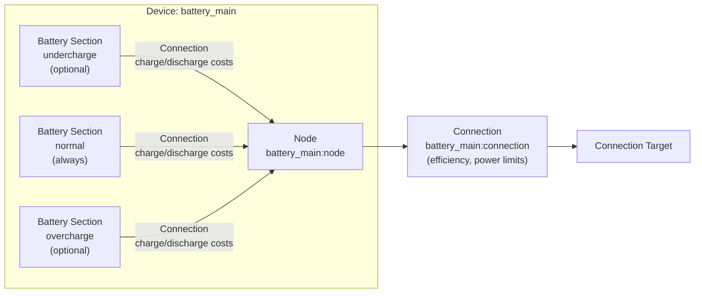

# Battery Modeling

The Battery device composes multiple [Battery model](../model-layer/battery.md) sections with [Connections](../model-layer/connection.md) through a central [Node](node.md) to provide energy storage with multi-section SOC tracking and cost-based operating preferences.

## Model Elements Created

The adapter creates 4-8 model elements depending on configuration:

| Model Element                              | Name                            | Parameters From Configuration                                                   |
| ------------------------------------------ | ------------------------------- | ------------------------------------------------------------------------------- |
| [Battery](../model-layer/battery.md)       | `{name}:undercharge` (optional) | Capacity: `(min% - undercharge%) * capacity`, initial charge distributed        |
| [Battery](../model-layer/battery.md)       | `{name}:normal` (always)        | Capacity: `(max% - min%) * capacity`, initial charge distributed                |
| [Battery](../model-layer/battery.md)       | `{name}:overcharge` (optional)  | Capacity: `(overcharge% - max%) * capacity`, initial charge distributed         |
| [Node](node.md)                            | `{name}:node`                   | Pure junction (no power generation/consumption)                                 |
| [Connection](../model-layer/connection.md) | `{name}:undercharge:to_node`    | Charge price: 3× early charge incentive, Discharge price: 1× + undercharge cost |
| [Connection](../model-layer/connection.md) | `{name}:normal:to_node`         | Charge price: 2× early charge incentive, Discharge price: 2× early discharge    |
| [Connection](../model-layer/connection.md) | `{name}:overcharge:to_node`     | Charge price: 1× + overcharge cost, Discharge price: 3× early discharge         |
| [Connection](../model-layer/connection.md) | `{name}:connection`             | Efficiency, power limits, discharge cost to network                             |

## Architecture Details

### Section Capacity Calculation

For a 10 kWh battery with configuration `[5%-10%-90%-95%]`:

- **Inaccessible energy**: 0-5% = 0.5 kWh (below undercharge, cannot be accessed)
- **Undercharge section**: 5-10% = 0.5 kWh
- **Normal section**: 10-90% = 8.0 kWh
- **Overcharge section**: 90-95% = 0.5 kWh

### Initial Charge Distribution

Initial charge is distributed bottom-up across sections:

1. Calculate accessible energy: `(initial_soc% - undercharge%) * capacity`
2. Fill undercharge section up to its capacity
3. Fill normal section with remaining energy up to its capacity
4. Fill overcharge section with any remaining energy

**Example**: 50% SOC in a `[5%-10%-90%-95%]` battery:

- Accessible: (50% - 5%) × 10 kWh = 4.5 kWh
- Undercharge gets: 0.5 kWh (full)
- Normal gets: 4.0 kWh (partial, 50% of its 8 kWh capacity)
- Overcharge gets: 0 kWh (empty)

### Cost-Based Operating Preferences

Connection prices create economic incentives for section usage:

**Charging order** (lower cost = more attractive):

1. Undercharge: 3× early charge incentive (strongest preference to fill first)
2. Normal: 2× early charge incentive
3. Overcharge: 1× early charge incentive + overcharge penalty

**Discharging order** (lower cost = more attractive):

1. Overcharge: 3× early discharge incentive (strongest preference to empty first)
2. Normal: 2× early discharge incentive
3. Undercharge: 1× early discharge incentive + undercharge penalty

**Key insight**: These are economic preferences, not hard constraints. The optimizer can use any section when conditions justify it.

### Early Charge/Discharge Incentives

The `early_charge_incentive` parameter (default 0.001 \$/kWh) creates time-varying preferences:

- **Charge incentive**: Negative cost (benefit) that decreases over time (-incentive → 0)
- **Discharge incentive**: Positive cost that increases over time (incentive → 2×incentive)

These small values (tenths of cents) break ties when grid prices are equal, encouraging:

- Earlier charging when costs are equal
- Later discharge when revenues are equal

## Devices Created

Battery creates 1-4 devices in Home Assistant depending on configuration:

| Device      | Name                 | Created When                        | Purpose                                       |
| ----------- | -------------------- | ----------------------------------- | --------------------------------------------- |
| Aggregate   | `{name}`             | Always                              | Total power, energy, SOC across all sections  |
| Undercharge | `{name}:undercharge` | `undercharge_percentage` configured | Undercharge section metrics and shadow prices |
| Normal      | `{name}:normal`      | Multi-section operation active      | Normal section metrics and shadow prices      |
| Overcharge  | `{name}:overcharge`  | `overcharge_percentage` configured  | Overcharge section metrics and shadow prices  |

## Parameter Mapping

The adapter transforms user configuration into model parameters:

| User Configuration          | Model Element(s)               | Model Parameter                                               | Notes                             |
| --------------------------- | ------------------------------ | ------------------------------------------------------------- | --------------------------------- |
| `capacity`                  | Battery sections               | Section capacities based on percentage ranges                 | Distributed across sections       |
| `initial_charge_percentage` | Battery sections               | `initial_charge` distributed bottom-up                        | Fills sections sequentially       |
| `min_charge_percentage`     | Battery sections               | Defines normal section lower bound                            | Inner bound (preferred min)       |
| `max_charge_percentage`     | Battery sections               | Defines normal section upper bound                            | Inner bound (preferred max)       |
| `undercharge_percentage`    | Battery sections               | Defines undercharge section lower bound                       | Outer bound (hard min)            |
| `overcharge_percentage`     | Battery sections               | Defines overcharge section upper bound                        | Outer bound (hard max)            |
| `early_charge_incentive`    | Section-to-node connections    | `price_target_source`, `price_source_target` with multipliers | Creates time-varying preferences  |
| `undercharge_cost`          | Undercharge-to-node connection | Added to `price_source_target` (discharge penalty)            | Penalty for undercharge discharge |
| `overcharge_cost`           | Overcharge-to-node connection  | Added to `price_target_source` (charge penalty)               | Penalty for overcharge charging   |
| `efficiency`                | Node-to-target connection      | `efficiency_source_target`, `efficiency_target_source`        | Applied to both directions        |
| `max_charge_power`          | Node-to-target connection      | `max_power_target_source`                                     | Network to battery                |
| `max_discharge_power`       | Node-to-target connection      | `max_power_source_target`                                     | Battery to network                |
| `discharge_cost`            | Node-to-target connection      | `price_source_target`                                         | Base degradation cost             |

## Output Mapping

The adapter aggregates model outputs to user-friendly sensor names:

**Aggregate device outputs**:

| Model Output(s)                           | Sensor Name       | Description                      |
| ----------------------------------------- | ----------------- | -------------------------------- |
| Sum of section `BATTERY_POWER_CHARGE`     | `power_charge`    | Total charging power             |
| Sum of section `BATTERY_POWER_DISCHARGE`  | `power_discharge` | Total discharging power          |
| Sum of section `BATTERY_ENERGY_STORED`    | `energy_stored`   | Total energy stored              |
| Calculated from total energy and capacity | `state_of_charge` | SOC percentage                   |
| Node `SOURCE_SINK_POWER_BALANCE`          | `power_balance`   | Shadow price at battery junction |

**Section device outputs** (undercharge, normal, overcharge):

| Model Output(s)                             | Sensor Name       | Description                       |
| ------------------------------------------- | ----------------- | --------------------------------- |
| Section `BATTERY_ENERGY_STORED`             | `energy_stored`   | Energy in this section            |
| Section `BATTERY_POWER_CHARGE`              | `power_charge`    | Charging power in this section    |
| Section `BATTERY_POWER_DISCHARGE`           | `power_discharge` | Discharging power in this section |
| Connection `CONNECTION_PRICE_TARGET_SOURCE` | `charge_price`    | Charging cost for this section    |
| Connection `CONNECTION_PRICE_SOURCE_TARGET` | `discharge_price` | Discharging cost for this section |
| Section `BATTERY_ENERGY_IN_FLOW`            | `energy_in_flow`  | Shadow price: energy in flow      |
| Section `BATTERY_ENERGY_OUT_FLOW`           | `energy_out_flow` | Shadow price: energy out flow     |
| Section `BATTERY_SOC_MAX`                   | `soc_max`         | Shadow price: section capacity    |
| Section `BATTERY_SOC_MIN`                   | `soc_min`         | Shadow price: section minimum     |

See [Battery Configuration](../../user-guide/elements/battery.md#sensors-created) for complete sensor documentation.

## Configuration Impact

### Section Configuration

- **No extended sections** (default): Single normal section with simple behavior
- **Undercharge section**: Allows conditional deep discharge when economically justified
- **Overcharge section**: Allows conditional high SOC when economically justified
- **Both sections**: Maximum flexibility with economic protection at extremes

### Cost Configuration

**Early charge incentive** (`early_charge_incentive`):

- Default: 0.001 \$/kWh (0.1 cents)
- Creates time-varying preferences within the optimization horizon
- Multiplied by section factors (3×, 2×, 1×) to guide charging/discharging order
- Should be small (< 0.01 \$/kWh) to avoid dominating actual price signals

**Undercharge cost** (`undercharge_cost`):

- Penalty for discharging below `min_charge_percentage`
- Set relative to grid price range
- Typical range: $0.50-$2.00/kWh depending on battery degradation concerns

**Overcharge cost** (`overcharge_cost`):

- Penalty for charging above `max_charge_percentage`
- Set relative to value of excess solar or low grid prices
- Typical range: $0.50-$2.00/kWh depending on battery longevity concerns

**Discharge cost** (`discharge_cost`):

- Base cost applied to all discharge operations
- Models battery degradation from cycling
- Typical range: $0.00-$0.05/kWh

## Next Steps

- :material-file-document:{ .lg .middle } **Battery configuration**

    ---

    Configure batteries in your Home Assistant setup.

    [:material-arrow-right: Battery configuration](../../user-guide/elements/battery.md)

- :material-battery-charging:{ .lg .middle } **Battery model**

    ---

    Mathematical formulation for single-section battery storage.

    [:material-arrow-right: Battery model](../model-layer/battery.md)

- :material-connection:{ .lg .middle } **Connection model**

    ---

    How power limits, efficiency, and pricing are applied.

    [:material-arrow-right: Connection formulation](../model-layer/connection.md)

- :material-circle-outline:{ .lg .middle } **Node model**

    ---

    How the central junction connects battery sections.

    [:material-arrow-right: Node formulation](node.md)

