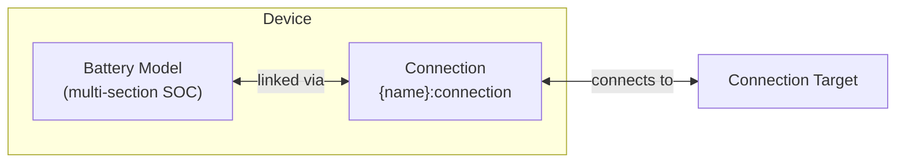

# Battery Modeling

The Battery device composes a [Battery model](../model-layer/battery.md) with an implicit [Connection](../model-layer/connection.md) to provide energy storage with multi-section SOC tracking.

## Model Elements Created

| Model Element                              | Name                | Parameters From Configuration                  |
| ------------------------------------------ | ------------------- | ---------------------------------------------- |
| [Battery](../model-layer/battery.md)       | `{name}`            | Capacity, SOC limits, efficiency, costs        |
| [Connection](../model-layer/connection.md) | `{name}:connection` | Power limits, efficiency (from battery config) |

## Devices Created

Battery creates 1-4 devices in Home Assistant depending on configuration:

| Device      | Name                 | Created When                        | Purpose                                       |
| ----------- | -------------------- | ----------------------------------- | --------------------------------------------- |
| Aggregate   | `{name}`             | Always                              | Total power, energy, SOC across all sections  |
| Undercharge | `{name}:undercharge` | `undercharge_percentage` configured | Undercharge section metrics and shadow prices |
| Normal      | `{name}:normal`      | Multi-section operation active      | Normal section metrics and shadow prices      |
| Overcharge  | `{name}:overcharge`  | `overcharge_percentage` configured  | Overcharge section metrics and shadow prices  |

## Parameter Mapping

The adapter transforms user configuration into model parameters:

| User Configuration          | Model Element | Model Parameter                                        | Notes                             |
| --------------------------- | ------------- | ------------------------------------------------------ | --------------------------------- |
| `capacity`                  | Battery       | `capacity`                                             | Direct mapping                    |
| `initial_charge_percentage` | Battery       | `initial_charge_percentage`                            | Direct mapping                    |
| `min_charge_percentage`     | Battery       | `min_charge_percentage`                                | Inner bound (preferred min)       |
| `max_charge_percentage`     | Battery       | `max_charge_percentage`                                | Inner bound (preferred max)       |
| `undercharge_percentage`    | Battery       | `undercharge_percentage`                               | Outer bound (hard min)            |
| `overcharge_percentage`     | Battery       | `overcharge_percentage`                                | Outer bound (hard max)            |
| `undercharge_cost`          | Battery       | `undercharge_cost`                                     | Penalty for undercharge discharge |
| `overcharge_cost`           | Battery       | `overcharge_cost`                                      | Penalty for overcharge charging   |
| `efficiency`                | Connection    | `efficiency_source_target`, `efficiency_target_source` | Applied to both directions        |
| `max_charge_power`          | Connection    | `max_power_target_source`                              | Network to battery                |
| `max_discharge_power`       | Connection    | `max_power_source_target`                              | Battery to network                |
| `discharge_cost`            | Connection    | `price_source_target`                                  | Cost per discharge kWh            |

## Output Mapping

The adapter maps model outputs to user-friendly sensor names:

**Aggregate device outputs**:

| Model Output              | Sensor Name       | Description             |
| ------------------------- | ----------------- | ----------------------- |
| `BATTERY_POWER_CHARGE`    | `power_charge`    | Total charging power    |
| `BATTERY_POWER_DISCHARGE` | `power_discharge` | Total discharging power |
| `BATTERY_ENERGY_STORED`   | `energy_stored`   | Total energy stored     |
| `BATTERY_STATE_OF_CHARGE` | `state_of_charge` | SOC percentage          |
| `BATTERY_POWER_BALANCE`   | `power_balance`   | Shadow price at battery |

**Section device outputs** (undercharge, normal, overcharge):

Each section device exposes region-specific metrics with prefixed names (e.g., `battery_undercharge_energy_stored`).

See [Battery Configuration](../../user-guide/elements/battery.md#sensors-created) for complete sensor documentation.

## Next Steps

- :material-file-document:{ .lg .middle } **Battery configuration**

    ---

    Configure batteries in your Home Assistant setup.

    [:material-arrow-right: Battery configuration](../../user-guide/elements/battery.md)

- :material-battery-charging:{ .lg .middle } **Battery model**

    ---

    Mathematical formulation for battery storage.

    [:material-arrow-right: Battery model](../model-layer/battery.md)

- :material-connection:{ .lg .middle } **Connection model**

    ---

    How power limits and efficiency are applied.

    [:material-arrow-right: Connection formulation](../model-layer/connection.md)

