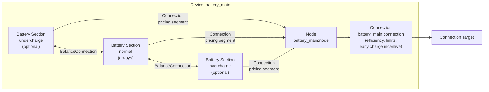

# Battery Modeling

The Battery device composes multiple [Battery model](../model-layer/elements/battery.md) sections with [Connections](../model-layer/connections/connection.md) through a central [Node](node.md) to provide energy storage with multi-section SOC tracking and cost-based operating preferences.

## Model Elements Created

The adapter creates 4-10 model elements depending on configuration:

| Model Element                                          | Name                                | Parameters From Configuration                                            |
| ------------------------------------------------------ | ----------------------------------- | ------------------------------------------------------------------------ |
| [Battery](../model-layer/elements/battery.md)          | `{name}:undercharge` (optional)     | Capacity: `(min% - undercharge%) * capacity`, initial charge distributed |
| [Battery](../model-layer/elements/battery.md)          | `{name}:normal` (always)            | Capacity: `(max% - min%) * capacity`, initial charge distributed         |
| [Battery](../model-layer/elements/battery.md)          | `{name}:overcharge` (optional)      | Capacity: `(overcharge% - max%) * capacity`, initial charge distributed  |
| [Node](node.md)                                        | `{name}:node`                       | Pure junction (no power generation/consumption)                          |
| [Connection](../model-layer/connections/connection.md) | `{name}:undercharge:to_node`        | Pricing segment for undercharge discharge penalty                        |
| [Connection](../model-layer/connections/connection.md) | `{name}:normal:to_node`             | Pricing segment with neutral costs                                       |
| [Connection](../model-layer/connections/connection.md) | `{name}:overcharge:to_node`         | Pricing segment for overcharge charge penalty                            |
| [Connection](../model-layer/connections/connection.md) | `{name}:balance:undercharge:normal` | Battery balance segment for undercharge/normal ordering                  |
| [Connection](../model-layer/connections/connection.md) | `{name}:balance:normal:overcharge`  | Battery balance segment for normal/overcharge ordering                   |
| [Connection](../model-layer/connections/connection.md) | `{name}:connection`                 | Efficiency, power-limit, and pricing segments                            |

## Architecture Details

### Section Capacity Calculation

For a 10 kWh battery with configuration `[5%-10%-90%-95%]`:

- **Inaccessible energy**: 0-5% = 0.5 kWh (below undercharge, cannot be accessed)
- **Undercharge section**: 5-10% = 0.5 kWh
- **Normal section**: 10-90% = 8.0 kWh
- **Overcharge section**: 90-95% = 0.5 kWh

### Initial Charge Distribution

Initial charge is distributed bottom-up across sections:

1. Calculate accessible energy: `(initial_soc% - undercharge%) * capacity`
2. Fill undercharge section up to its capacity
3. Fill normal section with remaining energy up to its capacity
4. Fill overcharge section with any remaining energy

**Example**: 50% SOC in a `[5%-10%-90%-95%]` battery:

- Accessible: (50% - 5%) × 10 kWh = 4.5 kWh
- Undercharge gets: 0.5 kWh (full)
- Normal gets: 4.0 kWh (partial, 50% of its 8 kWh capacity)
- Overcharge gets: 0 kWh (empty)

### Constraint-Based Section Ordering

[Battery balance segment](../model-layer/battery-balance-connection.md) enforces fill ordering between adjacent battery sections via LP constraints:

**Charging order** (enforced by constraints):

1. Undercharge section must fill before normal section
2. Normal section must fill before overcharge section

**Discharging order** (enforced by constraints):

1. Overcharge section empties before normal section
2. Normal section empties before undercharge section

**Key insight**: These are hard constraints, not economic preferences.
The optimizer cannot violate fill ordering regardless of price conditions.

### Penalty Costs

Section-to-node connections apply penalty costs for operating in extended ranges:

- **Undercharge section**: `undercharge_cost` penalty on discharge (discourages deep discharge)
- **Overcharge section**: `overcharge_cost` penalty on charge (discourages high SOC)
- **Normal section**: No penalties (preferred operating range)

### Early Charge/Discharge Incentives

The `early_charge_incentive` parameter (default 0.001 \$/kWh) creates time-varying preferences on the main connection (node to target):

- **Charge incentive**: Negative cost (benefit) that decreases over time (-incentive → 0)
- **Discharge incentive**: Positive cost that increases over time (incentive → 2×incentive + discharge_cost)

These small values (tenths of cents) break ties when grid prices are equal, encouraging:

- Earlier charging when costs are equal
- Later discharge when revenues are equal

The incentives apply to the main connection only, not to section-to-node connections.

## Devices Created

Battery creates 1-4 devices in Home Assistant depending on configuration:

| Device      | Name                 | Created When                        | Purpose                                       |
| ----------- | -------------------- | ----------------------------------- | --------------------------------------------- |
| Aggregate   | `{name}`             | Always                              | Total power, energy, SOC across all sections  |
| Undercharge | `{name}:undercharge` | `undercharge_percentage` configured | Undercharge section metrics and shadow prices |
| Normal      | `{name}:normal`      | Multi-section operation active      | Normal section metrics and shadow prices      |
| Overcharge  | `{name}:overcharge`  | `overcharge_percentage` configured  | Overcharge section metrics and shadow prices  |

## Parameter mapping

The adapter transforms user configuration into connection segments:

| User Configuration          | Model Element(s)    | Model Parameter                                        | Notes                              |
| --------------------------- | ------------------- | ------------------------------------------------------ | ---------------------------------- |
| `capacity`                  | Battery sections    | Section capacities based on percentage ranges          | Distributed across sections        |
| `initial_charge_percentage` | Battery sections    | `initial_charge` distributed bottom-up                 | Fills sections sequentially        |
| `min_charge_percentage`     | Battery sections    | Defines normal section lower bound                     | Inner bound (preferred min)        |
| `max_charge_percentage`     | Battery sections    | Defines normal section upper bound                     | Inner bound (preferred max)        |
| `undercharge_percentage`    | Battery sections    | Defines undercharge section lower bound                | Outer bound (hard min)             |
| `overcharge_percentage`     | Battery sections    | Defines overcharge section upper bound                 | Outer bound (hard max)             |
| `early_charge_incentive`    | Pricing segment     | `price_target_source` and `price_source_target`        | Time-varying on main connection    |
| `undercharge_cost`          | Pricing segment     | `price_source_target`                                  | Undercharge discharge penalty      |
| `overcharge_cost`           | Pricing segment     | `price_target_source`                                  | Overcharge charge penalty          |
| `efficiency`                | Efficiency segment  | `efficiency_source_target`, `efficiency_target_source` | Applied to both directions         |
| `max_charge_power`          | Power-limit segment | `max_power_target_source`                              | Network to battery                 |
| `max_discharge_power`       | Power-limit segment | `max_power_source_target`                              | Battery to network                 |
| `discharge_cost`            | Pricing segment     | Added to `price_source_target`                         | Added to early discharge incentive |
| (automatic)                 | Balance segments    | `capacity_lower` from section capacity                 | Enforces section fill ordering     |

## Output Mapping

The adapter aggregates model outputs to user-friendly sensor names:

**Aggregate device outputs**:

| Model Output(s)                           | Sensor Name       | Description                |
| ----------------------------------------- | ----------------- | -------------------------- |
| Sum of section `BATTERY_POWER_CHARGE`     | `power_charge`    | Charge power               |
| Sum of section `BATTERY_POWER_DISCHARGE`  | `power_discharge` | Discharge power            |
| Sum of section `BATTERY_ENERGY_STORED`    | `energy_stored`   | Energy stored              |
| Calculated from total energy and capacity | `state_of_charge` | State of charge            |
| Node `NODE_POWER_BALANCE`                 | `power_balance`   | Power balance shadow price |

**Section device outputs** (undercharge, normal, overcharge):

| Model Output(s)                      | Sensor Name          | Description                          |
| ------------------------------------ | -------------------- | ------------------------------------ |
| Section `BATTERY_ENERGY_STORED`      | `energy_stored`      | Energy stored in this section        |
| Section `BATTERY_POWER_CHARGE`       | `power_charge`       | Charge power in this section         |
| Section `BATTERY_POWER_DISCHARGE`    | `power_discharge`    | Discharge power in this section      |
| Section `BATTERY_ENERGY_IN_FLOW`     | `energy_in_flow`     | Energy in flow shadow price          |
| Section `BATTERY_ENERGY_OUT_FLOW`    | `energy_out_flow`    | Energy out flow shadow price         |
| Section `BATTERY_SOC_MAX`            | `soc_max`            | SOC max shadow price                 |
| Section `BATTERY_SOC_MIN`            | `soc_min`            | SOC min shadow price                 |
| Balance segment `BALANCE_POWER_DOWN` | `balance_power_down` | Power flowing down into this section |
| Balance segment `BALANCE_POWER_UP`   | `balance_power_up`   | Power flowing up out of this section |

The `balance_power_down` and `balance_power_up` sensors show power flowing through balance segments with adjacent sections.
Each section accumulates power from all adjacent balance segments (sections can have connections both above and below).
These sensors are useful for diagnosing section rebalancing when capacity changes occur.

See [Battery Configuration](../../user-guide/elements/battery.md#sensors-created) for complete sensor documentation.

## Configuration Impact

### Section Configuration

- **No extended sections** (default): Single normal section with simple behavior
- **Undercharge section**: Allows conditional deep discharge when economically justified
- **Overcharge section**: Allows conditional high SOC when economically justified
- **Both sections**: Maximum flexibility with economic protection at extremes

### Cost Configuration

**Early charge incentive** (`early_charge_incentive`):

- Default: 0.001 \$/kWh (0.1 cents)
- Creates time-varying preferences within the optimization horizon on the main connection
- Applies to both charging (negative cost = incentive) and discharging (positive cost = disincentive)
- Should be small (< 0.01 \$/kWh) to avoid dominating actual price signals

**Undercharge cost** (`undercharge_cost`):

- Penalty for discharging below `min_charge_percentage`
- Set relative to grid price range
- Typical range: $0.50-$2.00/kWh depending on battery degradation concerns

**Overcharge cost** (`overcharge_cost`):

- Penalty for charging above `max_charge_percentage`
- Set relative to value of excess solar or low grid prices
- Typical range: $0.50-$2.00/kWh depending on battery longevity concerns

**Discharge cost** (`discharge_cost`):

- Base cost applied to all discharge operations
- Models battery degradation from cycling
- Typical range: $0.00-$0.05/kWh

## Next Steps

- :material-file-document:{ .lg .middle } **Battery configuration**

    ---

    Configure batteries in your Home Assistant setup.

    [:material-arrow-right: Battery configuration](../../user-guide/elements/battery.md)

- :material-battery-charging:{ .lg .middle } **Battery model**

    ---

    Mathematical formulation for single-section battery storage.

    [:material-arrow-right: Battery model](../model-layer/elements/battery.md)

- :material-connection:{ .lg .middle } **Connection model**

    ---

    How power limits, efficiency, and pricing are applied.

    [:material-arrow-right: Connection formulation](../model-layer/connections/connection.md)

- :material-scale-balance:{ .lg .middle } **Balance segment**

    ---

    How section fill ordering is enforced.

    [:material-arrow-right: Battery balance segment](../model-layer/battery-balance-connection.md)

- :material-circle-outline:{ .lg .middle } **Node model**

    ---

    How the central junction connects battery sections.

    [:material-arrow-right: Node formulation](node.md)

