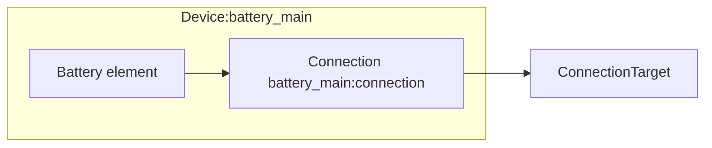

# Battery Modeling

The Battery device composes a single [Battery model](../model-layer/elements/battery.md) element and a single [Connection](../model-layer/connections/connection.md).
SOC preferences are encoded directly in the connection via the SOC pricing segment.

## Model Elements Created

The adapter creates two model elements:

| Model Element                                          | Name                | Parameters From Configuration                             |
| ------------------------------------------------------ | ------------------- | --------------------------------------------------------- |
| [Battery](../model-layer/elements/battery.md)          | `{name}`            | Capacity range, initial charge                            |
| [Connection](../model-layer/connections/connection.md) | `{name}:connection` | Efficiency, power limits, pricing, SOC pricing (optional) |

## Architecture Details

### Capacity range and offsets

The battery model tracks stored energy within a bounded range:

- **Lower bound**: `undercharge_percentage` when configured, otherwise `min_charge_percentage`
- **Upper bound**: `overcharge_percentage` when configured, otherwise `max_charge_percentage`

The model capacity is:

$$
C_{\text{model}}(t) = (\text{upper\%}(t) - \text{lower\%}(t)) \cdot C(t)
$$

Stored energy is measured relative to the lower bound.
User-facing energy and SOC add the lower bound offset back to the model values.

### SOC pricing segment

When undercharge or overcharge costs are configured, the connection includes the SOC pricing segment:

- **Undercharge penalty** applies when SOC falls below `min_charge_percentage`
- **Overcharge penalty** applies when SOC rises above `max_charge_percentage`

These are soft constraints driven by cost.
The battery can operate outside the preferred range when prices justify it, but it will never exceed the configured lower/upper bounds.

### Early charge/discharge incentives

The `early_charge_incentive` parameter (default 0.001 \$/kWh) creates time-varying preferences on the connection:

- **Charge incentive**: Negative cost (benefit) that decreases over time
- **Discharge incentive**: Positive cost that increases over time (plus `discharge_cost`)

These small values break ties when prices are equal.

## Devices Created

Battery creates a single Home Assistant device:

| Device  | Name     | Created When | Purpose                           |
| ------- | -------- | ------------ | --------------------------------- |
| Battery | `{name}` | Always       | Power, energy, SOC, shadow prices |

## Parameter mapping

| User Configuration          | Model Element(s)      | Model Parameter                                        | Notes                      |
| --------------------------- | --------------------- | ------------------------------------------------------ | -------------------------- |
| `capacity`                  | Battery               | Capacity range from lower/upper SOC bounds             | kWh, boundaries            |
| `initial_charge_percentage` | Battery               | `initial_charge` (offset by lower bound)               | kWh                        |
| `min_charge_percentage`     | Battery + SOC pricing | Preferred minimum SOC threshold                        | Penalty threshold          |
| `max_charge_percentage`     | Battery + SOC pricing | Preferred maximum SOC threshold                        | Penalty threshold          |
| `undercharge_percentage`    | Battery               | Lower bound for SOC range                              | Hard minimum               |
| `overcharge_percentage`     | Battery               | Upper bound for SOC range                              | Hard maximum               |
| `undercharge_cost`          | SOC pricing segment   | `undercharge_price`                                    | Penalty below min SOC      |
| `overcharge_cost`           | SOC pricing segment   | `overcharge_price`                                     | Penalty above max SOC      |
| `early_charge_incentive`    | Pricing segment       | Time-varying charge/discharge incentive                | Applied on main connection |
| `discharge_cost`            | Pricing segment       | Added to `price_source_target`                         | Base discharge cost        |
| `efficiency`                | Efficiency segment    | `efficiency_source_target`, `efficiency_target_source` | Applied to both directions |
| `max_charge_power`          | Power-limit segment   | `max_power_target_source`                              | Network to battery         |
| `max_discharge_power`       | Power-limit segment   | `max_power_source_target`                              | Battery to network         |

## Output Mapping

The adapter maps model outputs directly from the battery element:

| Model Output              | Sensor Name       | Description                |
| ------------------------- | ----------------- | -------------------------- |
| `BATTERY_POWER_CHARGE`    | `power_charge`    | Charge power               |
| `BATTERY_POWER_DISCHARGE` | `power_discharge` | Discharge power            |
| `BATTERY_ENERGY_STORED`   | `energy_stored`   | Total energy stored        |
| Calculated SOC            | `state_of_charge` | State of charge            |
| `BATTERY_POWER_BALANCE`   | `power_balance`   | Power balance shadow price |
| `BATTERY_ENERGY_IN_FLOW`  | `energy_in_flow`  | Energy-in shadow price     |
| `BATTERY_ENERGY_OUT_FLOW` | `energy_out_flow` | Energy-out shadow price    |
| `BATTERY_SOC_MAX`         | `soc_max`         | Max SOC shadow price       |
| `BATTERY_SOC_MIN`         | `soc_min`         | Min SOC shadow price       |

See [Battery Configuration](../../user-guide/elements/battery.md#sensors-created) for complete sensor documentation.

## Next Steps

- :material-file-document:{ .lg .middle } **Battery configuration**

    ---

    Configure batteries in your Home Assistant setup.

    [:material-arrow-right: Battery configuration](../../user-guide/elements/battery.md)

- :material-battery-charging:{ .lg .middle } **Battery model**

    ---

    Mathematical formulation for battery storage.

    [:material-arrow-right: Battery model](../model-layer/elements/battery.md)

- :material-connection:{ .lg .middle } **Connection model**

    ---

    How power limits, efficiency, and pricing are applied.

    [:material-arrow-right: Connection formulation](../model-layer/connections/connection.md)

