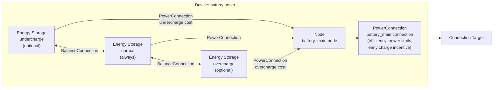

# Battery Modeling

The Battery device composes multiple [Energy Storage model](../model-layer/elements/energy-storage.md) partitions with [PowerConnections](../model-layer/connections/power-connection.md) through a central [Node](node.md) to provide energy storage with multi-partition SOC tracking and cost-based operating preferences.

## Model Elements Created

The adapter creates 4-10 model elements depending on configuration:

| Model Element                                                          | Name                                | Parameters From Configuration                                            |
| ---------------------------------------------------------------------- | ----------------------------------- | ------------------------------------------------------------------------ |
| [Energy Storage](../model-layer/elements/energy-storage.md)            | `{name}:undercharge` (optional)     | Capacity: `(min% - undercharge%) * capacity`, initial charge distributed |
| [Energy Storage](../model-layer/elements/energy-storage.md)            | `{name}:normal` (always)            | Capacity: `(max% - min%) * capacity`, initial charge distributed         |
| [Energy Storage](../model-layer/elements/energy-storage.md)            | `{name}:overcharge` (optional)      | Capacity: `(overcharge% - max%) * capacity`, initial charge distributed  |
| [Node](node.md)                                                        | `{name}:node`                       | Pure junction (no power generation/consumption)                          |
| [PowerConnection](../model-layer/connections/power-connection.md)      | `{name}:undercharge:to_node`        | Discharge price: undercharge cost penalty                                |
| [PowerConnection](../model-layer/connections/power-connection.md)      | `{name}:normal:to_node`             | No pricing (neutral)                                                     |
| [PowerConnection](../model-layer/connections/power-connection.md)      | `{name}:overcharge:to_node`         | Charge price: overcharge cost penalty                                    |
| [EnergyBalanceConnection](../model-layer/energy-balance-connection.md) | `{name}:balance:undercharge:normal` | Enforces fill ordering between undercharge and normal partitions         |
| [EnergyBalanceConnection](../model-layer/energy-balance-connection.md) | `{name}:balance:normal:overcharge`  | Enforces fill ordering between normal and overcharge partitions          |
| [PowerConnection](../model-layer/connections/power-connection.md)      | `{name}:connection`                 | Efficiency, power limits, early charge/discharge incentive               |

## Architecture Details

### Partition Capacity Calculation

For a 10 kWh battery with configuration `[5%-10%-90%-95%]`:

- **Inaccessible energy**: 0-5% = 0.5 kWh (below undercharge, cannot be accessed)
- **Undercharge partition**: 5-10% = 0.5 kWh
- **Normal partition**: 10-90% = 8.0 kWh
- **Overcharge partition**: 90-95% = 0.5 kWh

### Initial Charge Distribution

Initial charge is distributed bottom-up across partitions:

1. Calculate accessible energy: `(initial_soc% - undercharge%) * capacity`
2. Fill undercharge partition up to its capacity
3. Fill normal partition with remaining energy up to its capacity
4. Fill overcharge partition with any remaining energy

**Example**: 50% SOC in a `[5%-10%-90%-95%]` battery:

- Accessible: (50% - 5%) × 10 kWh = 4.5 kWh
- Undercharge gets: 0.5 kWh (full)
- Normal gets: 4.0 kWh (partial, 50% of its 8 kWh capacity)
- Overcharge gets: 0 kWh (empty)

### Constraint-Based Partition Ordering

[EnergyBalanceConnection](../model-layer/energy-balance-connection.md) elements enforce fill ordering between adjacent storage partitions via LP constraints:

**Charging order** (enforced by constraints):

1. Undercharge partition must fill before normal partition
2. Normal partition must fill before overcharge partition

**Discharging order** (enforced by constraints):

1. Overcharge partition empties before normal partition
2. Normal partition empties before undercharge partition

**Key insight**: These are hard constraints, not economic preferences.
The optimizer cannot violate fill ordering regardless of price conditions.

### Penalty Costs

Partition-to-node connections apply penalty costs for operating in extended ranges:

- **Undercharge partition**: `undercharge_cost` penalty on discharge (discourages deep discharge)
- **Overcharge partition**: `overcharge_cost` penalty on charge (discourages high SOC)
- **Normal partition**: No penalties (preferred operating range)

### Early Charge/Discharge Incentives

The `early_charge_incentive` parameter (default 0.001 \$/kWh) creates time-varying preferences on the main connection (node to target):

- **Charge incentive**: Negative cost (benefit) that decreases over time (-incentive → 0)
- **Discharge incentive**: Positive cost that increases over time (incentive → 2×incentive + discharge_cost)

These small values (tenths of cents) break ties when grid prices are equal, encouraging:

- Earlier charging when costs are equal
- Later discharge when revenues are equal

The incentives apply to the main connection only, not to partition-to-node connections.

## Devices Created

Battery creates 1-4 devices in Home Assistant depending on configuration:

| Device      | Name                 | Created When                        | Purpose                                         |
| ----------- | -------------------- | ----------------------------------- | ----------------------------------------------- |
| Aggregate   | `{name}`             | Always                              | Total power, energy, SOC across all partitions  |
| Undercharge | `{name}:undercharge` | `undercharge_percentage` configured | Undercharge partition metrics and shadow prices |
| Normal      | `{name}:normal`      | Multi-partition operation active    | Normal partition metrics and shadow prices      |
| Overcharge  | `{name}:overcharge`  | `overcharge_percentage` configured  | Overcharge partition metrics and shadow prices  |

## Parameter Mapping

The adapter transforms user configuration into model parameters:

| User Configuration          | Model Element(s)               | Model Parameter                                                   | Notes                              |
| --------------------------- | ------------------------------ | ----------------------------------------------------------------- | ---------------------------------- |
| `capacity`                  | Energy Storage partitions      | Partition capacities based on percentage ranges                   | Distributed across partitions      |
| `initial_charge_percentage` | Energy Storage partitions      | `initial_charge` distributed bottom-up                            | Fills partitions sequentially      |
| `min_charge_percentage`     | Energy Storage partitions      | Defines normal partition lower bound                              | Inner bound (preferred min)        |
| `max_charge_percentage`     | Energy Storage partitions      | Defines normal partition upper bound                              | Inner bound (preferred max)        |
| `undercharge_percentage`    | Energy Storage partitions      | Defines undercharge partition lower bound                         | Outer bound (hard min)             |
| `overcharge_percentage`     | Energy Storage partitions      | Defines overcharge partition upper bound                          | Outer bound (hard max)             |
| `early_charge_incentive`    | Node-to-target connection      | `price_target_source` (charge), `price_source_target` (discharge) | Time-varying on main connection    |
| `undercharge_cost`          | Undercharge-to-node connection | `price_source_target` (discharge penalty)                         | Penalty for undercharge discharge  |
| `overcharge_cost`           | Overcharge-to-node connection  | `price_target_source` (charge penalty)                            | Penalty for overcharge charging    |
| `efficiency`                | Node-to-target connection      | `efficiency_source_target`, `efficiency_target_source`            | Applied to both directions         |
| `max_charge_power`          | Node-to-target connection      | `max_power_target_source`                                         | Network to battery                 |
| `max_discharge_power`       | Node-to-target connection      | `max_power_source_target`                                         | Battery to network                 |
| `discharge_cost`            | Node-to-target connection      | Added to `price_source_target`                                    | Added to early discharge incentive |
| (automatic)                 | Balance connections            | `capacity_lower` from partition capacity                          | Enforces partition fill ordering   |

## Output Mapping

The adapter aggregates model outputs to user-friendly sensor names:

**Aggregate device outputs**:

| Model Output(s)                                   | Sensor Name       | Description                |
| ------------------------------------------------- | ----------------- | -------------------------- |
| Sum of partition `ENERGY_STORAGE_POWER_CHARGE`    | `power_charge`    | Charge power               |
| Sum of partition `ENERGY_STORAGE_POWER_DISCHARGE` | `power_discharge` | Discharge power            |
| Sum of partition `ENERGY_STORAGE_ENERGY_STORED`   | `energy_stored`   | Energy stored              |
| Calculated from total energy and capacity         | `state_of_charge` | State of charge            |
| Node `NODE_POWER_BALANCE`                         | `power_balance`   | Power balance shadow price |

**Partition device outputs** (undercharge, normal, overcharge):

| Model Output(s)                            | Sensor Name          | Description                            |
| ------------------------------------------ | -------------------- | -------------------------------------- |
| Partition `ENERGY_STORAGE_ENERGY_STORED`   | `energy_stored`      | Energy stored in this partition        |
| Partition `ENERGY_STORAGE_POWER_CHARGE`    | `power_charge`       | Charge power in this partition         |
| Partition `ENERGY_STORAGE_POWER_DISCHARGE` | `power_discharge`    | Discharge power in this partition      |
| Partition `ENERGY_STORAGE_ENERGY_IN_FLOW`  | `energy_in_flow`     | Energy in flow shadow price            |
| Partition `ENERGY_STORAGE_ENERGY_OUT_FLOW` | `energy_out_flow`    | Energy out flow shadow price           |
| Partition `ENERGY_STORAGE_SOC_MAX`         | `soc_max`            | SOC max shadow price                   |
| Partition `ENERGY_STORAGE_SOC_MIN`         | `soc_min`            | SOC min shadow price                   |
| Balance connection `BALANCE_POWER_DOWN`    | `balance_power_down` | Power flowing down into this partition |
| Balance connection `BALANCE_POWER_UP`      | `balance_power_up`   | Power flowing up out of this partition |

The `balance_power_down` and `balance_power_up` sensors show power flowing through balance connections with adjacent partitions.
Each partition accumulates power from all adjacent balance connections (partitions can have connections both above and below).
These sensors are useful for diagnosing partition rebalancing when capacity changes occur.

See [Battery Configuration](../../user-guide/elements/battery.md#sensors-created) for complete sensor documentation.

## Configuration Impact

### Partition Configuration

- **No extended partitions** (default): Single normal partition with simple behavior
- **Undercharge partition**: Allows conditional deep discharge when economically justified
- **Overcharge partition**: Allows conditional high SOC when economically justified
- **Both partitions**: Maximum flexibility with economic protection at extremes

### Cost Configuration

**Early charge incentive** (`early_charge_incentive`):

- Default: 0.001 \$/kWh (0.1 cents)
- Creates time-varying preferences within the optimization horizon on the main connection
- Applies to both charging (negative cost = incentive) and discharging (positive cost = disincentive)
- Should be small (< 0.01 \$/kWh) to avoid dominating actual price signals

**Undercharge cost** (`undercharge_cost`):

- Penalty for discharging below `min_charge_percentage`
- Set relative to grid price range
- Typical range: $0.50-$2.00/kWh depending on battery degradation concerns

**Overcharge cost** (`overcharge_cost`):

- Penalty for charging above `max_charge_percentage`
- Set relative to value of excess solar or low grid prices
- Typical range: $0.50-$2.00/kWh depending on battery longevity concerns

**Discharge cost** (`discharge_cost`):

- Base cost applied to all discharge operations
- Models battery degradation from cycling
- Typical range: $0.00-$0.05/kWh

## Next Steps

- :material-file-document:{ .lg .middle } **Battery configuration**

    ---

    Configure batteries in your Home Assistant setup.

    [:material-arrow-right: Battery configuration](../../user-guide/elements/battery.md)

- :material-battery-charging:{ .lg .middle } **Energy Storage model**

    ---

    Mathematical formulation for single-partition energy storage.

    [:material-arrow-right: Energy Storage model](../model-layer/elements/energy-storage.md)

- :material-connection:{ .lg .middle } **Connection model**

    ---

    How power limits, efficiency, and pricing are applied.

    [:material-arrow-right: PowerConnection formulation](../model-layer/connections/power-connection.md)

- :material-scale-balance:{ .lg .middle } **Balance connection**

    ---

    How partition fill ordering is enforced.

    [:material-arrow-right: EnergyBalanceConnection](../model-layer/energy-balance-connection.md)

- :material-circle-outline:{ .lg .middle } **Node model**

    ---

    How the central junction connects storage partitions.

    [:material-arrow-right: Node formulation](node.md)

