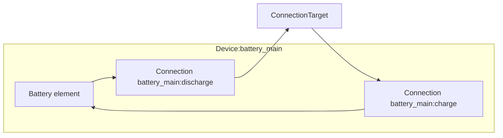

# Battery Modeling

The Battery device composes a single [Battery model](../model-layer/elements/battery.md) element and two [Connections](../model-layer/connections/connection.md), one for discharging and one for charging.
SOC preferences are encoded directly in the discharge connection via the SOC pricing segment.

## Model Elements Created

```mermaid
graph LR
    subgraph deviceBattery["Device:battery_main"]
        Battery["Battery element"]
        Discharge["Connection battery_main:discharge"]
        Charge["Connection battery_main:charge"]
    end
    Target[ConnectionTarget]
    Battery --> Discharge
    Discharge --> Target
    Target --> Charge
    Charge --> Battery
```

The adapter creates three model elements:

| Model Element                                          | Name               | Parameters From Configuration                    |
| ------------------------------------------------------ | ------------------ | ------------------------------------------------ |
| [Battery](../model-layer/elements/battery.md)          | `{name}`           | Capacity range, initial charge, salvage value    |
| [Connection](../model-layer/connections/connection.md) | `{name}:discharge` | Efficiency, power limits, SOC pricing (optional) |
| [Connection](../model-layer/connections/connection.md) | `{name}:charge`    | Power limits, efficiency                         |

## Architecture Details

### Capacity range and offsets

The battery model tracks stored energy within a bounded range:

- **Lower bound**: undercharge percentage when configured, otherwise `min_charge_percentage`
- **Upper bound**: overcharge percentage when configured, otherwise `max_charge_percentage`

The model capacity is:

$$
C_{\text{model}}(t) = (\text{upper\%}(t) - \text{lower\%}(t)) \cdot C(t)
$$

Stored energy is measured relative to the lower bound.
User-facing energy and SOC add the lower bound offset back to the model values.

### Metered terminal convention

Battery management systems, hybrid inverter battery ports, and battery meters all measure power at the battery terminals.
Manufacturers rate charge and discharge power at the same point.
In the model the terminals are the bus end of the battery's connections, and efficiency is the loss between the terminals and the stored energy.
See [Where values are measured](../../user-guide/measurement-points.md) for how this convention applies across every element.

Each connection therefore places its efficiency segment next to the battery and its power-limit segment at the bus end:

| Connection         | Segment order                                 | Power limit applies to     |
| ------------------ | --------------------------------------------- | -------------------------- |
| `{name}:discharge` | efficiency, power limit, SOC pricing (if set) | Power delivered to the bus |
| `{name}:charge`    | power limit, efficiency                       | Power drawn from the bus   |

With discharge efficiency $\eta_d$, charge efficiency $\eta_c$, and terminal powers $P_d$ and $P_c$:

$$
P_d(t) \le P_d^{\max}(t), \qquad P_c(t) \le P_c^{\max}(t)
$$

$$
E(t+1) = E(t) + \left(\eta_c P_c(t) - \frac{P_d(t)}{\eta_d}\right) \Delta t
$$

The charge, discharge, and active power sensors all report terminal power, so they match what a meter on the battery would read.

### SOC pricing segment

When undercharge or overcharge costs are configured, the connection includes the SOC pricing segment:

- **Undercharge penalty** applies while SOC is below `min_charge_percentage`
- **Overcharge penalty** applies while SOC is above `max_charge_percentage`

Both costs are holding rates in \$/kWh/h.
The penalty for each period is the energy outside the threshold multiplied by the rate and the period duration in hours.
See the [SOC pricing segment](../model-layer/segments/soc-pricing.md) for the formulation.

These are soft constraints driven by cost.
The battery can operate outside the preferred range when prices justify it, but it will never exceed the configured lower/upper bounds.

### Salvage value

The battery element can include a terminal salvage value.
This assigns a per-kWh value to the final stored energy at the horizon end.
It discourages draining the battery to zero when energy is still valuable beyond the forecast window.

## Devices Created

Battery creates a single Home Assistant device:

| Device  | Name     | Created When | Purpose                           |
| ------- | -------- | ------------ | --------------------------------- |
| Battery | `{name}` | Always       | Power, energy, SOC, shadow prices |

## Parameter mapping

| User Configuration          | Model Element(s)      | Model Parameter                            | Notes                          |
| --------------------------- | --------------------- | ------------------------------------------ | ------------------------------ |
| `capacity`                  | Battery               | Capacity range from lower/upper SOC bounds | kWh, boundaries                |
| `initial_charge_percentage` | Battery               | `initial_charge` (offset by lower bound)   | kWh                            |
| `min_charge_percentage`     | Battery + SOC pricing | Preferred minimum SOC threshold            | Penalty threshold              |
| `max_charge_percentage`     | Battery + SOC pricing | Preferred maximum SOC threshold            | Penalty threshold              |
| Undercharge percentage      | Battery               | Lower bound for SOC range                  | Hard minimum                   |
| Overcharge percentage       | Battery               | Upper bound for SOC range                  | Hard maximum                   |
| Undercharge cost            | SOC pricing segment   | `discharge_energy_price`                   | \$/kWh/h below min SOC         |
| Overcharge cost             | SOC pricing segment   | `charge_capacity_price`                    | \$/kWh/h above max SOC         |
| `salvage_value`             | Battery               | `salvage_value`                            | Terminal value for stored kWh  |
| `efficiency_source_target`  | Efficiency segment    | `efficiency_source_target`                 | Battery to network (discharge) |
| `efficiency_target_source`  | Efficiency segment    | `efficiency_target_source`                 | Network to battery (charge)    |
| `max_power_target_source`   | Power-limit segment   | `max_power_target_source`                  | Network to battery             |
| `max_power_source_target`   | Power-limit segment   | `max_power_source_target`                  | Battery to network             |

## Output Mapping

Power sensors come from the bus end of the connections, and the remaining sensors from the battery element:

| Model Output                              | Sensor Name                         | Description                  |
| ----------------------------------------- | ----------------------------------- | ---------------------------- |
| `{name}:charge` `CONNECTION_POWER`        | `power_charge`                      | Charge power at terminals    |
| `{name}:discharge` `CONNECTION_POWER_OUT` | `power_discharge`                   | Discharge power at terminals |
| Calculated as discharge minus charge      | `power_active`                      | Net power at terminals       |
| `BATTERY_ENERGY_STORED`                   | `energy_stored`                     | Total energy stored          |
| Calculated SOC                            | `state_of_charge`                   | State of charge              |
| `BATTERY_POWER_BALANCE`                   | `power_balance_shadow_energy_price` | Power balance shadow price   |
| `BATTERY_ENERGY_IN_FLOW`                  | `energy_in_flow`                    | Energy-in shadow price       |
| `BATTERY_ENERGY_OUT_FLOW`                 | `energy_out_flow`                   | Energy-out shadow price      |
| `BATTERY_SOC_MAX`                         | `soc_max`                           | Max SOC shadow price         |
| `BATTERY_SOC_MIN`                         | `soc_min`                           | Min SOC shadow price         |

See [Battery Configuration](../../user-guide/elements/battery.md#sensors-created) for complete sensor documentation.

## Next steps

- :material-file-document:{ .lg .middle } **Battery configuration**

    ---

    Configure batteries in your Home Assistant setup.

    [:material-arrow-right: Battery configuration](../../user-guide/elements/battery.md)

- :material-battery-charging:{ .lg .middle } **Battery model**

    ---

    Mathematical formulation for battery storage.

    [:material-arrow-right: Battery model](../model-layer/elements/battery.md)

- :material-connection:{ .lg .middle } **Connection model**

    ---

    How power limits, efficiency, and pricing are applied.

    [:material-arrow-right: Connection formulation](../model-layer/connections/connection.md)

