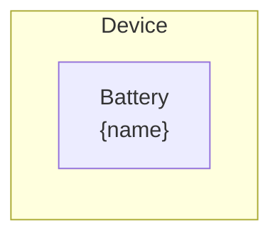

# Battery Section Modeling

The Battery Section device provides direct access to the model layer [Battery](../model-layer/elements/battery.md) element.
Unlike the standard Battery element which composes multiple sections with connections and nodes,
this element creates a single battery section that must be connected manually via Connection elements.

## Model Elements Created

| Model Element                                 | Name     | Parameters From Configuration  |
| --------------------------------------------- | -------- | ------------------------------ |
| [Battery](../model-layer/elements/battery.md) | `{name}` | All parameters mapped directly |

## Devices Created

Battery Section creates 1 device in Home Assistant:

| Device  | Name     | Created When | Purpose                              |
| ------- | -------- | ------------ | ------------------------------------ |
| Primary | `{name}` | Always       | Direct access to model layer Battery |

## Parameter Mapping

The adapter passes user configuration directly to the Battery model element:

| User Configuration | Model Element | Model Parameter  | Notes                       |
| ------------------ | ------------- | ---------------- | --------------------------- |
| `name`             | Battery       | `name`           | Element name                |
| `capacity`         | Battery       | `capacity`       | Battery capacity (kWh)      |
| `initial_charge`   | Battery       | `initial_charge` | Initial stored energy (kWh) |

## Sensors Created

### Battery Section Device

| Sensor            | Unit   | Update    | Description                            |
| ----------------- | ------ | --------- | -------------------------------------- |
| `power_charge`    | kW     | Real-time | Power being charged into battery       |
| `power_discharge` | kW     | Real-time | Power being discharged from battery    |
| `power_active`    | kW     | Real-time | Net active power (discharge - charge)  |
| `energy_stored`   | kWh    | Real-time | Current energy stored in battery       |
| `power_balance`   | \$/kW  | Real-time | Shadow price of power at terminals     |
| `energy_in_flow`  | \$/kWh | Real-time | Shadow price of charging constraint    |
| `energy_out_flow` | \$/kWh | Real-time | Shadow price of discharging constraint |
| `soc_max`         | \$/kWh | Real-time | Shadow price of maximum capacity       |
| `soc_min`         | \$/kWh | Real-time | Shadow price of minimum capacity       |

See [Battery Section Configuration](../../user-guide/elements/battery_section.md#sensors-created) for detailed sensor documentation.

## Configuration Example

### Basic Configuration

| Field              | Value                   |
| ------------------ | ----------------------- |
| **Name**           | Battery Section 1       |
| **Capacity**       | sensor.battery_capacity |
| **Initial Charge** | sensor.battery_energy   |

## Typical Use Cases

**Direct Model Access**:
Use Battery Section when you need direct control over battery modeling without the multi-section composition provided by the standard Battery element.

**Custom Battery Topologies**:
Create custom battery configurations by manually connecting multiple Battery Section elements with Connection elements and nodes.

**Advanced Modeling**:
Access raw model layer Battery behavior for research, testing, or advanced optimization scenarios.

## Physical Interpretation

Battery Section represents a single-section energy storage device with no implicit connections or internal routing.
All power flow must be explicitly configured via Connection elements.

### Configuration Guidelines

- **Manual Connections Required**: Unlike the standard Battery element, Battery Section does not create implicit connections.
    You must create Connection elements to connect it to nodes or other elements.
- **Single Section Only**: Battery Section creates a single battery section without SOC region modeling.
    For multi-section behavior, use the standard Battery element or compose multiple Battery Section elements manually.
- **Direct Model Mapping**: All configuration parameters map directly to the model layer Battery element with no transformation.

## Next Steps

- :material-file-document:{ .lg .middle } **Battery Section configuration**

    ---

    Configure Battery Section in your Home Assistant setup.

    [:material-arrow-right: Battery Section configuration](../../user-guide/elements/battery_section.md)

- :material-battery-charging:{ .lg .middle } **Battery model**

    ---

    Understand the mathematical formulation of the Battery model element.

    [:material-arrow-right: Battery formulation](../model-layer/elements/battery.md)

- :material-connection:{ .lg .middle } **Connection model**

    ---

    Learn how to connect Battery Section to other elements.

    [:material-arrow-right: PowerConnection formulation](../model-layer/connections/power-connection.md)

