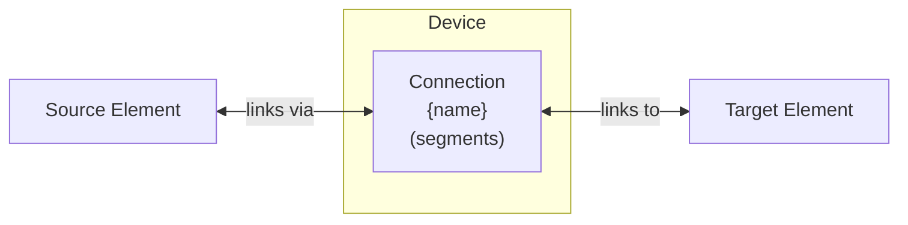

# Connection Modeling

The Connection device provides explicit user-defined power flow paths between elements.
Unlike implicit connections created by other devices, it allows full control over bidirectional flow, efficiency, and pricing.

## Model Elements Created

| Model Element                                          | Name     | Parameters From Configuration              |
| ------------------------------------------------------ | -------- | ------------------------------------------ |
| [Connection](../model-layer/connections/connection.md) | `{name}` | Source, target, and segment specifications |

The Connection device creates a `Connection` model element with a segment chain.
The adapter builds power-limit, efficiency, pricing, and demand pricing segments based on configured fields.

## Devices Created

Connection creates 1 device in Home Assistant:

| Device  | Name     | Created When | Purpose                  |
| ------- | -------- | ------------ | ------------------------ |
| Primary | `{name}` | Always       | Explicit power flow path |

## Parameter mapping

The adapter maps configuration into connection segments:

| User Configuration         | Segment           | Segment Field              | Notes                          |
| -------------------------- | ----------------- | -------------------------- | ------------------------------ |
| `source`                   | Connection        | `source`                   | Source element name            |
| `target`                   | Connection        | `target`                   | Target element name            |
| `max_power_source_target`  | PowerLimitSegment | `max_power_source_target`  | Optional, unlimited if not set |
| `max_power_target_source`  | PowerLimitSegment | `max_power_target_source`  | Optional, unlimited if not set |
| `efficiency_source_target` | EfficiencySegment | `efficiency_source_target` | Percent converted to ratio     |
| `efficiency_target_source` | EfficiencySegment | `efficiency_target_source` | Percent converted to ratio     |
| `price_source_target`      | PricingSegment    | `price_source_target`      | Optional, no cost if not set   |
| `price_target_source`      | PricingSegment    | `price_target_source`      | Optional, no cost if not set   |
| `demand_window_source_target` | DemandPricingSegment | `demand_window_source_target` | Optional, disabled if not set |
| `demand_window_target_source` | DemandPricingSegment | `demand_window_target_source` | Optional, disabled if not set |
| `demand_price_source_target`  | DemandPricingSegment | `demand_price_source_target`  | Optional, no cost if not set  |
| `demand_price_target_source`  | DemandPricingSegment | `demand_price_target_source`  | Optional, no cost if not set  |
| `demand_block_hours`          | DemandPricingSegment | `demand_block_hours`          | Defaults to 0.5 hours         |
| `demand_days`                 | DemandPricingSegment | `demand_days`                 | Defaults to 1 day             |

If a field is omitted, the corresponding segment defaults apply.
Power limits and pricing are skipped when values are `None`.
Efficiency defaults to 100% via the efficiency segment.

## Sensors Created

### Connection Device

| Sensor                | Unit  | Update    | Description                                   |
| --------------------- | ----- | --------- | --------------------------------------------- |
| `power_source_target` | kW    | Real-time | Power flow from source to target              |
| `power_target_source` | kW    | Real-time | Power flow from target to source              |
| `power_active`        | kW    | Real-time | Net power (source→target minus target→source) |
| `shadow_power_max_*`  | \$/kW | Real-time | Shadow prices for power limits                |
| `time_slice`          | \$/kW | Real-time | Shadow price for time-slice coupling          |

See [Connection Configuration](../../user-guide/elements/connections.md) for detailed sensor and configuration documentation.

## Configuration Examples

### AC/DC Inverter

| Field                           | Value    |
| ------------------------------- | -------- |
| **Name**                        | Inverter |
| **Source**                      | DC Bus   |
| **Target**                      | AC Bus   |
| **Max Power Source to Target**  | 10.0     |
| **Max Power Target to Source**  | 10.0     |
| **Efficiency Source to Target** | 0.97     |
| **Efficiency Target to Source** | 0.96     |

### Wheeling Charge

| Field                      | Value                  |
| -------------------------- | ---------------------- |
| **Name**                   | Grid Transfer          |
| **Source**                 | Zone A                 |
| **Target**                 | Zone B                 |
| **Price Source to Target** | sensor.wheeling_charge |
| **Price Target to Source** | sensor.wheeling_charge |

## Typical Use Cases

**AC/DC Conversion**:
Model inverter efficiency losses between DC battery/solar and AC loads/grid with bidirectional efficiency parameters.

**Wheeling Charges**:
Apply transmission costs for power transfer between geographic zones or utility territories.

**Capacity Limits**:
Constrain power flow through physical bottlenecks like panel ratings or cable capacity using max_power parameters.

**Time-Varying Availability**:
Use forecast sensors for max_power to model connection availability windows (e.g., scheduled maintenance).

## Physical Interpretation

Connection represents a controllable power flow path between elements with optional constraints on capacity, efficiency, and cost.

### When to Use Explicit Connections

Many device elements create implicit connections automatically:

- Battery/Grid/PV/Load automatically connect to their target node
- These implicit connections have sensible defaults (100% efficiency, no price)

Use explicit Connection devices when you need:

- **Additional power paths** between nodes not covered by device defaults
- **Non-100% efficiency** (inverter losses, transmission losses)
- **Non-zero pricing** (wheeling charges, conversion costs)
- **Capacity constraints** beyond those set by connected devices
- **Time-varying parameters** (availability windows, dynamic pricing)

### Configuration Guidelines

- **Bidirectional Control**:
    Set both `max_power_source_target` and `max_power_target_source` for asymmetric capacity (common in inverters).
- **Efficiency Matters**:
    Even small efficiency differences (95% vs 100%) significantly affect optimal battery dispatch strategies.
- **Price vs Limit**:
    Use `price` to encourage/discourage flow while allowing the optimizer freedom.
    Use `max_power` for hard physical constraints.
- **Implicit Connections**:
    Don't create explicit connections that duplicate implicit ones—this creates parallel paths with potentially confusing results.

## Next Steps

- :material-file-document:{ .lg .middle } **Connection configuration**

    ---

    Configure connections in your Home Assistant setup.

    [:material-arrow-right: Connection configuration](../../user-guide/elements/connections.md)

- :material-connection:{ .lg .middle } **Connection model**

    ---

    Mathematical formulation for power flow.

    [:material-arrow-right: Connection model](../model-layer/connections/connection.md)

- :material-network:{ .lg .middle } **Network overview**

    ---

    How connections form the optimization network.

    [:material-arrow-right: Network overview](../index.md)

