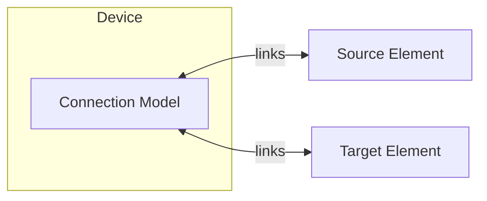

# Connection Modeling

The Connection device provides explicit user-defined power flow paths between elements.
Unlike implicit connections created by other devices, Connection allows full control over bidirectional flow, efficiency, and pricing.

Connection creates a single [Connection model](../model-layer/connection.md) with user-specified parameters.

## Model Elements Created

| Model Element                              | Name     | Parameters From Configuration  |
| ------------------------------------------ | -------- | ------------------------------ |
| [Connection](../model-layer/connection.md) | `{name}` | All parameters mapped directly |

## When to Use Explicit Connections

Many device elements create implicit connections automatically as part of their model composition.

Use explicit Connection devices when you need:

- **Additional power paths**: Connections between nodes not covered by device defaults
- **Inverter modeling**: AC/DC conversion with efficiency losses
- **Transmission constraints**: Wheeling charges or capacity limits between zones
- **Availability windows**: Time-varying connection availability

## Parameter Mapping

All user configuration maps directly to model parameters:

| User Configuration         | Model Parameter            | Notes                          |
| -------------------------- | -------------------------- | ------------------------------ |
| `source`                   | `source`                   | Source element name            |
| `target`                   | `target`                   | Target element name            |
| `max_power_source_target`  | `max_power_source_target`  | Optional, unlimited if not set |
| `max_power_target_source`  | `max_power_target_source`  | Optional, unlimited if not set |
| `efficiency_source_target` | `efficiency_source_target` | Optional, 100% if not set      |
| `efficiency_target_source` | `efficiency_target_source` | Optional, 100% if not set      |
| `price_source_target`      | `price_source_target`      | Optional, no cost if not set   |
| `price_target_source`      | `price_target_source`      | Optional, no cost if not set   |

## Output Mapping

| Model Output                         | Sensor Name               | Description                      |
| ------------------------------------ | ------------------------- | -------------------------------- |
| `CONNECTION_POWER_SOURCE_TARGET`     | `power_source_target`     | Power flow from source to target |
| `CONNECTION_POWER_TARGET_SOURCE`     | `power_target_source`     | Power flow from target to source |
| `CONNECTION_POWER_MAX_SOURCE_TARGET` | `power_max_source_target` | Configured max power (if set)    |
| `CONNECTION_POWER_MAX_TARGET_SOURCE` | `power_max_target_source` | Configured max power (if set)    |
| `CONNECTION_PRICE_SOURCE_TARGET`     | `price_source_target`     | Configured price (if set)        |
| `CONNECTION_PRICE_TARGET_SOURCE`     | `price_target_source`     | Configured price (if set)        |
| `CONNECTION_SHADOW_POWER_MAX_*`      | `shadow_power_max_*`      | Shadow prices for power limits   |

See [Connection Configuration](../../user-guide/elements/connections.md#sensors-created) for complete sensor documentation.

## Next Steps

- :material-file-document:{ .lg .middle } **Connection configuration**

    ---

    Configure connections in your Home Assistant setup.

    [:material-arrow-right: Connection configuration](../../user-guide/elements/connections.md)

- :material-connection:{ .lg .middle } **Connection model**

    ---

    Mathematical formulation for power flow.

    [:material-arrow-right: Connection model](../model-layer/connection.md)

- :material-network:{ .lg .middle } **Network overview**

    ---

    How connections form the optimization network.

    [:material-arrow-right: Network overview](../index.md)

