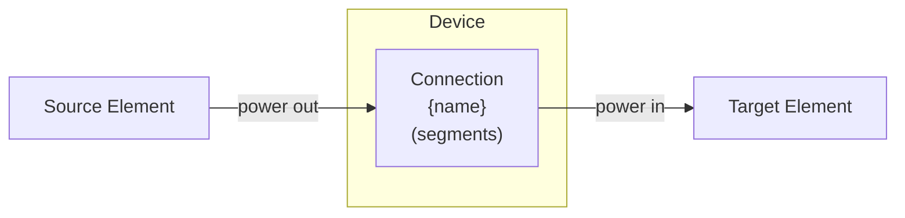

# Connection Modeling

The Connection device provides explicit user-defined **unidirectional** power flow paths between elements.
Unlike implicit connections created by other devices, it allows control over capacity, efficiency, and pricing along a single direction (source → target).

Bidirectional physical paths are modeled as **two** Connection devices with swapped endpoints.

## Model Elements Created

```mermaid
graph LR
    subgraph "Device"
        MC["Connection<br/>{name}<br/>(segments)"]
    end

    Source[Source Element]
    Target[Target Element]

    Source -->|power out| MC
    MC -->|power in| Target
```

| Model Element                                          | Name     | Parameters From Configuration              |
| ------------------------------------------------------ | -------- | ------------------------------------------ |
| [Connection](../model-layer/connections/connection.md) | `{name}` | Source, target, and segment specifications |

The Connection device creates one `Connection` model element with a segment chain.
The adapter maps each configured field to a single forward segment.

## Devices Created

Connection creates 1 device in Home Assistant:

| Device  | Name     | Created When | Purpose                    |
| ------- | -------- | ------------ | -------------------------- |
| Primary | `{name}` | Always       | Explicit power flow path   |

## Parameter mapping

The adapter maps configuration into connection segments:

| User Configuration         | Segment           | Segment field | Notes                          |
| -------------------------- | ----------------- | ------------- | ------------------------------ |
| `source`                   | Connection        | `source`      | Source element name            |
| `target`                   | Connection        | `target`      | Target element name            |
| `max_power_source_target`  | PowerLimitSegment | `max_power`   | Optional, unlimited if unset |
| `efficiency_source_target` | EfficiencySegment | `efficiency`  | Percent converted to ratio     |
| `price_source_target`      | PricingSegment    | `price`       | Optional, no cost if unset     |

If a field is omitted, the corresponding segment defaults apply.
Power limits and pricing are skipped when values are `None`.
Efficiency defaults to 100% via the efficiency segment.

## Sensors Created

### Connection Device

| Sensor              | Unit | Update    | Description                        |
| ------------------- | ---- | --------- | ---------------------------------- |
| `connection_power`  | kW   | Real-time | Power flow from source to target   |

See [Connection Configuration](../../user-guide/elements/connections.md) for detailed sensor and configuration documentation.

## Configuration Examples

### One-way capacity limit

| Field          | Value  |
| -------------- | ------ |
| **Name**       | Link   |
| **Source**     | Zone A |
| **Target**     | Zone B |
| **Max power**  | 10.0   |

### Wheeling charge

| Field     | Value                  |
| --------- | ---------------------- |
| **Name**  | Grid transfer          |
| **Source**| Zone A                 |
| **Target**| Zone B                 |
| **Price** | sensor.wheeling_charge |

### Bidirectional path (two connections)

| Connection | Source | Target | Notes                          |
| ---------- | ------ | ------ | ------------------------------ |
| A to B     | Zone A | Zone B | Forward limits and pricing     |
| B to A     | Zone B | Zone A | Independent reverse parameters |

For packaged AC/DC conversion with a DC bus, the [Inverter](inverter.md) device is often simpler than manual dual connections.

## Typical Use Cases

**Additional network paths**:
Connect nodes that are not linked by implicit element connections.

**Conversion and losses**:
Model inverter or transmission efficiency on a dedicated path.

**Wheeling charges**:
Apply transmission costs between zones or territories.

**Capacity limits**:
Constrain flow through bottlenecks (panel ratings, cable capacity).

**Time-varying availability**:
Use forecast sensors for max power to model maintenance or scheduling windows.

## Physical Interpretation

Connection represents one directed power flow path with optional constraints on capacity, efficiency, and cost.

### When to Use Explicit Connections

Many device elements create implicit connections automatically:

- Battery/Grid/PV/Load automatically connect to their target node
- These implicit connections have sensible defaults (100% efficiency, no price)

Use explicit Connection devices when you need:

- **Additional power paths** between nodes not covered by device defaults
- **Non-100% efficiency** (inverter losses, transmission losses)
- **Non-zero pricing** (wheeling charges, conversion costs)
- **Capacity constraints** beyond those set by connected devices
- **Time-varying parameters** (availability windows, dynamic pricing)

### Configuration Guidelines

- **Two directions**: Add two Connection subentries with swapped source and target when both directions matter.
- **Efficiency matters**: Even small efficiency differences (95% vs 100%) significantly affect optimal dispatch.
- **Price vs limit**: Use price to encourage or discourage flow; use max power for hard physical limits.
- **Implicit connections**: Do not duplicate implicit paths—parallel connections can confuse results.

## Next steps

- :material-file-document:{ .lg .middle } **Connection configuration**

    ---

    Configure connections in your Home Assistant setup.

    [:material-arrow-right: Connection configuration](../../user-guide/elements/connections.md)

- :material-connection:{ .lg .middle } **Connection model**

    ---

    Mathematical formulation for power flow.

    [:material-arrow-right: Connection model](../model-layer/connections/connection.md)

- :material-network:{ .lg .middle } **Network overview**

    ---

    How connections form the optimization network.

    [:material-arrow-right: Network overview](../index.md)

