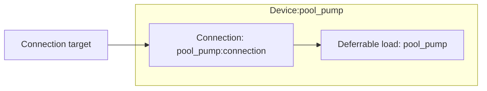

# Deferrable load modeling

The deferrable load device composes one deferrable load model element and one [Connection](../model-layer/connections/connection.md).

## Model elements created

The adapter creates two model elements:

| Model Element                                          | Name                | Purpose                                              |
| ------------------------------------------------------ | ------------------- | ---------------------------------------------------- |
| Deferrable load                                        | `{name}`            | Per-window energy requirements with priced shortfall |
| [Connection](../model-layer/connections/connection.md) | `{name}:connection` | Network → load, limited by the configured max power  |

## Architecture details

### Window scheduling

Calendar events define run windows, and the energy in each event's text (kWh) is that window's requirement.
Only events with a positive energy form windows; an event without a usable number keeps no window open.

The [deferrable load model](../model-layer/elements/deferrable_load.md) needs windows that never overlap, so the adapter prepares them from the calendar:

- **Overlapping events merge** into one window whose requirement is the sum of their energies.
    Merging is transitive: an event that overlaps two others joins all three.
- **Touching events stay separate**: when one event ends exactly where the next starts, each keeps its own requirement and is settled at its own end.
- **Windows running past the horizon end** are clamped to the final boundary, where their requirement falls due.
    A requirement that cannot fit in the clamped window is priced as a shortfall, and the shortfall relaxes as the horizon moves forward.

Window edges snap outward to the containing period boundaries, as for every calendar field.
The adapter passes the result to the model as three masks: which periods are inside a window, where windows start, and each window's requirement at its end boundary.
Power can only flow while a window is open, and the connection caps it at the configured max power.

### Energy already delivered

Each optimization starts a fresh horizon, so a window that is already open at the horizon start would otherwise demand its full energy again.
When a delivered energy sensor is configured, its reading $E_0$ seeds the open window's accumulator.
The window covering the first period counts as open, including one that starts inside that period.

- **Under target**: the remaining requirement, less $E_0$, stays due at the window end.
- **Over target**: the overshoot already happened, so it is not priced as overage and the window takes no new energy unless an overage price makes it worthwhile.
- **Negative reading**: treated as zero.

The reading never counts toward a later window, and with no window open it is ignored.

### Settlement

Each window is settled at its end boundary.
The shortfall below its requirement is priced at the shortfall price at that boundary.
Without an overage price the window cannot take more than its requirement.
With an overage price, delivery beyond the requirement is allowed and priced at the overage price at that boundary.
Delivering early inside a window is never penalized.

## Devices created

The deferrable load element creates a single Home Assistant device:

| Device          | Name     | Created when | Purpose                                     |
| --------------- | -------- | ------------ | ------------------------------------------- |
| Deferrable Load | `{name}` | Always       | Power, delivered energy, shortfall, overage |

## Parameter mapping

| User configuration | Model element(s)               | Model parameter                            | Notes                                       |
| ------------------ | ------------------------------ | ------------------------------------------ | ------------------------------------------- |
| `window_calendar`  | Deferrable load `{name}`       | `in_window`, `window_start`, `requirement` | Overlaps merged, clamped to the horizon end |
| `energy_delivered` | Deferrable load `{name}`       | `initial_energy`                           | Seeds the open window only, clamped ≥ 0     |
| `deficit_price`    | Deferrable load `{name}`       | `deficit_price`                            | Defaults to \$10/kWh, clamped ≥ 0           |
| `overage_price`    | Deferrable load `{name}`       | `overage_price`                            | Optional, clamped ≥ 0; unset caps delivery  |
| `max_power`        | Connection `{name}:connection` | Power limit segment                        | Optional                                    |

## Output mapping

The adapter maps model outputs to deferrable-load-specific sensor names:

| Model output                       | Sensor name        | Description                                |
| ---------------------------------- | ------------------ | ------------------------------------------ |
| Connection power                   | `power`            | Power drawn by the load                    |
| `DEFERRABLE_LOAD_ENERGY_DELIVERED` | `energy_delivered` | Energy delivered in the current window     |
| `DEFERRABLE_LOAD_ENERGY_SHORTFALL` | `energy_shortfall` | Requirement each window misses, at its end |
| `DEFERRABLE_LOAD_ENERGY_OVERAGE`   | `energy_overage`   | Delivery beyond each window's requirement  |

See [Deferrable Load Configuration](../../user-guide/elements/deferrable_load.md#sensors-created) for complete sensor documentation.

## Next steps

- :material-file-document:{ .lg .middle } **Deferrable load configuration**

    ---

    Configure deferrable loads in your Home Assistant setup.

    [:material-arrow-right: Deferrable load configuration](../../user-guide/elements/deferrable_load.md)

- :material-car-electric:{ .lg .middle } **EV modeling**

    ---

    The EV's trip sink uses the same deferrable load element.

    [:material-arrow-right: EV modeling](ev.md)

- :material-connection:{ .lg .middle } **Connection model**

    ---

    How power limits, efficiency, and pricing are applied.

    [:material-arrow-right: Connection formulation](../model-layer/connections/connection.md)

