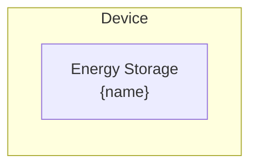

# Energy Storage Modeling

The Energy Storage device provides direct access to the model layer [Energy Storage](../model-layer/elements/energy-storage.md) element.
Unlike the standard Battery element which composes multiple partitions with connections and nodes,
this element creates a single energy storage partition that must be connected manually via Connection elements.

## Model Elements Created

| Model Element                                               | Name     | Parameters From Configuration  |
| ----------------------------------------------------------- | -------- | ------------------------------ |
| [Energy Storage](../model-layer/elements/energy-storage.md) | `{name}` | All parameters mapped directly |

## Devices Created

Energy Storage creates 1 device in Home Assistant:

| Device  | Name     | Created When | Purpose                                     |
| ------- | -------- | ------------ | ------------------------------------------- |
| Primary | `{name}` | Always       | Direct access to model layer Energy Storage |

## Parameter Mapping

The adapter passes user configuration directly to the Energy Storage model element:

| User Configuration | Model Element  | Model Parameter  | Notes                       |
| ------------------ | -------------- | ---------------- | --------------------------- |
| `name`             | Energy Storage | `name`           | Element name                |
| `capacity`         | Energy Storage | `capacity`       | Storage capacity (kWh)      |
| `initial_charge`   | Energy Storage | `initial_charge` | Initial stored energy (kWh) |

## Sensors Created

### Energy Storage Device

| Sensor            | Unit   | Update    | Description                            |
| ----------------- | ------ | --------- | -------------------------------------- |
| `power_charge`    | kW     | Real-time | Power being charged into storage       |
| `power_discharge` | kW     | Real-time | Power being discharged from storage    |
| `power_active`    | kW     | Real-time | Net active power (discharge - charge)  |
| `energy_stored`   | kWh    | Real-time | Current energy stored                  |
| `power_balance`   | \$/kW  | Real-time | Shadow price of power at terminals     |
| `energy_in_flow`  | \$/kWh | Real-time | Shadow price of charging constraint    |
| `energy_out_flow` | \$/kWh | Real-time | Shadow price of discharging constraint |
| `soc_max`         | \$/kWh | Real-time | Shadow price of maximum capacity       |
| `soc_min`         | \$/kWh | Real-time | Shadow price of minimum capacity       |

See [Energy Storage Configuration](../../user-guide/elements/energy_storage.md#sensors-created) for detailed sensor documentation.

## Configuration Example

### Basic Configuration

| Field              | Value                   |
| ------------------ | ----------------------- |
| **Name**           | Energy Storage 1        |
| **Capacity**       | sensor.storage_capacity |
| **Initial Charge** | sensor.storage_energy   |

## Typical Use Cases

**Direct Model Access**:
Use Energy Storage when you need direct control over storage modeling without the multi-partition composition provided by the standard Battery element.

**Custom Storage Topologies**:
Create custom storage configurations by manually connecting multiple Energy Storage elements with Connection elements and nodes.

**Advanced Modeling**:
Access raw model layer Energy Storage behavior for research, testing, or advanced optimization scenarios.

## Physical Interpretation

Energy Storage represents a single-partition energy storage device with no implicit connections or internal routing.
All power flow must be explicitly configured via Connection elements.

### Configuration Guidelines

- **Manual Connections Required**: Unlike the standard Battery element, Energy Storage does not create implicit connections.
    You must create Connection elements to connect it to nodes or other elements.
- **Single Partition Only**: Energy Storage creates a single storage partition without SOC region modeling.
    For multi-partition behavior, use the standard Battery element or compose multiple Energy Storage elements manually.
- **Direct Model Mapping**: All configuration parameters map directly to the model layer Energy Storage element with no transformation.

## Next Steps

- :material-file-document:{ .lg .middle } **Energy Storage configuration**

    ---

    Configure Energy Storage in your Home Assistant setup.

    [:material-arrow-right: Energy Storage configuration](../../user-guide/elements/energy_storage.md)

- :material-battery-charging:{ .lg .middle } **Energy Storage model**

    ---

    Understand the mathematical formulation of the Energy Storage model element.

    [:material-arrow-right: Energy Storage formulation](../model-layer/elements/energy-storage.md)

- :material-connection:{ .lg .middle } **Connection model**

    ---

    Learn how to connect Energy Storage to other elements.

    [:material-arrow-right: PowerConnection formulation](../model-layer/connections/power-connection.md)

